# Stage 1 AI Paper-Trading Agent

This project is a practice trading system for the Indian stock market.

It watches live market prices, studies 10 selected NSE stocks, creates possible
trade ideas, and then tests those ideas using virtual money only. It is not
allowed to place a real order.

The simplest way to explain it:

> The system behaves like a careful student trader. It watches the market,
> writes down why it would buy or reject a stock, practices the trade with fake
> money, counts the real-world costs, and saves proof for every step.

## Data Flow Diagram

This is the high-level workflow of the project. **Blue nodes are implemented
Stage 1 paper-trading steps. Orange nodes show the planned Project X safety
layer in a future broker-connected workflow.**

```mermaid
flowchart TD
    A["Live market prices from FYERS"] --> B["Clean and normalize the data"]
    B --> C["Build one-minute bars"]
    C --> D["Create market features"]
    D --> E["Candidate gate"]
    E --> F{"Is this stock worth checking?"}
    F -->|No| G["Reject it and save the reason"]
    F -->|Yes| H["Create a frozen trade candidate"]
    H --> I["Bull Bear Risk Tribunal"]
    I --> J{"Final paper decision"}
    J -->|Hold| K["Do not enter a trade"]
    J -->|Allow long or short| L["Paper risk sizing"]
    L --> M["Wait for the next real observable price"]
    M --> N{"Is the entry still fair?"}
    N -->|No| O["Reject missed or bad entry"]
    N -->|Yes| P["Create a paper trade only"]
    P --> Q["Track stop loss and flatten time"]
    Q --> R["Exit the paper trade"]
    R --> S["Calculate costs and final PnL"]
    S --> T["Save proof for replay and review"]

    J -.->|"Future approved execution intent"| X1

    subgraph PROJECTX["Project X: planned execution-truth safety layer"]
        X1["Record bot trade intent"]
        X2{"Deterministic safety policy<br/>passes?"}
        X3["Reject or pause new entry<br/>and notify trader"]
        X4["Project X sends approved order<br/>through supported broker adapter"]
        X5["Broker and exchange return acknowledgement,<br/>fills, pending orders and positions"]
        X6["Canonical order and position state"]
        X7["Continuous health monitor"]
        X8["Feed freshness, API health, margin,<br/>and broker-state age"]
        X9{"Intent matches confirmed<br/>broker state?"}
        X10["Continue monitoring while orders<br/>or positions remain active"]
        X11["Pause supported new entries and<br/>alert trader with actual exposure"]
        X12["Trader approves a supported recovery action<br/>(initial version: no automatic flattening)"]
        X13["Broker executes recovery request"]
        X14{"Final broker state verified?"}
        X15["Record verified incident timeline"]
        X16["Keep incident unresolved and escalate"]
        X17["Existing positions or pending orders<br/>(including after restart/manual action)"]

        X1 --> X2
        X2 -->|"No"| X3
        X2 -->|"Yes"| X4 --> X5 --> X6
        X7 --> X8 --> X9
        X6 --> X9
        X17 --> X6
        X9 -->|"Yes"| X10 --> X6
        X9 -->|"No or stale"| X11 --> X12 --> X13 --> X14
        X14 -->|"Yes"| X15
        X14 -->|"No"| X16
    end

    classDef stageone fill:#0d47a1,stroke:#90caf9,color:#ffffff,stroke-width:2px;
    classDef projectx fill:#7c2d12,stroke:#fdba74,color:#ffffff,stroke-width:3px;
    class A,B,C,D,E,F,G,H,I,J,K,L,M,N,O,P,Q,R,S,T stageone;
    class X1,X2,X3,X4,X5,X6,X7,X8,X9,X10,X11,X12,X13,X14,X15,X16,X17 projectx;
    style PROJECTX fill:#3b1d0f,stroke:#fdba74,stroke-width:4px;
```



**Where Project X starts and helps:** In a future broker-connected system,
Project X sits between the bot and the broker for any hard safety gate. It
records the bot's intent before submission, applies deterministic policies, and
continuously observes broker orders, fills, positions, margin, API health, and
data freshness. It also checks existing positions and pending orders after a
restart or manual action. The first version detects, pauses supported new
entries, alerts the trader, and waits for explicit recovery approval; it does
not automatically flatten positions. This repository remains paper-only and
cannot submit, pause, or recover a real broker order.

In simple words:

1. The system receives live market prices from FYERS.
2. It cleans the data so bad, stale, or suspicious prices are not trusted.
3. It builds one-minute market bars from the clean tick data.
4. It calculates useful features like momentum, VWAP, RSI, volume strength,
   spread, and market comparison.
5. The candidate gate checks whether a stock is strong enough to consider.
6. If the stock is weak or the data is bad, the system rejects it and saves the
   reason.
7. If the stock passes, the system creates a frozen paper-trade candidate.
8. The Bull Bear Risk Tribunal reviews the candidate from three angles:
   strength, weakness, and risk.
9. The final decision is HOLD, ALLOW_LONG, or ALLOW_SHORT.
10. If a trade is allowed, the system calculates paper position size using the
    risk rules.
11. It waits for the next real market price instead of pretending it entered at
    an old price.
12. If the entry is still fair, it creates a paper trade only.
13. The trade exits on stop loss or before the market day ends.
14. The final result is calculated after realistic Shoonya and Zerodha style
    costs.
15. Everything is saved so the same day can be checked and replayed later.

The most important point:

> The system does not jump directly from "stock is going up" to "buy." It moves
> through data cleaning, strength checks, agent-style review, risk checks,
> fair-entry checks, paper execution, cost calculation, and evidence saving.

## How To Explain This Project

Use this version when explaining the project to someone quickly:

- This is a paper-only trading research system for selected NSE stocks.
- It uses FYERS for live market data, but it cannot place real orders.
- It looks for stocks that are stronger than the market, active enough, fresh,
  and not too expensive to enter.
- It rejects weak ideas and saves the reason instead of hiding failed signals.
- A Bull Bear Risk Tribunal reviews each strong candidate before a paper trade
  is allowed.
- The system waits for the next real observable price, so it does not cheat by
  using old prices.
- It includes spread, slippage, and broker-style costs, because small trades can
  look good before costs and bad after costs.
- It limits daily trades, open positions, position size, and daily loss.
- Every important decision is saved with proof so the day can be replayed later.
- The main goal is not to prove that AI can trade. The main goal is to prove
  whether a trading decision was fair, safe, and repeatable.

## What This Project Is

This is a paper-trading research system.

Paper trading means the system pretends to trade, but no real money is used.
The system can say, "I would buy Infosys here," but it cannot send that order to
a broker.

The project uses FYERS only to receive market prices. It does not use FYERS to
place orders. There is no broker order adapter, no order socket, and no route in
this codebase that can place a real trade.

## Why This Project Exists

Many trading demos only show a profit or loss number. That is not enough.

This project tries to answer deeper questions:

- Did the system use only information available at that time?
- Was the market data fresh?
- Was the stock actually strong, or only moving because the whole market moved?
- Was there enough buying and selling activity?
- Were trading costs included?
- Can the same day be replayed later and produce the same result?
- Can we prove that no real-money order was possible?

So the main goal is not "trust the AI." The main goal is "check the proof."

## What Stocks It Watches

The system watches 10 tradable stocks:

- RELIANCE
- TCS
- INFY
- HDFCBANK
- ICICIBANK
- SBIN
- BHARTIARTL
- LT
- AXISBANK
- ITC

It also watches two market context symbols:

- NIFTY 50
- India VIX

NIFTY 50 is like the main scoreboard of the Indian stock market. It represents
50 large Indian companies. If NIFTY 50 is up by 0.3%, the broad market is mildly
positive.

India VIX is a fear or volatility indicator. If it is high, the market is
usually more nervous and jumpy.

The system does not trade NIFTY 50 or India VIX. It only uses them to understand
the market environment.

## Demo Example: Strong Stock

Suppose the system is watching Infosys.

Question: Is the overall Indian market going up?

Answer: Yes. NIFTY 50 is up by 0.3%. That means the broad market mood is
positive.

Question: Is Infosys also going up?

Answer: Yes. Infosys is up by 3%.

Question: Is Infosys stronger than the market?

Answer: Yes. The market is up only 0.3%, but Infosys is up 3%. That means
Infosys is not just moving because the whole market is moving. It is showing
extra strength.

Question: Is Infosys trading above today's normal average traded price?

Answer: Yes. Buyers are paying above the average price where most trading
happened today.

Question: Is the recent direction still going up?

Answer: Yes. The recent prices are still moving upward, so it is not just one
random jump.

Question: Are enough people actually buying and selling it?

Answer: Yes. Trading activity is above normal for that stock.

Question: Is the buying-selling price gap small?

Answer: Yes. The gap is below 0.15%, so entering the trade is not too expensive.

Question: Is the data fresh?

Answer: Yes. The latest price is not older than 6 seconds.

Question: Can we enter at the next real market price?

Answer: Yes. The system checks the next real price after the decision. If that
price is still fair, the system creates a paper trade.

Final result: Infosys becomes a possible practice buy.

## Demo Example: Weak Stock

Suppose the Indian market is up by 0.5%, but TCS is up only 0.1%.

Question: Is the market going up?

Answer: Yes.

Question: Is TCS also going up strongly?

Answer: No. TCS is barely moving.

Question: Is TCS stronger than the market?

Answer: No. The market is up 0.5%, but TCS is up only 0.1%. TCS is weaker than
the market.

Question: Should we buy it just because it is green?

Answer: No. A stock can look positive only because the whole market is positive.
The system wants a stock that shows its own strength.

Final result: The system rejects TCS and records the reason.

## Demo Example: Fake Hype

Suppose a stock suddenly jumps very fast.

Question: Is the stock going up?

Answer: Yes.

Question: Is it stronger than the market?

Answer: Yes.

Question: Should the system buy immediately?

Answer: No. A fast jump can be real strength, but it can also be hype.

The system checks:

- Did enough shares actually trade during the jump?
- Is the buying-selling price gap still small?
- Is the latest price fresh?
- Did the price already move too far before we could enter?
- Can we still enter at a fair next price?

If the next available price has moved too far, the system rejects the trade.

Final result: The system does not chase the stock blindly.

## How Often It Checks

The system checks all 10 stocks every 3 minutes.

For example:

- 9:25 AM
- 9:28 AM
- 9:31 AM
- 9:34 AM

This does not mean the system waits 3 minutes after finding a trade.

It means every 3 minutes the system asks: "Which stocks are worth considering
right now?"

If a stock passes at 9:25 AM, the system tries to enter using the next real
available market price within 20 seconds. If the price has already moved too
far, it rejects the trade.

Why 3 minutes? Because checking every second can react to random market noise.
Three minutes gives the move a little time to prove itself, while still being
fast enough for intraday paper trading.

## How Many Trades It Can Take

The system is intentionally limited.

Maximum completed trades per day: 2.

A completed trade means one entry and one exit.

Example:

- Buy Infosys at 10:00 AM.
- Sell Infosys at 10:20 AM.
- That is 1 completed trade.

Maximum open trades at one time: 2.

An open trade means a trade that has started but has not ended yet.

Example:

- Infosys is bought but not sold yet. That is 1 open position.
- Reliance is bought but not sold yet. Now there are 2 open positions.
- The system cannot open a third position until one of them is closed.

Same-stock cooldown: 15 minutes.

After the system makes a decision on one stock, it waits 15 minutes before
considering that same stock again. This helps avoid repeatedly chasing the same
move.

## How It Controls Risk

Starting virtual money: Rs 100,000.

Risk per trade: 0.25% of virtual money.

On Rs 100,000, that is about Rs 250.

This does not mean the system buys any quantity and waits until it loses Rs 250.
Instead, it calculates the quantity before entering.

Example:

- Stock price is Rs 1,000.
- Planned exit-if-wrong price is Rs 990.
- Risk per share is Rs 10.
- Allowed risk is Rs 250.
- Maximum quantity is 25 shares.

Because:

25 shares x Rs 10 = Rs 250 risk.

Maximum capital in one stock: 25% of virtual money.

On Rs 100,000, one position cannot use more than about Rs 25,000.

Daily loss stop: 0.75% of starting money.

On Rs 100,000, that is about Rs 750.

If the daily loss reaches this level, the system stops taking new trades. It is
designed to learn safely, not gamble.

## When It Sells

The current Stage 1 system mainly exits in two ways.

First, it sells if the trade goes wrong and reaches the planned stop point.

Second, it closes open trades before the market day ends. The system stops
looking for new entries after 2:45 PM and flattens open positions at or after
3:15 PM.

At this stage, there is no fixed profit-booking rule like "sell when profit
reaches Rs 300." That is intentional. Profit-booking rules need separate testing
before they are trusted.

## What Market Checks It Uses

The code uses market indicators, but the idea is simple.

It checks whether the stock is above the average price where most trading
happened today. This helps judge whether buyers are paying above the normal price
of the day.

It checks whether the recent direction is still strong. This helps avoid a stock
that moved once and then became weak.

It checks whether the stock is stronger than the overall market. If the market
is up 0.3% and one stock is up 3%, that stock is showing extra strength.

It checks whether trading activity is above normal for that stock. The configured
minimum is 0.5 above its usual activity level.

It checks whether the buying-selling price gap is small. The maximum allowed gap
is 15 basis points, which is about 0.15%.

It checks whether the latest price is fresh. If the latest price is older than 6
seconds, the system rejects it as stale.

It checks whether the next real available price is still fair. If the stock has
already moved more than 0.25 times its normal movement range, the system rejects
the entry.

## What Edge Cases It Handles

Old price data:

If the latest price is older than 6 seconds, the system does not trade on it.

Sudden hype:

If a stock jumps too fast and the next fair entry is gone, the system rejects it.

Wide buying-selling gap:

If the gap is more than 0.15%, the system rejects it because trading may be too
costly.

Low activity:

If not enough people are buying and selling, the move may not be reliable. The
system rejects it.

Too many trades:

If 2 completed trades are already done for the day, the system stops taking new
ones.

Too much daily loss:

If the virtual account loses about Rs 750 on a Rs 100,000 starting balance, the
system stops for the day.

Bad market messages:

If data is missing, malformed, impossible, or not part of the selected stock
list, it is rejected or placed in quarantine.

Zero prices:

If price and quantity are both zero, the system treats that quote side as
unavailable. If price is zero but quantity is positive, the message is
inconsistent and is rejected.

Same stock again and again:

The 15-minute cooldown prevents the system from repeatedly chasing the same
stock.

## What Evidence Integrity Means

Evidence integrity means the system keeps proof.

Every important step is saved:

- the market data received;
- the time it was received;
- the reason a stock was accepted or rejected;
- the simulated entry price;
- the simulated exit price;
- the costs;
- the final result;
- the replay report.

If bad data arrives, the system does not hide it. It stores it separately in
quarantine.

If someone asks later, "Why did the system buy Infosys and reject TCS?", the
saved evidence should answer that question.

Replay is part of this. Replay means the system can run the same saved day again
and should produce the same result. If the result changes without explanation,
that is a problem.

## Why Shoonya And Zerodha Are Used

Shoonya and Zerodha are Indian brokers.

This project does not place trades through them. It uses their cost models to
calculate realistic paper-trading results.

Why? Because a trade can look profitable before charges and become a loss after
charges.

Example:

- Practice profit before costs: Rs 20.
- Brokerage, taxes, spread, and slippage: Rs 25.
- Realistic result after costs: minus Rs 5.

The system checks the same paper trade under both Shoonya-style and
Zerodha-style costs. These are two cost views of the same simulated trade, not
two separate accounts.

## Tech Stack

Python is the main backend language. It runs the trading logic, data processing,
replay, risk checks, and tests.

FYERS API is used for market data only. It provides live prices.

Polars is used for fast data processing. It helps process ticks, one-minute
bars, features, and replay files.

Parquet is used to store market data in a compact and efficient format.

SQLite is used to store local manifests and operational records.

Pydantic is used for strict data schemas. It helps make sure records have the
right fields and types.

Pytest is used for automated tests.

Next.js and React are used for the dashboard.

Telegram is used only for outbound alerts. The system can send alerts, but it
does not accept trading commands from Telegram.

Git and SHA-256 hashes are used to identify code and data evidence.

## Current Research Boundary

The live paper path is deterministic and rule-based. AI models, news decisions,
cloud models, memory, and automatic learning are disabled in the live decision
path.

The reward records do not update the strategy. Winning or losing paper trades
cannot automatically change the rules.

Historical research is separate from live paper trading. Research results cannot
silently change the live baseline.

## Setup

From PowerShell in this project folder:

```powershell
python -m venv .venv
.\.venv\Scripts\python.exe -m pip install --require-hashes -r requirements.lock
.\.venv\Scripts\python.exe -m pip install -e . --no-deps --no-build-isolation
```

Verify the offline environment:

```powershell
.\.venv\Scripts\python.exe scripts\verify_environment.py
.\.venv\Scripts\python.exe scripts\scan_secrets.py
.\.venv\Scripts\python.exe -m pytest
```

## FYERS Authorization

Live market recording needs daily local FYERS authorization.

Copy `.env.example` to `.env`, fill the required FYERS values locally, and never
commit `.env`.

Start authorization:

```powershell
.\.venv\Scripts\python.exe scripts\authenticate_fyers.py start
```

After completing the browser login and 2FA yourself, finish authorization:

```powershell
.\.venv\Scripts\python.exe scripts\authenticate_fyers.py finish
```

Start data-only recording:

```powershell
.\.venv\Scripts\python.exe scripts\record_fyers.py
```

Run the live paper engine while the recorder is running:

```powershell
.\.venv\Scripts\python.exe scripts\run_live_paper.py
```

The recorder writes new market data files. Restarts do not overwrite old chunks.

## Useful Research Commands

Prepare historical research data:

```powershell
.\.venv\Scripts\python.exe scripts\prepare_historical_research.py
```

Use the public daily Yahoo fallback if FYERS Historical is unavailable:

```powershell
.\.venv\Scripts\python.exe scripts\prepare_historical_research.py --source yahoo --resolution D
```

Run factor research:

```powershell
.\.venv\Scripts\python.exe scripts\run_factor_research.py
```

Run the intraday variant lab:

```powershell
.\.venv\Scripts\python.exe scripts\run_intraday_variant_lab.py
```

Run the Bull Bear Risk Tribunal on a frozen candidate file:

```powershell
.\.venv\Scripts\python.exe scripts\run_agentic_tribunal.py data\derived\candidates\date=YYYY-MM-DD\your-candidates.parquet
```

Validate a recorded day:

```powershell
.\.venv\Scripts\python.exe scripts\validate_recording.py 2026-07-20
```

Recover/finalize a stale paper session offline:

```powershell
.\.venv\Scripts\python.exe scripts\run_live_paper.py --session-date YYYY-MM-DD --finalize-only
```

## Telegram Alerts

Telegram is outbound-only at runtime.

That means the system can send alerts, but it does not read Telegram commands
and cannot receive trading instructions from Telegram.

Setup:

```powershell
.\scripts\setup_telegram.ps1
```

## Non-Negotiable Safety Rules

- The system runs in paper mode.
- Live order endpoints are disabled.
- FYERS is used only for market data.
- Secrets stay in `.env`, which is ignored by Git.
- Bad or suspicious data is rejected or quarantined.
- Real-money trading is not available in this repository.
- AI output cannot become an executable trading instruction.
- Research cannot silently change the live paper strategy.

## One-Line Summary

This project is a safe, auditable, paper-only trading research system: it watches
the market, explains each practice trade decision, controls risk, counts real
costs, and saves proof so every result can be checked later.
