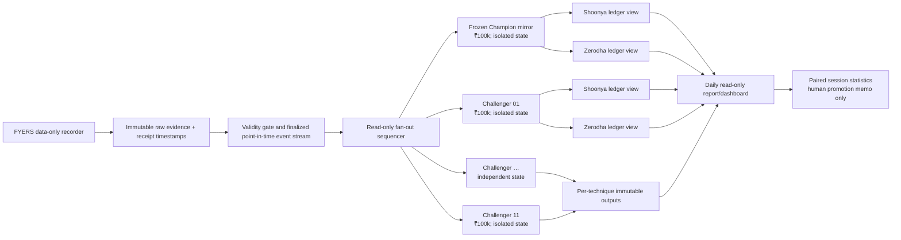

# Stage 1 Deep Research Proposal and Independent Audit

**Project:** NSE cash-equity intraday paper-trading laboratory  
**Audit date:** 27 July 2026 (Asia/Kolkata)  
**Revision:** Champion–Challenger Paper Laboratory, Baseline Loss Root-Cause / Edge-Recovery, and finalized 27 July session addenda  
**Scope:** read-only verification of the handoff, every source file and non-sealed artifact it cited, primary-source research, and a proposal only  
**Hard boundary:** paper trading; no order placement, order adapter, order WebSocket, credentials, `.env` access, sealed-TEST access, live-path AI/news, fine-tuning, threshold changes, or implementation changes  
**Decision status:** **NO-GO for strategy promotion. Approval may be considered for P0 evidence-integrity repairs only.**

## 1. Executive verdict

Stage 1 is a useful paper-research scaffold, but its evidence is not yet admissible for strategy selection. The most important problem is not that the small finalized ledgers are below starting capital; it is that the system can silently assign valid July 2026 ticks to 1979/1980, revise already-used bars after later laptop receipt, and leave an append-only journal disagreeing with the replay-derived state. Those defects break the causal claim that a candidate was knowable, final, and executable when recorded.

The current deterministic live path is materially safer than a typical retail bot: it is paper-only, uses a data WebSocket, serves a read-only control room, imposes deterministic risk limits, and simulates fills only from later-received ticks. Nevertheless, the stronger repository-wide claim that no order-capable dependency or object exists is false: two offline scripts instantiate the FYERS generic client class, whose installed SDK exposes order methods, even though the scripts inspected call only profile, quote, or history endpoints. The live import graph should be proven by an allowlist and the generic client isolated before any stronger safety attestation.

The quantitative evidence remains negative or insufficient:

- Finalized capital is `₹99,645.1459` under the Shoonya profile and `₹99,618.7844` under Zerodha, versus `₹100,000` starting capital.
- All six daily historical factor experiments are `NO_EVIDENCE`.
- The intraday lab contains only two eligible sessions and labels the family `INSUFFICIENT_SESSIONS`.
- No strategy has passed promotion.
- Yahoo daily candles do not prove one-minute execution performance.
- Twenty-seven July is now operationally finalized with deterministic replay, but its 09:36 engine start misses mandatory opening coverage and is therefore `PARTIAL_SESSION`, not an independent full-session performance trial.

The correct sequence is therefore: repair provenance and finalization; commit a reproducible baseline; make every session produce a chained, signed acceptance artifact; collect enough valid, independent sessions; then evaluate one preregistered family of no more than 12 variants. Qwen, FinBERT, embeddings, and official news remain non-executing shadow studies. Nothing in this report predicts or promises profitability.

### Recommendation score scale

Scores are `1–5`. Higher is better for **evidential value**, **zero-cost compatibility**, and **reversibility**. Lower is better for **difficulty**, **overfitting risk**, and **operational risk**.

| Recommendation | Evidential value | Difficulty | Overfitting risk | Operational risk | ₹0 compatibility | Reversibility |
|---|---:|---:|---:|---:|---:|---:|
| Timestamp plausibility, quarantine, and causal watermark | 5 | 3 | 1 | 2 | 5 | 5 |
| Unified session validity gate and zero-trade proof | 5 | 3 | 1 | 2 | 5 | 5 |
| Git baseline, deterministic replay hash, chained/signed cards | 5 | 3 | 1 | 2 | 5 | 5 |
| Feed supervision, reconciliation, and dashboard truth states | 5 | 3 | 1 | 2 | 5 | 5 |
| Paper-fill and cost-model calibration | 4 | 4 | 2 | 3 | 5 | 4 |
| Frozen 12-variant research family | 3 | 4 | 4 | 2 | 5 | 5 |
| Qwen/FinBERT/news shadow studies | 2 | 4 | 4 | 3 | 5 | 5 |

## 2. Factual verification of the attached handoff

The handoff was read completely and checked against the project without reading `.env` or any sealed TEST contents.

| Handoff claim | Independent result | Evidence / qualification |
|---|---|---|
| Paper-only deterministic system | **Verified for the active inspected path** | `src/stage1/scripts/record_fyers.py:28,71`; `src/stage1/scripts/run_live_paper.py`; control-room HTTP methods at `src/stage1/scripts/run_control_room.py:812-840` are read-only GET routes and reject POST with 405. |
| Ten tradable equities plus NIFTY 50 and India VIX context | **Verified** | `config/universe.yaml`; tradables are RELIANCE, TCS, INFY, HDFCBANK, ICICIBANK, SBIN, BHARTIARTL, LT, AXISBANK, ITC; context symbols are NIFTY50 and INDIAVIX. |
| Current schedule and deterministic guardrails | **Verified** | `config/strategy.yaml`: market open 09:15, candidate start 09:25, cutoff 14:45, flatten 15:15, shutdown 15:35; stale limit 6 s; 3-minute cadence; five candidates/session; two positions and two round trips; 0.25% risk/trade; 0.75% daily-loss limit; 25% max position value. |
| Finalized ledgers below starting capital | **Verified** | Handoff and finalized replay artifacts through 24 July: Shoonya `₹99,645.1459`; Zerodha `₹99,618.7844`; starting capital `₹100,000`. |
| Six daily factors found no evidence | **Verified** | `data/reports/historical_factor_report.json`: six `NO_EVIDENCE` results; causality audit 8,150 passed rows; 2,940 rows remain sealed; test metrics absent. Sealed rows were not opened. |
| Intraday family has insufficient evidence | **Verified** | `data/evaluation/intraday_variant_report.json`: 144 result cells = 6 variants × 2 sessions × 2 cost profiles × 6 delays; family status `INSUFFICIENT_SESSIONS`. |
| Replay totals | **Verified** | 20 July: 14 candidates, 3 approvals, 2 trades, ending `₹99,830.9839/₹99,820.4065`; 22 July: 1/1/1, `₹99,792.8527/₹99,777.5119`; 24 July: 23 candidates, 2 approvals, 2 trades, `₹99,645.1459/₹99,618.7844`. |
| Zero-trade 23 July | **Verified but incompletely proven** | Bars, features, and state exist; the no-candidate return path produces no full run card. |
| Impossible 1980 timestamps | **Verified and expanded** | Read-only SQLite and all implicated raw Parquet rows found 47 records with `exch_feed_time=315513000`; normalized exchange time becomes `1979-12-31T18:30:00Z`, while receipt is July 2026 and 40 records carry a plausible July 2026 `last_traded_time`. All 12 symbols are affected. |
| State/journal disagreement on 27 July | **Verified; final structural reconciliation added in Appendix C** | Final replay/state contains 14 candidates, 4 approvals, 4 intents, 2 entry fills, and 2 completed trades. The append-only journal contains 20 candidate/risk events, 5 approved intents, 3 rejection events, 2 entry fills, and 2 exits. One superseded BHARTIARTL attempt and six replaced/vanished candidate versions lack explicit retraction transitions. |
| No Git commit | **Verified** | Repository has no `HEAD`; inspected implementation, configuration, tests, and project metadata are untracked. |
| Tests pass | **Not independently refreshed** | The handoff records 91 core and 2 dashboard tests. They were not rerun because this mandate permits only the final report and test execution could create caches/logs. Treat as a historical assertion, not current audit evidence. |
| Local Qwen is frozen | **Not yet reproducible** | Config records `qwen3.5:9b` and digest `sha256:be595…`; local Ollama reports model ID `6488c96fa5fa`. Resolve identity before shadow use. |

The existing cost profiles are mostly directionally plausible. Zerodha’s official schedule confirms equity-intraday brokerage of 0.03% or ₹20 per executed order, whichever is lower, and lists the taxes/levies used by the project ([Zerodha charges](https://zerodha.com/charges/)). Shoonya currently advertises equity-intraday brokerage of 0.03% or ₹5, whichever is lower, and lists NSE transaction charges of 0.00297%, plus a very small IPFT levy ([Shoonya pricing](https://shoonya.com/pricing)). The local common NSE transaction rate is 0.00307%, which is slightly conservative for Shoonya but omits IPFT; effective dates and contract notes must be reconciled rather than silently sharing one levy table. NSE explains that statutory levies and exchange charges are separate components ([NSE investor levies](https://www.nseindia.com/static/invest/first-time-investor-sebi-turnover-fees-stt-other-levies)).

## 3. Confirmed defects with file-and-line evidence

### P0-1 — Provider-time sentinel is accepted as a real exchange time

`_provider_timestamp` accepts any positive epoch and gives `exch_feed_time` priority over `last_traded_time` (`src/stage1/market/normalizer.py:79-108,181-192`). The provider value `315513000` is positive but represents 1979-12-31 18:30 UTC. The audit found:

- 47 raw rows with that exact sentinel;
- receipts on 16, 22, and 24 July 2026;
- all 12 subscribed symbols affected;
- 40 rows with a conflicting, plausible July 2026 `last_traded_time`;
- representative AXISBANK row: feed time `315513000`, last-traded time `1784714399`, normalized exchange time `1979-12-31T18:30:00Z`, received in July 2026.

This is not merely cosmetic. It can mispartition sessions, contaminate bar membership, distort staleness/latency, and make point-in-time evidence false. Required handling: parse every candidate time field; validate exchange calendar/session and bounded distance from receipt; quarantine conflicts as `PROVIDER_TIME_SENTINEL` or `TIMESTAMP_FIELD_CONFLICT`; preserve raw fields; never silently choose a conflicting fallback.

### P0-2 — “Complete” exchange-time bars are mutable after the decision

The bar builder aggregates all available rows into time buckets and calculates bar endings (`src/stage1/market/bar_builder.py:93-155,202-208`). The live loop labels a bar complete whenever `bar_end <= now` and rewrites the current day’s bar/feature files (`src/stage1/scripts/run_live_paper.py:241-244`). Feature availability is derived from bar time (`src/stage1/strategy/features.py:125-135`), and candidates are timestamped later (`src/stage1/strategy/candidate_gate.py:230-238`).

A late-received tick whose exchange time belongs to an earlier bucket can therefore revise a bar already used for a candidate. On 27 July, candidate/snapshot pairs for INFY, BHARTIARTL, AXISBANK, and LT were replaced or disappeared as later receipts changed prior bars. This is look-ahead by revision, even if the replacement candidate itself carries a later creation time.

Required model:

`raw event time → local received_at → eligibility watermark → immutable finalized bar → feature available_at → decision_at → first eligible simulated fill received_at`

An event can affect a decision only if its full raw record was received before that decision’s frozen input cutoff. Event-time systems use watermarks and explicit late-data policies precisely because event time and processing time differ ([Apache Beam programming guide](https://beam.apache.org/documentation/programming-guide/)). Stage 1 needs the same concept locally: provisional bars may update; finalized bars may not. Corrections become separate late-data records and invalidate/restate the session, never silently rewrite evidence.

### P0-3 — Replay-derived state and append-only journal are irreconcilable

At 13:45:55 IST, `state/live-paper-2026-07-27.json` held 10 candidates, 4 approvals, 2 fills, and 2 completed trades. Read-only journal queries showed 15 candidates, 15 risk decisions, 5 intents, 4 fills, 4 outcomes, and 4 rewards. Rebuilding mutable intraday history replaces state, while append-only records preserve earlier decisions. There is no retraction/supersession protocol linking both views.

Fix: immutable candidate IDs must refer to immutable input snapshot hashes. Candidate status can transition only through an append-only state machine such as `PROVISIONAL → FINAL → APPROVED/REJECTED → SIMULATED`, or `PROVISIONAL → RETRACTED`. Engine execution must consume only `FINAL`; replay must reproduce every transition and the terminal aggregate.

### P0-4 — Zero-trade sessions lack complete proof artifacts

The no-candidate branch writes bars/features/state and returns at `src/stage1/scripts/run_live_paper.py:241-305`. Candidate artifacts and run-card construction occur only later (`src/stage1/scripts/run_live_paper.py:429+`). A session with no trade may be legitimate, late, disconnected, stale, or simply not evaluated; today those cases are not cryptographically or semantically distinguishable.

Every attempted session needs a final acceptance card, including zero candidates/trades, recording scheduled/actual start, coverage by symbol, reconnects, warm-up periods, stale ratios, candidate evaluations, invalidation reasons, ledger reconciliation, source/code/config/data hashes, and terminal validity.

### P0-5 — Run cards are neither chained nor signed

The code records `code_commit="UNBORN_OR_UNAVAILABLE"` (`src/stage1/scripts/run_live_paper.py:466`) and `previous_run_hash=None` (`:480`). Actual inspected run cards also have null predecessors. A content hash detects accidental change only if a trusted copy is retained; it does not authenticate who produced the card, nor detect replacement of an entire unanchored chain.

Create a local append-only chain: each card includes prior accepted card hash, manifest Merkle/root hash, and a detached signature from a locally protected research-signing key. Signing is for evidence integrity, not broker authentication. The public verification key and daily chain head should be backed up separately.

### P0-6 — No committed, reproducible code baseline

The repository has no first commit and no resolvable `HEAD`. Consequently, `UNBORN_OR_UNAVAILABLE` cannot identify the code that generated an artifact. The first controlled change must be a human-reviewed baseline commit after confirming that secrets, runtime data, logs, and sealed partitions remain excluded. The commit must not retroactively certify old evidence.

### P0-7 — Session validity logic exists but is not a universal acceptance gate

Contrary to the handoff’s literal “absence” claim, `src/stage1/validation/recording.py:110-185` already evaluates integrity, coverage, continuity, and emits `PASS`, `PARTIAL_SESSION`, or `FAIL`. The defect is integration and semantics: it is not a single deterministic `VALID/PARTIAL/INVALID` terminal gate for every recorder, engine, replay, ledger, run card, and promotion decision; it also lacks the timestamp-plausibility and full causal-order tests above.

Map and extend, do not create a competing classifier:

- `VALID`: scheduled scope met, required symbols/feed current, causal and integrity checks pass, full reconciliation, deterministic replay hash match.
- `PARTIAL`: evidence is internally sound but coverage/start/end/reconnect criteria make it ineligible for performance inference.
- `INVALID`: corruption, impossible/conflicting time, missing manifests, hash/replay mismatch, unreconciled decisions/fills, or causal violation.

`PARTIAL` and `INVALID` sessions may support engineering diagnosis, never P&L promotion.

### P0-8 — Active path is data-only, but repository-wide order-capability claim is too strong

The recorder imports only `fyers_apiv3.FyersWebsocket.data_ws` (`src/stage1/scripts/record_fyers.py:71`), and the live control room is read-only. However, `scripts/verify_fyers_live.py:83` and `scripts/prepare_historical_research.py:78` instantiate `fyersModel.FyersModel`. The installed class exposes methods including place, modify, and cancel order, although those scripts call only non-order endpoints.

Required attestation:

1. deny order-related modules, symbols, strings, dynamic imports, `eval`/`exec`, subprocess launch, and writable plugin paths in the live dependency graph;
2. use a minimal market-data-only wrapper/interface;
3. move generic REST/history tooling to a separately invoked offline environment with no live-engine import path;
4. add a startup capability inventory that fails closed;
5. test that all POST/order routes are absent, not merely unused.

### P1 defects

- The replay enters on the first tick with `received_at > candidate.created_at` (`src/stage1/paper/replay.py:315-319,501-510`), which is a good causal guard, but it does not cure revised input bars.
- Entry quantity is capped by displayed depth or 1% of recent volume (`src/stage1/paper/replay.py:331-348`); stops are scanned in receipt order (`:513-524`). These are useful approximations.
- Forced flatten assumes the entire remaining quantity can fill (`src/stage1/paper/replay.py:365-383,536-571`). There is no exit-side queue, partial-fill, impact, opening/closing-auction, or gap-through-stop model.
- Reconnect backoff exists (`1,2,5,10,30` seconds), but a socket-connected state is not proof that every symbol is current or that the engine has warmed up.
- The dashboard README is still generic starter material, weakening operational handoff even though runtime routes are read-only.

## 4. Any defects in the handoff itself

The handoff is valuable and unusually candid, but these statements need correction:

1. **“No deterministic validity classifier” is overstated.** A `PASS/PARTIAL_SESSION/FAIL` validator exists; the real gap is its incomplete checks, naming, and failure to gate all artifacts and promotion.
2. **“No order-capable import path” is only true of the active recorder/engine path.** Generic FYERS client objects exist in offline scripts and the full SDK is installed.
3. **Test counts are time-bound.** “91 + 2 tests pass” was not rerun in this audit and should be tagged with exact commit/tree hash, command, environment, timestamp, and output hash.
4. **The handoff’s 27 July counts were a provisional snapshot, not stable facts.** The session later finalized at 14 candidates, 4 approvals, 2 entries and 2 exits. The append-only journal still contains superseded history; Appendix C reconciles both views by immutable IDs.
5. **“Unchained run cards” is accurate; “unsigned” needs a threat model.** Hashing and signing solve different problems, and a local signing key is useful only if protected and independently anchored.
6. **The handoff should distinguish evidence absence from strategy failure.** `NO_EVIDENCE` and `INSUFFICIENT_SESSIONS` reject promotion, not necessarily the economic hypothesis.
7. **The Qwen model identity is internally inconsistent.** The config digest and local Ollama ID do not match; “frozen” is not yet reproducible.
8. **A few documentation paths are stale, and the dashboard README is generic.** Documentation truth should be an acceptance item.

## 5. Immediate P0 correction sequence

No item below should be implemented without explicit approval. Each is a future-session change; none should alter old data in place.

1. **Freeze and inventory.** Stop treating current sessions as promotion evidence; record a read-only tree manifest; review ignore rules; create the first human-approved Git commit. Label all prior artifacts `LEGACY_UNATTESTED`.
2. **Add raw-time validation.** Preserve all provider time fields; enforce epoch unit, exchange calendar, session, receipt-distance, monotonicity, and conflict checks. Quarantine rather than repair raw rows.
3. **Define receipt-cutoff semantics.** Add per-record `received_at`, parser completion time, source sequence where available, and immutable raw hash. Document the only legal causal order.
4. **Introduce provisional/final bars and a watermark.** A conservative first rule is `finalize_at = bar_end + 10 s`, only if each symbol is fresh and no reconnect warm-up is active. The 10 s is an engineering preregistration, not a tuned alpha parameter. Record all later arrivals separately and mark the session `PARTIAL` or `INVALID` according to severity.
5. **Make decisions consume finalized snapshots only.** Store a snapshot hash and `available_at`; no reconstructed state may replace a historical candidate.
6. **Unify journal and state.** Derive state solely by folding append-only transitions; implement explicit retraction/supersession before paper execution; reconcile exact counts and hashes at end of day.
7. **Finish the validity gate.** Extend the existing validator to terminal `VALID/PARTIAL/INVALID`; require it for run cards, ledgers, evaluation inclusion, and dashboard status.
8. **Always finalize a session.** Produce a no-trade proof card with coverage, zero-candidate reason vector, all candidate evaluations, process/feed/reconnect metrics, hashes, and reconciliation.
9. **Chain and sign cards.** Link accepted cards, sign locally, export the public key and chain head, and verify independently.
10. **Prove paper-only capability.** Add static import/call checks, runtime capability inventory, network-method allowlist, and tests that order strings/routes/classes cannot enter the live package.
11. **Full independent replay.** Rebuild from immutable raw inputs into a new output namespace; compare every bar, feature, candidate, decision, simulated fill, ledger amount, and terminal hash.
12. **Acceptance dry run.** Require five consecutive scheduled paper sessions with terminal cards and zero unexplained reconciliation differences before collecting a new research dataset. These five sessions test infrastructure and do not count toward strategy evidence unless preregistered before collection.

## 6. P1 reliability roadmap

| Area | Required design | Exact first acceptance target |
|---|---|---|
| Supervision | Separate recorder and engine heartbeats; parent supervisor observes both; no automatic strategy mutation | A forced recorder or engine exit is detected within 6 s, marked in the card, and cannot be shown as healthy |
| Per-symbol freshness | Track last receipt, last valid event time, tick rate, stale ratio, gap duration, and source state for all 12 symbols | No tradable decision if its symbol, NIFTY50, or INDIAVIX exceeds 6 s stale; reason is persisted |
| Reconnect | Persist disconnect start/end, attempt sequence, subscription acknowledgement, first valid tick per symbol | After any reconnect, require all required symbols current plus three finalized 1-minute bars before new candidates |
| Latency | Record exchange→receipt, receipt→parse, parse→bar-final, feature→decision, decision→eligible-fill distributions | Card reports count, p50/p95/p99/max and negative/impossible values for each stage |
| Stale-tick ratios | Rolling 1, 5, and 15-minute windows; numerator and denominator explicit | Warn at >1%; block new entries at >5% for any required symbol; keep collecting evidence |
| Startup | Preflight time sync, session calendar, model-disabled flag, paper mode, config/code hashes, clean capability inventory | Any failed hard preflight prevents paper decisions and still produces an `INVALID` card |
| End of day | Reconcile raw manifests, bar counts, feature rows, candidates, decisions, intents, fills, outcomes, rewards, positions, cash | Exact equality or explicit linked exception; open position after 15:15 is `INVALID` |
| Incremental vs replay | Incremental engine writes append-only snapshots; independent batch replay uses raw inputs only | Identical terminal hashes and per-event sequence for a `VALID` session |
| Fill realism | Receipt-ordered quote/trade book, spread crossing, depth/volume cap, queue uncertainty, partial exits, gap-through stops | Deterministic under a seed; sensitivity at 0.25%, 0.5%, and 1% volume participation |
| Dashboard truth | Separate process alive, socket connected, subscription confirmed, ticks current, engine consuming, candidate evaluated, paper position, terminal validity | Each tile has independent timestamp/source; no aggregate green “live” indicator |
| Immutable acceptance | One terminal JSON/Markdown card plus raw manifest and detached signature | Verification works in a clean local environment without the running engine |

Normal NSE cash hours are 09:15–15:30, with the pre-open process preceding the normal session ([NSE market timings](https://www.nseindia.com/resources/exchange-communication-holidays), [NSE pre-open](https://www.nseindia.com/static/products-services/equity-market-pre-open)). The current system’s 09:25 candidate start and 15:15 flatten are conservative internal choices, not exchange rules.

FYERS documents Data WebSocket access and currently describes market-data access through its API ([Data WebSocket documentation](https://support.fyers.in/portal/en/kb/articles/how-can-i-use-the-data-websocket-in-api-v3-to-access-real-time-data), [data-feed FAQ](https://support.fyers.in/portal/en/kb/articles/do-i-need-to-pay-for-datafeeds)). FYERS’ current API page advertises free API access and up to 100,000 requests/day, subject to account/app permissions ([FYERS API](https://fyers.in/products/api)). A current support article states up to 5,000 simultaneous Data WebSocket symbols, while older support material has quoted lower limits; the project’s 12 symbols are below every located limit, but the exact account entitlement must be checked at run time ([FYERS symbol limit](https://support.fyers.in/portal/en/kb/articles/is-there-a-limit-to-the-number-of-symbols-i-can-track-using-the-data-websocket-in-api-v3)).

## 7. Source-quality and claim-evidence matrix

| Claim / decision | Best evidence used | Quality | Transfer limit / decision |
|---|---|---|---|
| Current behavior and defects | Project source, raw Parquet, read-only SQLite, generated artifacts | Highest for this implementation | Re-run after a committed version; observations are timestamped |
| NSE schedule and official announcements | NSE product pages, RSS, corporate filings | Primary | Website/API availability and redistribution rights still require operational review |
| Retail algo obligations | SEBI circulars | Primary regulatory | Stage 1 places no orders; re-check before any Stage 2 order-capable design ([SEBI Feb 2025 circular](https://www.sebi.gov.in/legal/circulars/feb-2025/safer-participation-of-retail-investors-in-algorithmic-trading_91614.html), [timeline extension](https://www.sebi.gov.in/legal/circulars/sep-2025/extension-of-timeline-for-implementation-of-sebi-circular-dated-february-04-2025-on-safer-participation-of-retail-investors-in-algorithmic-trading-_96979.html)) |
| Charges | Broker official pricing and NSE levy page | Primary, current webpage | Version by effective date and reconcile to contract notes |
| Intraday momentum | Peer-reviewed/accepted manuscripts | Strong for studied markets | Most cited samples are US/developed markets, not this NSE cash universe |
| ORB | Working papers/theses and retail videos | Low-to-moderate | Execution assumptions often unrealistic; retain only as falsifiable hypothesis |
| Multiple-testing control | Peer-reviewed and established methodology papers | Strong methodological | Small samples still lack power; correction does not create evidence |
| Event-time causality | Official stream-processing documentation plus local raw traces | Strong engineering analogy | Watermark length must be operationally validated, not P&L-tuned |
| Open-source framework behavior | Repository code/license/activity | Direct for software | Do not import order/broker frameworks wholesale |
| YouTube rule claims | Visible metadata/chapters; transcripts unavailable or incomplete | Low | No video qualifies as evidence; at most a research lead |
| Forums/blogs/social claims | None used for decisions | Lowest | Excluded from variant justification |

Knight Capital’s failure is a relevant controls warning, not a market-strategy analogy: the SEC found deployment and control failures around obsolete code and order flow, illustrating why code/version/capability controls must precede automation ([SEC release](https://www.sec.gov/newsroom/press-releases/2013-222), [SEC administrative order](https://www.sec.gov/files/litigation/admin/2013/34-70694.pdf)).

## 8. YouTube research table

No inspected video met the required combination of a usable, timestamped transcript, exact entry/stop/exit rules, disclosed code/data, reproducibility, and NSE cash-equity applicability. Therefore no variant in Section 11 depends on a YouTube claim.

| Video | Channel / publication | Relevant transcript timestamps | Exact claimed rules | Missing assumptions / disclosure | Reproducible? / NSE cash? | Classification |
|---|---|---|---|---|---|---|
| [15-Min ORB Strategy: Why Most Traders Lose (And How to Fix It)](https://www.youtube.com/watch?v=jlShztsY3oA) | The Moving Average; 6 Jun 2025 | Visible chapters: strategy 00:29, “key things” 02:15, “fix” 02:47; caption text could not be reliably retrieved | Title/chapter level only; exact machine-verifiable entry, stop, exit, order type unavailable | Fill at boundary, spread, queue, fees, data/code, sample and failures not disclosed in usable form | No / not specifically NSE cash | `RESEARCH_LEAD` only; rules must be independently specified |
| [Ultimate VWAP Trading Strategy (Insanely Effective!)](https://www.youtube.com/watch?v=wVof35ErhEY) | Wysetrade; 20 Jan 2024 | Transcript panel was indicated but usable transcript body was unavailable | VWAP strategy claim; exact auditable rules unavailable | Same omissions; promotional title is not evidence | No / not demonstrated | `REJECT` as evidence |
| [Intraday Trading Strategies — 9.20 am VWAP + MA Strategy](https://www.youtube.com/watch?v=GXSNSC3LHZY) | Neeraj Joshi; page indicated approximately 3 years old at audit | No usable exact transcript timestamps | VWAP + moving-average idea only | Exact bar finality, entry, stop, exit, costs, sample, code/data absent | No / mentions Indian intraday but does not establish NSE cash reproducibility | `RESEARCH_LEAD` only |
| [Intraday Option Buying Strategy using VWAP](https://www.youtube.com/watch?v=1IgiogVjyq0) | Upsurge Club; page indicated approximately 9 months old | No usable audited transcript | VWAP applied to option buying | Different instrument/microstructure; exact executable specification and data absent | No / options, not cash equity | `REJECT` |
| [MASTER VWAP Trading in 75 Minutes](https://www.youtube.com/watch?v=52UMotdu4Mk) | Mind Math Money; page indicated approximately 3 weeks old | No usable audited transcript | Broad VWAP education | No NSE cash validation, code/data, complete execution model | No / not demonstrated | `REJECT` as evidence |

Views, likes, testimonials, screenshots, and claimed returns were ignored. If a transcript later becomes legally and reliably available, it should be archived with retrieval time and hash, then independently converted to a preregistered rule; it must not be copied into the active family after outcomes are seen.

## 9. Research-paper synthesis

### What the literature supports

Gao, Han, Li, and Zhou document that the first half-hour return predicts the last half-hour return in SPY and other heavily traded US ETFs, with stronger effects on high-volatility/high-volume days ([Journal of Financial Economics record](https://ideas.repec.org/a/eee/jfinec/v129y2018i2p394-414.html)). Li, Sakkas, and Urquhart report intraday momentum across 16 developed equity markets ([accepted manuscript](https://centaur.reading.ac.uk/95566/1/Accepted-Version.pdf)). These papers justify testing time-of-day and market-relative continuation; they do **not** establish profitability for ten NSE cash equities after Indian costs and laptop latency.

India-focused work documents intraday liquidity/volatility patterns and Nifty futures behavior, but the instrument, sample, and market structure differ from this cash-equity execution problem ([Indian equity microstructure study](https://ideas.repec.org/a/ejn/ejefjr/v4y2016i1p24-40.html), [Nifty intraday volatility paper](https://www.econstor.eu/bitstream/10419/183471/1/Nifty-Intraday-Volatility.pdf)). Intraday spreads, volume, and volatility commonly vary by time of day; a fixed threshold may therefore encode a time regime rather than genuine alpha ([intraday microstructure study](https://www.uowoajournals.org/aabfj/article/914/galley/913/download/)).

Opening-range-breakout material is weaker. A recent US-equity SSRN paper supplies a research lead ([ORB paper](https://papers.ssrn.com/sol3/papers.cfm?abstract_id=4729284)), while an earlier ORB study explicitly assumes perfect threshold execution, zero bid-ask spread, and zero commissions ([Umeå working paper](http://www.econ.umu.se/ueslpnr/ues845.pdf)). Those assumptions are unacceptable here. ORB, failed ORB, and retest variants remain hypotheses only, with receipt-ordered fills, spread, costs, partial fills, and gap-through stops.

Auction and continuous-market impact differ, so a forced 15:15 flatten should not be generalized to closing-auction execution or priced as a frictionless close ([price-impact study](https://www.cambridge.org/core/journals/journal-of-financial-and-quantitative-analysis/article/price-impact-in-closing-auctions-opening-auctions-and-continuous-markets-a-benchmark-for-cost-of-trading-on-anomalies/0F72910A79C5B42CF6E85F55164CE846)). Stage 1 should remain out before the close and explicitly model deteriorating exit liquidity.

### What the methodology requires

Backtest selection inflates Sharpe ratios and false discoveries. The Deflated Sharpe Ratio adjusts for non-normal returns and the number/quality of trials ([Bailey and López de Prado](https://papers.ssrn.com/sol3/papers.cfm?abstract_id=2460551)); the Probability of Backtest Overfitting evaluates selection instability across configurations ([PBO paper](https://papers.ssrn.com/sol3/papers.cfm?abstract_id=2326253)). Harvey, Liu, and Zhu show why conventional significance thresholds are inadequate when many factors are tried ([Review of Financial Studies](https://academic.oup.com/rfs/article/29/1/5/1843824), [working-paper PDF](https://www.nber.org/system/files/working_papers/w20592/w20592.pdf)).

Session returns are dependent and heteroskedastic, so confidence intervals should resample whole sessions with a stationary/block bootstrap, not individual trades ([Politis–Romano stationary bootstrap](https://www.ssc.wisc.edu/~bhansen/718/Politis%20Romano.pdf)). Family-wise comparisons should use a stepdown procedure such as Romano–Wolf ([method paper](http://www-stat.wharton.upenn.edu/~steele/Courses/956/Resource/MultipleComparision/RomanoWolf05.pdf)). These methods reduce false confidence; they cannot rescue two sessions or a flawed causal record.

### Resulting research stance

- Relative momentum, time-of-day continuation, ORB, VWAP continuation/pullback, and tightly controlled VWAP mean reversion are eligible to test.
- Cross-sectional relative strength, gap behavior, breadth, volatility regimes, targets, trailing exits, and event-risk filters are important, but adding them all at once would make causal attribution impossible.
- First-family variants must be capped at 12 and registered before any new eligible session.
- A losing small sample is not disproof; a winning small sample is not proof.

## 10. GitHub-framework/component assessment

No external trading repository should be installed wholesale. Frameworks with broker/order abstractions violate the desired minimal capability surface even when used only for backtests.

| Repository | License / maintenance observed | Data and look-ahead assumptions | Order-capable / safety implications | Component decision |
|---|---|---|---|---|
| [vectorbt](https://github.com/polakowo/vectorbt) | Apache-2.0 plus Commons Clause restrictions; active files observed in Jul 2026 | Fast vectorized arrays; user must shift signals and model point-in-time availability; easy to sweep huge grids | Portfolio/order simulation; matrix speed increases selection risk | Do not import. Optional offline result-oracle patterns only after license review; never use automatic grid search |
| [zipline-reloaded](https://github.com/stefan-jansen/zipline-reloaded) | Apache-2.0; recent observed release 3.1.1 in Jul 2025 | Event-scheduled bars/bundles; daily/minute calendars require careful India adaptation | Includes order API and broker-like abstractions | Do not import. Study calendar/event-scheduling tests only |
| [backtesting.py](https://github.com/kernc/backtesting.py) | AGPL-3.0; maintained repository | Bar-based engine; indicators and same-bar decisions need explicit lag discipline | Contains broker/order simulation; AGPL obligations | Reject for Stage 1 implementation; may compare formulas manually |
| [LEAN](https://github.com/QuantConnect/Lean) | Apache-2.0; active files observed Jul 2026 | Mature event engine but extensive configuration/data conventions | Large framework with live brokerages and order routes; excessive capability surface | Reject for Stage 1; use public architecture ideas only |
| [backtrader](https://github.com/mementum/backtrader) | GPL-3.0; slower observed maintenance cadence | Bar/event model with strategy-controlled timing | Broker/order abstractions and GPL integration concerns | Reject |
| [FinBERT](https://github.com/ProsusAI/finBERT) | Apache-2.0 | Financial-language sentiment model, not an execution or alpha model | No broker route itself; model/data dependency and calibration risks | Eligible only as frozen after-the-fact/shadow event classifier ([model card](https://huggingface.co/ProsusAI/finbert)) |

Any borrowed idea must be reimplemented minimally under a compatible license, covered by local causal tests, and kept outside the live package until approved. Repository popularity is not evidence of trading validity.

## 11. Maximum 12 pre-registered strategy variants

### Family lock and common definitions

This is one proposed family, `F1-2026-07`, containing exactly 12 variants. It does not change the active baseline. `V00–V05` preserve the six variants already declared in `config/intraday_variants.yaml`; `V06–V11` are new offline-research specifications. The family, code hash, data cutoff, and all rules must be signed before collecting or examining new eligible outcomes. Any edit creates a new family and consumes a new trial; failed/abandoned trials remain in the trial ledger.

Appendix B adds the execution architecture for running a maximum of 12 isolated techniques, including the Champion. Appendix A proposes a later root-cause family, `CC-ER1`. Only one signed active experiment set may run at a time: `F1-2026-07` and `CC-ER1` must never be combined into a larger simultaneous search. Every card from both families remains in the permanent trial ledger whether active, inactive, losing, or rejected.

Common exact definitions:

- **U10 universe:** RELIANCE, TCS, INFY, HDFCBANK, ICICIBANK, SBIN, BHARTIARTL, LT, AXISBANK, and ITC, as NSE cash equities. NIFTY50 and INDIAVIX are context only.
- **Point-in-time bar:** an immutable finalized 1-minute bar produced from records whose full raw payload had `received_at ≤ input_cutoff`; proposed finalization watermark is bar end + 10 seconds. A later record cannot revise it.
- **Decision/fill:** evaluate on the first 3-minute engine cycle at or after the qualifying finalized bar. Simulated entry is the first eligible tradable tick with `received_at > decision_at`, subject to spread/liquidity and a 20-second deadline. No same-bar fill.
- **Indicators:** session VWAP; EMA(9), EMA(21); RSI(14); ATR(14) using finalized 1-minute bars; `rel5 = stock 5-minute return − NIFTY50 5-minute return`; volume z-score uses only earlier finalized bars under the frozen current formula.
- **Baseline long:** price above VWAP, EMA9 > EMA21, `rel5 ≥ +10 bp`, RSI in `[52,72]`, volume z-score `≥0.5`. **Baseline short:** symmetric price below VWAP, EMA9 < EMA21, `rel5 ≤ −10 bp`, RSI in `[28,48]`, volume z-score `≥0.5`.
- **Common safety rejection:** before 09:25 or after variant cutoff; price `<₹100`; spread `>15 bp` unless variant is stricter; stale/missing stock, NIFTY50, or INDIAVIX; reconnect warm-up; invalid/partial input; existing same-symbol position; max 2 open positions, max 2 round trips/session, sector cap 1, daily loss `≥0.75%`, or any deterministic risk rejection.
- **Sizing:** integer shares equal to the smaller of `(0.25% of current paper equity)/(entry-to-stop risk per share)` and `(25% of current paper equity)/entry price`, then capped by eligible liquidity. No AI input.
- **Liquidity:** at most displayed eligible depth when present, otherwise 1% of recent eligible 1-minute traded volume; test 0.25%, 0.5%, and 1% caps. Reject zero/unknown volume rather than assuming infinite liquidity.
- **Common cost profiles:** exact broker-specific, effective-dated Shoonya and Zerodha profiles in Section 17; marketable entry/exit crosses the observed spread; additional slippage sensitivities of 0, 1, 3, and 5 bp/side plus artificial delays of 0, 0.25, 1, 5, 15, and 45 seconds.
- **Terminal rule:** all positions flatten by 15:15 using the same liquidity/partial-fill rules; inability to flatten becomes an adverse marked-liability and invalidates operational acceptance, not a free full fill.

### V00 — Frozen baseline

1. **Hypothesis:** aligned VWAP trend, short/medium momentum, relative momentum, bounded RSI, and above-normal volume may persist briefly after costs.
2. **Universe:** U10.
3. **Inputs:** finalized 1-minute OHLCV, session VWAP, EMA9/21, RSI14, ATR14, NIFTY50 `rel5`, spread/depth/receipt times, deterministic risk state; INDIAVIX only for health, not signal.
4. **Entry:** baseline long/short exactly as defined above; first qualifying evaluation from 09:25 through 14:45.
5. **Rejections:** common safety rejection; RSI or volume/relative threshold not met.
6. **Exit:** ATR stop or mandatory 15:15 flatten; no profit target, trailing stop, or discretionary exit.
7. **Stop:** fixed at entry ± `1.2 × ATR14` in the adverse direction, never widened.
8. **Maximum hold:** until 15:15.
9. **Sizing:** common deterministic sizing.
10. **Liquidity/spread:** common limits; 15 bp maximum.
11. **Turnover:** 0–2 round trips/session; maximum gross four marketable legs excluding partials.
12. **Costs:** both common profiles and all declared slippage/delay stresses.
13. **Latency sensitivity:** high around threshold crossings; must remain non-negative at 5 s delay for promotion.
14. **Possible regimes:** liquid, directional, broad market-aligned sessions.
15. **Disable regimes:** invalid/partial data, stale context, reconnect warm-up; research expects weakness in choppy/low-volume periods.
16. **Ablations:** V01–V05 isolate threshold components; no unregistered combination.
17. **Minimum data:** eligibility gates in Section 12; at least 50 development, 30 validation, and 30 sealed-test trades across required sessions.
18. **Development/validation:** frozen paired protocol in Section 12; baseline is comparator and is not “selected.”
19. **Failure:** net ledger remains below start alone is descriptive; formal rejection occurs if Section 12 gates fail.
20. **Overfit/leakage risk:** medium; multiple stacked indicators and revised bars are major risks, controlled only by finalization and preregistration.

### V01 — Strict momentum (existing)

1. **Hypothesis:** stronger relative momentum and volume with narrower RSI bands may improve signal quality enough to offset fewer trades.
2. **Universe:** U10.
3. **Inputs:** V00 inputs.
4. **Entry:** V00 except `|rel5| ≥20 bp`; volume z-score `≥1.0`; long RSI `[55,68]`; short RSI `[32,45]`.
5. **Rejections:** V00 rejections plus any stricter threshold failure.
6. **Exit:** V00.
7. **Stop:** V00 `1.2 × ATR14`.
8. **Maximum hold:** 15:15.
9. **Sizing:** common sizing.
10. **Liquidity/spread:** 15 bp and common liquidity.
11. **Turnover:** expected lower than V00; still capped 0–2 round trips/session.
12. **Costs:** both profiles and common stresses.
13. **Latency sensitivity:** high because stronger bursts can decay quickly.
14. **Possible regimes:** high-volume directional expansions.
15. **Disable regimes:** common invalidity plus quiet/range-bound sessions.
16. **Ablations:** paired against V00 only; V01 changes the declared momentum/volume/RSI bundle and must not be decomposed post hoc.
17. **Minimum data:** Section 12 and at least 50/30/30 trades in development/validation/test.
18. **Development/validation:** positive paired session delta after correction; stable across symbols/regimes.
19. **Failure:** insufficient trades by split or any formal gate failure is `INSUFFICIENT_EVIDENCE`/reject, never relaxed thresholds.
20. **Overfit/leakage risk:** high because four thresholds differ as a bundle; retained only because it was already declared.

### V02 — Tight spread (existing)

1. **Hypothesis:** excluding wider quotes reduces spread/selection costs more than it sacrifices opportunity.
2. **Universe:** U10.
3. **Inputs:** V00 inputs.
4. **Entry:** V00 with maximum observed spread `8 bp`.
5. **Rejections:** V00 plus spread `>8 bp`.
6. **Exit:** V00.
7. **Stop:** V00 `1.2 × ATR14`.
8. **Maximum hold:** 15:15.
9. **Sizing:** common sizing.
10. **Liquidity/spread:** 8 bp; common volume/depth cap.
11. **Turnover:** no more than V00; expected moderately lower.
12. **Costs:** both profiles and common stresses.
13. **Latency sensitivity:** medium-high because an 8 bp quote can disappear before simulated entry.
14. **Possible regimes:** normal/deep liquidity.
15. **Disable regimes:** common invalidity; sparse or locked/stale quotes.
16. **Ablations:** only spread threshold differs from V00.
17. **Minimum data:** Section 12, including enough rejected-spread observations to estimate opportunity loss.
18. **Development/validation:** paired net improvement, not just lower gross turnover.
19. **Failure:** no adjusted paired improvement, unstable symbol dependence, or formal gate failure.
20. **Overfit/leakage risk:** low-medium; one intuitive execution parameter, but quote timestamp errors can leak.

### V03 — Early-only (existing)

1. **Hypothesis:** the baseline’s continuation effect, if real, is concentrated before noon.
2. **Universe:** U10.
3. **Inputs:** V00 inputs.
4. **Entry:** V00, but last new entry decision is 12:00:00 IST.
5. **Rejections:** V00 plus decision after 12:00.
6. **Exit:** V00.
7. **Stop:** V00 `1.2 × ATR14`.
8. **Maximum hold:** 15:15.
9. **Sizing:** common sizing.
10. **Liquidity/spread:** V00 common constraints.
11. **Turnover:** expected lower than V00, capped 0–2.
12. **Costs:** both profiles and common stresses.
13. **Latency sensitivity:** same as V00 within eligible window.
14. **Possible regimes:** opening-to-midday directional sessions.
15. **Disable regimes:** common invalidity; no new entries after noon regardless of observed afternoon outcome.
16. **Ablations:** only entry cutoff differs from V00.
17. **Minimum data:** Section 12 with morning and excluded-afternoon opportunity counts.
18. **Development/validation:** paired improvement must not come from one symbol or one month.
19. **Failure:** formal gates fail or loss simply migrates to longer morning holds.
20. **Overfit/leakage risk:** medium; time cutoff can be selected from the same small sample, so 12:00 is frozen.

### V04 — No volume threshold (existing)

1. **Hypothesis:** the current volume z-score filter may discard useful trend signals or be unstable early in session.
2. **Universe:** U10.
3. **Inputs:** V00 inputs; volume remains recorded for ablation but does not gate.
4. **Entry:** V00 with volume z-score minimum disabled (`−∞` in the existing declaration).
5. **Rejections:** V00 except no rejection solely for low volume; zero/unknown executable liquidity still rejects.
6. **Exit:** V00.
7. **Stop:** V00 `1.2 × ATR14`.
8. **Maximum hold:** 15:15.
9. **Sizing:** common sizing.
10. **Liquidity/spread:** common; removal of a signal filter does not remove fill-liquidity limits.
11. **Turnover:** expected greater than or equal to V00, still capped 0–2.
12. **Costs:** both profiles and all stresses; turnover cost is central.
13. **Latency sensitivity:** high in low-liquidity observations.
14. **Possible regimes:** orderly trends with below-average printed volume.
15. **Disable regimes:** invalid data, zero/unknown liquidity, wide spread, reconnect warm-up.
16. **Ablations:** only signal volume-z gate differs from V00.
17. **Minimum data:** Section 12 plus separate low-volume bucket results.
18. **Development/validation:** must improve net, not gross, return and not worsen partial-fill/tail gates.
19. **Failure:** added trades have non-positive adjusted contribution or increase tail/capacity failures.
20. **Overfit/leakage risk:** low-medium as a single ablation; volume normalization itself must remain point-in-time.

### V05 — No RSI threshold (existing)

1. **Hypothesis:** RSI bounds duplicate EMA/VWAP momentum and may exclude the strongest continuation.
2. **Universe:** U10.
3. **Inputs:** V00 inputs; RSI is recorded but not a gate.
4. **Entry:** V00 with RSI bounds disabled.
5. **Rejections:** V00 except no RSI rejection.
6. **Exit:** V00.
7. **Stop:** V00 `1.2 × ATR14`.
8. **Maximum hold:** 15:15.
9. **Sizing:** common sizing.
10. **Liquidity/spread:** common.
11. **Turnover:** expected greater than or equal to V00; capped 0–2.
12. **Costs:** both profiles and common stresses.
13. **Latency sensitivity:** high for extreme moves and gap-like continuation.
14. **Possible regimes:** persistent trends in which “overbought/oversold” does not reverse.
15. **Disable regimes:** common invalidity; no special regime is inferred before validation.
16. **Ablations:** only RSI gate differs from V00.
17. **Minimum data:** Section 12 plus stratification by the RSI observations V00 would reject.
18. **Development/validation:** corrected paired improvement and no tail deterioration.
19. **Failure:** marginal RSI-excluded trades are non-positive net or tail gates fail.
20. **Overfit/leakage risk:** low-medium; one component ablation, with ordinary indicator warm-up risk.

### V06 — Opening-range breakout continuation

1. **Hypothesis:** price discovery from 09:15–09:30 can produce continuation after a genuine, liquid break.
2. **Universe:** U10.
3. **Inputs:** finalized 09:15–09:29 bars; their high/low; finalized current bar; VWAP, EMA9/21, `rel5`, volume z-score, ATR14, quotes/receipts/risk.
4. **Entry:** from 09:30 through 11:30, long on the first finalized close at least one NSE tick above opening-range high with price>VWAP, EMA9>EMA21, `rel5≥10 bp`, volume z≥0.5; short symmetrically below range low.
5. **Rejections:** common safety rules; a break observed before final range lock; qualifying close returns inside range; more than one prior break in that symbol/session; range width `<0.25%` or `>2.00%` of 09:15 open.
6. **Exit:** stop, 45-minute time stop, or 15:15, whichever first; no target/trailing.
7. **Stop:** adverse `1.2 × ATR14` from entry, never widened.
8. **Maximum hold:** 45 minutes.
9. **Sizing:** common sizing from the ATR stop.
10. **Liquidity/spread:** 15 bp/common cap.
11. **Turnover:** at most one ORB entry/symbol and two round trips/session.
12. **Costs:** both profiles/common stresses.
13. **Latency sensitivity:** very high at a breakout; 5-second net stability required.
14. **Possible regimes:** broad directional, high-volume opening expansion.
15. **Disable regimes:** invalid/partial opening range, reconnect during 09:15–09:30, stale NIFTY50, very narrow/wide range.
16. **Ablations:** compare V06 to V00; separately report removing only `rel5` offline, but that result is diagnostic and cannot promote in F1.
17. **Minimum data:** Section 12; at least 30 qualifying independent opening sessions and required trade counts.
18. **Development/validation:** paired net delta, regime/symbol stability, execution sensitivity, corrected inference.
19. **Failure:** benefit exists only at zero delay/cost, one symbol, or one width edge; or any formal gate fails.
20. **Overfit/leakage risk:** high; opening window and width bounds are researcher choices and range finality is a direct leakage risk.

### V07 — Failed opening-range breakout

1. **Hypothesis:** a liquid break that rapidly closes back inside the opening range can trap late continuation traders and mean-revert.
2. **Universe:** U10.
3. **Inputs:** V06 inputs plus post-break excursion extreme.
4. **Entry:** 09:30–12:00; require one finalized close ≥1 tick outside the locked range, then within the next five finalized bars a close back inside; enter opposite the failed break on the next eligible tick.
5. **Rejections:** common rules; breakout bar or re-entry bar spread >15 bp; more than five bars to return; second failure; range width outside `[0.25%,2.00%]`; re-entry close crosses beyond range midpoint before decision.
6. **Exit:** range midpoint target, stop, 45-minute time stop, or 15:15 first. Target fill is receipt-ordered and liquidity-constrained.
7. **Stop:** one NSE tick beyond the maximum/minimum of the failed excursion, with position size additionally capped as if risk were at least `0.5 × ATR14`.
8. **Maximum hold:** 45 minutes.
9. **Sizing:** common risk sizing using `max(actual stop distance,0.5×ATR14)`.
10. **Liquidity/spread:** common 15 bp/caps.
11. **Turnover:** at most one failed-ORB entry/symbol; two round trips/session.
12. **Costs:** both profiles/common stresses.
13. **Latency sensitivity:** high; re-entry can move toward target before fill.
14. **Possible regimes:** false opening impulse followed by balanced trade.
15. **Disable regimes:** strongly trending index/stock, invalid range, reconnect, stale context.
16. **Ablations:** target-at-midpoint versus time/stop decomposition is reported diagnostically; no post hoc replacement.
17. **Minimum data:** Section 12; at least 30 qualifying failures and split trade minima.
18. **Development/validation:** positive paired net result and stable adverse-selection/partial-fill metrics.
19. **Failure:** target is reached before a causally eligible fill, stop gaps dominate, or formal gates fail.
20. **Overfit/leakage risk:** high; pattern sequencing, excursion, and target must use only finalized bars and later receipts.

### V08 — Opening-range breakout retest

1. **Hypothesis:** waiting for a retest after a break may reduce false breakouts while retaining continuation.
2. **Universe:** U10.
3. **Inputs:** V06 inputs; first break bar; ATR14; subsequent retest bars.
4. **Entry:** 09:30–12:00; after a finalized close ≥1 tick outside range, within the next ten finalized bars price must touch the broken boundary within `0.10×ATR14`, not close back inside, then close beyond the retest bar’s prior high (long) or low (short); enter next eligible tick.
5. **Rejections:** common; no retest within ten bars; any finalized close inside range; range width outside `[0.25%,2.00%]`; second breakout/retest sequence.
6. **Exit:** stop, 60-minute time stop, or 15:15 first; no profit target/trailing.
7. **Stop:** `1.2×ATR14` adverse from entry.
8. **Maximum hold:** 60 minutes.
9. **Sizing:** common.
10. **Liquidity/spread:** common 15 bp/caps.
11. **Turnover:** lower expected frequency than V06; maximum two round trips/session.
12. **Costs:** both profiles/common stresses.
13. **Latency sensitivity:** medium-high; retest confirmation deliberately sacrifices earlier price.
14. **Possible regimes:** orderly directional opening with two-sided liquidity.
15. **Disable regimes:** gap/impulse without retest, invalid range, stale/reconnect, wide spread.
16. **Ablations:** V08 versus V06 measures retest confirmation; no tuning of 0.10 ATR or ten bars in F1.
17. **Minimum data:** Section 12 and at least 30 qualifying retest sessions.
18. **Development/validation:** net improvement or materially better tail risk after multiple-testing correction.
19. **Failure:** apparent gain is only lower frequency, or missed/late fills erase it.
20. **Overfit/leakage risk:** high; multi-bar pattern and boundary-touch logic are vulnerable to same-bar and late-tick leakage.

### V09 — VWAP continuation

1. **Hypothesis:** persistent trading on one side of session VWAP with aligned short EMAs and relative momentum can continue after a shallow pause.
2. **Universe:** U10.
3. **Inputs:** finalized bars, VWAP and 5-minute VWAP slope, EMA9/21, `rel5`, RSI14, volume z, ATR14, quote/liquidity/risk.
4. **Entry:** 09:30–14:00; require three consecutive finalized closes above VWAP, EMA9>EMA21, `rel5≥10 bp`, volume z≥0.5, RSI `[52,72]`; long when the latest close exceeds the previous finalized bar high; symmetric short.
5. **Rejections:** common; any of the three closes crosses VWAP; absolute distance from VWAP at decision `>1.5×ATR14`; spread >15 bp.
6. **Exit:** stop, 45-minute time stop, or 15:15; no target/trailing.
7. **Stop:** `1.2×ATR14` adverse.
8. **Maximum hold:** 45 minutes.
9. **Sizing:** common.
10. **Liquidity/spread:** common 15 bp/caps.
11. **Turnover:** potentially 0–2 round trips/session.
12. **Costs:** both profiles/common stresses.
13. **Latency sensitivity:** high at prior-bar break.
14. **Possible regimes:** persistent liquid trend with market confirmation.
15. **Disable regimes:** oscillation around VWAP, flat/missing context, invalid/reconnect.
16. **Ablations:** V09 versus V00 isolates sequence/45-minute hold as a bundled new hypothesis; internal components reported without promotion.
17. **Minimum data:** Section 12 and qualifying sequences in at least 30 sessions.
18. **Development/validation:** paired corrected gain, positive 5-second stress, stable by symbol/time.
19. **Failure:** entry advantage vanishes after spread/delay or depends on a single extreme day.
20. **Overfit/leakage risk:** high; sequence, distance, and hold parameters create researcher degrees of freedom.

### V10 — First VWAP pullback

1. **Hypothesis:** the first controlled pullback to a rising/falling VWAP after trend establishment offers better price than chasing continuation.
2. **Universe:** U10.
3. **Inputs:** V09 inputs plus “first touch since trend establishment” state.
4. **Entry:** 09:30–13:30; establish long trend with five consecutive finalized closes above VWAP and positive 5-minute VWAP slope; the first later bar must touch within `0.10×ATR14` of VWAP, close above VWAP, and the next finalized bar close above the rejection bar high; enter next eligible tick. Symmetric short.
5. **Rejections:** common; any close crosses VWAP before confirmation; not the first touch; touch bar spread >15 bp; `rel5` does not have correct sign by at least 10 bp; volume z <0.5.
6. **Exit:** stop, 60-minute time stop, or 15:15; no target/trailing.
7. **Stop:** `1.2×ATR14` adverse from entry.
8. **Maximum hold:** 60 minutes.
9. **Sizing:** common.
10. **Liquidity/spread:** common 15 bp/caps.
11. **Turnover:** maximum one pullback entry/symbol, two round trips/session.
12. **Costs:** both profiles/common stresses.
13. **Latency sensitivity:** medium-high after confirmation.
14. **Possible regimes:** smooth directional sessions with orderly retracement.
15. **Disable regimes:** repeated VWAP crossings, jump/gap moves, invalid/reconnect/stale context.
16. **Ablations:** compare V10 to V09; “first touch” and confirmation are a locked bundle in F1.
17. **Minimum data:** Section 12; at least 30 sessions with qualifying first pullbacks.
18. **Development/validation:** positive corrected paired net delta and no worse tail/partial-fill behavior.
19. **Failure:** most apparent entries require hindsight to identify “first,” or advantage disappears with causal next-tick fill.
20. **Overfit/leakage risk:** high; state-machine correctness and same-bar touch/close ordering must be tested adversarially.

### V11 — Controlled VWAP mean reversion

1. **Hypothesis:** during a demonstrably flat midday index regime, large stock deviations from VWAP may revert after an exhaustion close.
2. **Universe:** U10.
3. **Inputs:** finalized bars, VWAP/slope, ATR14, RSI14, NIFTY50 15-minute return, quotes/liquidity/risk.
4. **Entry:** only 11:00–13:30; require `|NIFTY50 15-minute return|≤20 bp` and `|VWAP 5-minute slope|≤2 bp`; short if stock close is `≥1.0×ATR14` above VWAP and RSI≥70, long if ≤`−1.0×ATR14` and RSI≤30; enter only after the next finalized bar closes toward VWAP.
5. **Rejections:** common; INDIAVIX/context stale; spread >8 bp; any index/slope regime bound fails; same symbol already attempted; scheduled official company announcement known before decision.
6. **Exit:** VWAP target, stop, 30-minute time stop, or 15:15 first; receipt-ordered, liquidity-constrained target.
7. **Stop:** additional `0.5×ATR14` beyond the extreme present at signal confirmation, with minimum sizing distance `0.5×ATR14`.
8. **Maximum hold:** 30 minutes.
9. **Sizing:** common using `max(actual stop distance,0.5×ATR14)`.
10. **Liquidity/spread:** stricter 8 bp and common caps.
11. **Turnover:** maximum one attempt/symbol and two round trips/session.
12. **Costs:** both profiles/common stresses.
13. **Latency sensitivity:** very high because part of a short reversion may occur before fill.
14. **Possible regimes:** liquid, flat-index midday balance without known event.
15. **Disable regimes:** directional/high-volatility market, event window, invalid/partial/reconnect, missing official-news state.
16. **Ablations:** report event filter, flat-index gate, and exhaustion confirmation contributions diagnostically; none may be removed in F1.
17. **Minimum data:** Section 12 plus at least 30 flat-regime sessions and required trades.
18. **Development/validation:** corrected paired gain, positive across both long/short buckets unless one side was preregistered absent, and robust at 5 s.
19. **Failure:** zero-delay-only profit, event contamination, asymmetric one-symbol result, or any tail/capacity gate failure.
20. **Overfit/leakage risk:** very high; regime, event availability, extreme, confirmation, and target timing all require exact point-in-time state.

### Hypotheses deliberately deferred from F1

Cross-sectional rank portfolios, gap continuation/failure, breadth, explicit volatility-regime switching, fixed/volatility-normalized profit-target comparisons, trailing exits, and alternative maximum holds are scientifically relevant but excluded from F1 to avoid a combinatorial family. They may become a separately preregistered family only after F1 is closed and its full trial ledger is retained.

## 12. Exact frozen evaluation protocol

### 12.1 Evidence eligibility and provider separation

1. Only terminal `VALID` NSE trading sessions collected after the P0 acceptance dry run enter performance evaluation.
2. `PARTIAL`, `INVALID`, late-start, incomplete-coverage, hash-mismatch, causally revised, or unreconciled sessions remain in the engineering corpus but contribute neither trades nor zero returns to strategy inference.
3. Intraday execution evidence comes from immutable, locally recorded FYERS ticks/quotes with receipt times and manifests. Official NSE calendars and announcements may supply context. Yahoo daily data may support broad daily-factor research only; it never fills gaps, constructs intraday bars, decides fills, or proves minute-level execution.
4. A session uses one frozen provider schema/version. Providers are never silently spliced within a session. Any future alternate feed is a separate paired dataset with explicit symbol/time mapping and licensing.
5. Corporate actions and symbol changes are applied from point-in-time official records with an effective timestamp; no current adjusted series may rewrite historical intraday decisions.

### 12.2 Chronological split

After five consecutive P0 infrastructure dry-run sessions pass:

| Ordered eligible block | Size | Permitted use |
|---|---:|---|
| Development | first 40 `VALID` sessions | Implementation debugging, frozen F1 descriptive analysis, no sealed claims |
| Purge | next 5 `VALID` sessions | Discarded from fitting/comparison; prevents boundary contamination |
| Validation | next 25 `VALID` sessions | One preregistered evaluation of all 12 variants |
| Embargo | next 5 `VALID` sessions | Discarded; no rule edits or inspection for selection |
| Sealed test | next 20 `VALID` sessions | Encrypted/permission-gated; opened once only after a signed selection memo |

Calendar time may be longer because partial/invalid sessions do not count. There is no random row/trade shuffle. Each session is indivisible. Indicators reset at session boundaries. The existing two-session lab is development-only legacy evidence and cannot enter validation or sealed test.

### 12.3 Trial and data locks

Before the first new development session, sign:

- repository commit and clean-tree hash;
- environment/lockfile hash;
- raw schema, calendar, universe, session-validity rules, watermark, and time-sync rule;
- 12 variant cards and machine-readable parameter file;
- cost/effective-date table and execution-delay grid;
- split rule, random seed, bootstrap/multiple-testing code hash, metrics, and all rejection thresholds;
- complete historical trial ledger, including abandoned, failed, exploratory, and legacy variants.

Changing any strategy, risk, cost, fill, validity, feature, prompt, model, or split rule after lock ends F1. A corrected family starts prospectively; old evidence is retained.

### 12.4 Primary unit, estimand, and statistics

- **Primary unit:** one `VALID` session.
- **Primary endpoint:** mean paired difference in net session return, `Δ_s = challenger_s − V00_s`, including zero-trade sessions for both strategies.
- **Primary null:** `E[Δ_s] ≤ 0`; one-sided family-wise alpha 0.05.
- **Confidence interval:** 10,000-replicate stationary bootstrap of whole ordered sessions with expected block length 5, using the locked seed. Report 95% interval, median, mean, and probability of loss; do not bootstrap individual trades.
- **Multiple testing:** Romano–Wolf stepdown across the 11 challenger-versus-V00 primary comparisons. All 12 configurations and all earlier related trials enter the selection ledger.
- **Sharpe:** annualized only from net session returns, with zero-trade valid sessions included; also report unannualized mean/SD. Require Deflated Sharpe Ratio probability `≥0.95`, using the full declared trial count and observed skew/kurtosis.
- **PBO:** compute CSCV/PBO only as a selection-instability diagnostic over the development-plus-validation configuration/session matrix, with at least eight non-empty chronological sub-blocks. Require estimated PBO `≤0.20`. PBO never replaces the chronological untouched validation or sealed test.
- **Paired loss metrics:** maximum peak-to-trough paper drawdown, worst session, 95% expected shortfall of session returns, loss-session rate, stop gap, and time-to-recovery.

### 12.5 Minimum evidence

A challenger is eligible for validation only if it has:

- observations on all 40 development sessions;
- at least 50 causally fillable development trades;
- trades in at least 20 independent development sessions;
- trades in at least 5 of the 10 U10 symbols;
- no single symbol contributing more than 35% of trades.

It is eligible for sealed test only with at least 30 validation trades across at least 15 validation sessions and 5 symbols. A test conclusion requires at least 30 sealed-test trades across at least 12 test sessions and 5 symbols. Otherwise the immutable status is `INSUFFICIENT_EVIDENCE`; sample thresholds cannot be relaxed after inspection.

### 12.6 Costs, execution, and robustness

Every primary result is net under both effective-dated Shoonya and Zerodha profiles. The preregistered execution cube is:

- delays: `0, 0.25, 1, 5, 15, 45` seconds after deterministic decision;
- additional adverse slippage: `0, 1, 3, 5` bp per side, on top of observed spread crossing;
- volume participation cap: `0.25%, 0.5%, 1.0%`;
- unknown depth: reject/no fill in the primary analysis; the current 1% fallback is a separately labeled optimistic sensitivity;
- forced exits/stops: same queue, spread, liquidity, and partial-fill treatment as entries; gap through a stop fills no better than the first later eligible price.

The primary operating cell is 1-second delay, 1 bp/side additional slippage, and 0.5% recent-volume participation; it is declared now and cannot be chosen from results. Zero-delay/zero-slippage results are diagnostic only.

### 12.7 Parameter-neighbourhood and stability tests

For each numeric strategy threshold, evaluate one parameter at a time at multipliers `{0.8,0.9,1.0,1.1,1.2}` while all others remain locked; time cutoffs move by `−15, −5, 0, +5, +15` minutes, clipped to market rules. These neighbors are robustness diagnostics, not additional selectable strategies.

Required stability:

- at least 4 of 5 points have non-negative validation mean paired delta;
- the locked center is not the unique best point;
- neither adjacent point loses more than 50% of the center’s mean improvement;
- sign remains non-negative under both brokers, the 5-second delay, and 1% participation stress;
- result is not exclusively one symbol, one month, long or short direction, or one post-hoc regime.

Report by symbol, long/short, entry-hour bucket, weekday, spread tercile, liquidity tercile, and market-direction/volatility buckets. Development-derived bucket edges are frozen before validation. These are diagnostics; no subgroup may be selected as a new rule in F1.

### 12.8 Drawdown, tail, and capacity gates

A challenger must satisfy all:

1. validation maximum drawdown no worse than `min(5% of starting equity, V00 drawdown + 1 percentage point)`;
2. validation 95% expected shortfall no worse than V00 by more than 0.25 percentage points of session equity;
3. worst simulated gap/partial-exit liability fits inside the existing 0.75% daily-loss architecture or the variant is rejected;
4. no positive claim if more than 5% of intended entries or exits are unfilled at the primary cell;
5. positive paired delta at 0.25% participation and non-negative at 0.5% and 1.0%;
6. total turnover, charges, rejected quantity, average fill delay, and effective spread reported, never hidden in a single “slippage” number.

### 12.9 Promotion and sealed-test rule

After validation, a signed human selection memo may name **at most one** challenger. It must already pass:

- adjusted one-sided `p<0.05`;
- bootstrap lower 95% bound for mean paired delta `>0`;
- DSR probability `≥0.95`;
- PBO `≤0.20`;
- all minimum evidence, stability, cost, latency, drawdown, tail, and capacity gates.

The sealed test is then opened once by a separate human-approved command. No strategy/analysis edit is permitted. Promotion requires the selected variant’s sealed-test mean net return `>0`, paired mean delta `>0`, 95% bootstrap lower bound for delta `>0`, and all operational/tail gates. Failure closes F1; there is no repeated test peek, threshold relaxation, or switching to the second-best challenger. Promotion means a new paper version at a future session boundary, never real trading.

## 13. Controlled-learning architecture

The learning loop is a governed evidence pipeline, not autonomous self-modification:

1. **Collect immutable session evidence.** Hash raw records, receipts, manifests, clocks, code, config, environment, and source availability.
2. **Finalize and classify session validity.** Emit exactly one signed `VALID`, `PARTIAL`, or `INVALID` acceptance result.
3. **Replay and verify deterministic hashes.** Independent full replay must match incremental outputs and terminal ledger.
4. **Generate outcome vectors and failure labels automatically.** Examples: no fill, spread rejection, stale context, stop gap, late arrival, reconciliation failure; definitions are versioned.
5. **Place lessons in `PENDING_HUMAN_REVIEW`.** Automated text/model output is non-authoritative.
6. **Group evidence across independent sessions and regimes.** Do not learn from a single trade/session.
7. **Propose one minimal change at a time.** Proposal states causal rationale, exact diff, expected failure modes, and affected metrics.
8. **Pre-register the proposed change.** Sign rules, family, splits, costs, evaluation, and rejection gates.
9. **Replay all eligible development sessions.** No sealed data; all attempts logged.
10. **Evaluate on untouched validation sessions.** One locked pass for the family.
11. **Apply realistic Indian costs, latency, and slippage.** Both broker profiles and the frozen execution cube.
12. **Compare against the frozen baseline with paired statistics.** Session-level bootstrap, multiplicity, DSR/PBO, tails/capacity.
13. **Require human approval.** Models and scripts cannot approve, merge, promote, or alter risk.
14. **Promote a new version only at a future session boundary.** Never mid-session or retroactively.
15. **Preserve immediate rollback to the previous frozen version.** Rollback is human-triggered, version-addressed, and produces a signed incident card.

Allowed automation: immutable collection, deterministic validation, replay, labeling, metric calculation, report drafting, and candidate proposal generation. Forbidden automation: editing strategy/prompts/models/risk/source; choosing position size; approving a proposal; opening sealed data; merging code; or changing live behavior.

### Controlled memory eligibility

Start Qwen with **no memory**. Human-reviewed memory becomes eligible only after:

1. at least 60 `VALID` independent sessions and 100 labeled failure examples;
2. labels have versioned definitions and a human audit sample with ≥95% agreement;
3. no-memory shadow behavior is stable and schema-compliant;
4. a frozen memory corpus contains only approved, non-secret, point-in-time evidence with source hashes;
5. the only changed component is memory retrieval;
6. the memory variant defeats no-memory on untouched validation for prespecified classification/calibration metrics, not trading P&L;
7. a human approves the fixed corpus and retrieval code.

Memory remains advisory and cannot write back to itself. New “lessons” return to `PENDING_HUMAN_REVIEW`.

## 14. Local Qwen and FinBERT shadow plan

### 14.1 Preconditions

Do not run Qwen shadow comparisons until the configured digest `sha256:be595…` is reconciled with local Ollama ID `6488c96fa5fa`. Freeze and record the exact Ollama tag, content digest, Modelfile/template, tokenizer/model source, license, runtime version, quantization, prompt hash, JSON schema, temperature `0`, seed where supported, context limit, CPU/GPU configuration, and timeout. Ollama publishes a local `qwen3.5:9b` package page ([Ollama library](https://ollama.com/library/qwen3.5:9b)); the upstream model card is the authority for model details and license and must be archived at approval time ([Qwen3.5-9B model card](https://huggingface.co/Qwen/Qwen3.5-9B)).

FinBERT is a financial-text sentiment model released with an Apache-2.0 repository and public model card, but its original task/domain do not establish NSE announcement accuracy or alpha ([FinBERT repository](https://github.com/ProsusAI/finBERT), [model card](https://huggingface.co/ProsusAI/finbert)). Freeze its exact revision and tokenizer; do not silently track `main`.

### 14.2 Identical-candidate shadow experiment

The deterministic engine first completes and persists its candidate/risk decision. Only then may a separate, network-disabled shadow worker receive the same immutable candidate packet plus permitted point-in-time text. Shadow output has no channel back to candidate, size, risk, fill, dashboard control, or broker SDK.

Proposed Qwen schema:

```json
{
  "packet_hash": "sha256",
  "label": "CONSISTENT|QUESTIONABLE|INSUFFICIENT_CONTEXT",
  "failure_tags": ["ENUM_ONLY"],
  "evidence_refs": ["HASH_OR_SOURCE_ID"],
  "confidence_bucket": "LOW|MEDIUM|HIGH",
  "explanation": "max 400 chars"
}
```

Initial tasks:

- explain deterministic rejection/failure after session;
- detect contradictions between metrics and narrative;
- map run-card exceptions to a frozen taxonomy;
- summarize official announcement text already received;
- retrieve relevant human-approved procedures.

Forbidden outputs/tasks: `BUY/SELL`, target/stop/size, threshold change, code patch, prompt edit, memory write, promotion, or prediction of profit.

### 14.3 Metrics and acceptance

Evaluate schema-valid rate, deterministic repeat rate, timeout/crash rate, abstention rate, label precision/recall/F1 against a human-blind test set, confidence calibration/Brier score, evidence-reference accuracy, hallucinated-reference rate, latency, RAM/CPU, and leakage checks. The initial gate is:

- 100% valid JSON after one allowed deterministic repair parser (no model retry cascade);
- ≥99% repeat consistency on identical packets;
- zero fabricated source/hash references in the audited set;
- ≥95% macro-F1 for a narrow frozen failure taxonomy with at least 200 untouched labeled examples;
- p95 completion within the after-session budget, not a trading latency budget;
- complete process isolation and no live-decision effect.

Failure simply keeps the model disabled. P&L is not an AI acceptance metric.

### 14.4 Fine-tuning boundary

Do not fine-tune Qwen on the current trading outcomes. Fine-tuning may be discussed only for narrow schema compliance or event classification after at least 1,000 independently human-labeled official announcements spanning at least 12 months, with at least 200 chronologically later untouched examples, documented class balance, provenance, license, inter-annotator process, and a frozen base-model comparison. It remains shadow-only. Fine-tuning for profitable-trade prediction, position sizing, online adaptation, or a few-session outcome set is rejected.

## 15. Official point-in-time news-ingestion design

News is a shadow evidence stream, not a live signal in Stage 1.

### 15.1 Free primary sources

- NSE corporate announcements and filings: [corporate filings](https://www.nseindia.com/companies-listing/corporate-filings-announcements), [NSE RSS catalog](https://www.nseindia.com/static/rss-feed), [announcement RSS](https://nsearchives.nseindia.com/content/RSS/Online_announcements.xml).
- SEBI corporate-filings curation and news/circulars: [SEBI corporate filings](https://www.sebi.gov.in/curation/corporate_filings.html), [SEBI listing/news](https://www.sebi.gov.in/sebiweb/home/HomeAction.do?doListingAll=yes).
- RBI press releases: [RBI press releases](https://rbi.org.in/Scripts/BS_PressreleaseDisplay.aspx).

Public availability does not automatically grant redistribution or unlimited automated access. Respect robots/terms, cache conservatively, identify the client, and obtain legal/operational confirmation before sustained collection.

### 15.2 Immutable event record

For each listing item and attachment, store:

- source name, exact URL, HTTP status and headers;
- first poll start, first byte received, last byte received, parse completed, and local monotonic/UTC clock quality;
- source-published time, exchange dissemination time if supplied, effective corporate-event time if distinct;
- raw bytes, MIME, byte length, SHA-256, parser version, and extraction hash;
- issuer/symbol mapping version and ambiguity flag;
- correction/supersession link; never overwrite an earlier version;
- availability timestamp `available_at = max(authoritative dissemination time when trustworthy, local last-byte receipt, parse completion)`;
- duplicate cluster ID based on source ID plus hashes, while retaining every source observation;
- licensing/terms snapshot reference and retention policy.

No feature may be available before complete receipt and successful parse. A backtest must simulate polling and parse delay from these timestamps, not use the source’s displayed publication time alone.

### 15.3 Polling and failure policy

Initial zero-cost shadow schedule: NSE announcement RSS every 60 seconds; NSE/SEBI/RBI index pages every 5 minutes during their relevant publication windows; attachment downloads once per discovered immutable URL with bounded retry/backoff. These are conservative proposed rates, not guarantees of permitted quota. HTTP 429/403, changed HTML, missing timestamps, certificate errors, time drift, and incomplete attachment all produce an unavailable/failed event, never a guessed timestamp.

The deterministic first event taxonomy is: earnings/results, dividend/corporate action, capital raising, order/contract, management/board change, regulatory/legal, trading suspension/status, merger/acquisition, credit rating, operational incident, macro/policy, and `OTHER/AMBIGUOUS`. Human-labeled precision is evaluated before FinBERT/Qwen; model sentiment never becomes a position instruction.

### 15.4 Point-in-time studies

Permitted shadow questions:

- Was a deterministic candidate created within `±30` minutes of an announcement that was actually available?
- Did spreads, latency, gaps, or partial fills worsen after official events?
- Can a frozen classifier identify event type and abstain reliably?
- Does an **avoidance-only** event flag reduce adverse tails on validation without improving position size or overriding risk?

The `±30`-minute study window is descriptive. Any future exclusion window is a new preregistered family. Unscheduled company events, NSE dissemination outages, ambiguous timestamps, and corrected filings require conservative unavailability.

## 16. Component-ablation plan

| Ablation | Comparator | Only permitted difference | Primary metric | Status in F1 |
|---|---|---|---|---|
| Strict bundle | V01 vs V00 | relative momentum, volume, RSI bundle already declared | paired net session delta | Selectable, multiplicity-adjusted |
| Spread | V02 vs V00 | 8 bp vs 15 bp maximum | net delta and unfilled/rejected opportunity | Selectable |
| Time window | V03 vs V00 | 12:00 vs 14:45 last entry | net delta by entry hour | Selectable |
| Volume gate | V04 vs V00 | volume z gate off | net delta/tail/capacity | Selectable |
| RSI gate | V05 vs V00 | RSI gate off | net delta/tail | Selectable |
| ORB confirmation | V08 vs V06 | retest state machine instead of immediate break | net delta, fill delay, false-break losses | Diagnostic within 11 corrected challenger tests |
| VWAP entry shape | V10 vs V09 | first-pullback state machine vs continuation | net delta, delay/capture ratio | Diagnostic; primary comparisons remain versus V00 |
| Mean reversion | V11 vs V00 | full locked controlled-MR rule | net delta and event/tail failures | Selectable |
| Cost profile | Same variant | Shoonya vs Zerodha effective-dated costs | net return difference | Mandatory sensitivity, not selectable |
| Latency | Same variant | declared delay cell | decay curve | Mandatory sensitivity |
| Liquidity | Same variant | 0.25/0.5/1% participation | capacity and unfilled rate | Mandatory sensitivity |
| Qwen | Frozen Qwen vs no model | shadow explanation only | schema/F1/calibration/fabrication | Separate non-P&L experiment |
| Memory | Approved memory vs no memory | fixed retrieval corpus only | same classification metrics | Not eligible initially |
| FinBERT | Frozen model vs deterministic keyword baseline | event sentiment/type annotation | macro-F1/calibration | Separate shadow experiment |
| News | no-news baseline vs point-in-time avoidance label | deterministic avoidance flag only | tail loss and opportunity cost | Future family, not F1 |

Do not combine the “winning” pieces after seeing results. A combination is a new hypothesis, new family, and new future data requirement. Component attribution is invalid when several inputs/exits are changed together; V01, V07, and V11 are explicitly bundled and should be described that way.

## 17. Cost and latency model

### 17.1 Frozen per-fill accounting

For each executed partial fill with turnover `T = quantity × price`:

```text
brokerage = min(profile_rate × T, profile_cap_per_executed_order allocation)
STT       = 0.025% × sell-side turnover
txn       = profile.exchange_transaction_rate × turnover
SEBI      = 0.0001% × turnover
GST       = 18% × (brokerage + txn + applicable IPFT/service components)
stamp     = 0.003% × buy-side turnover
IPFT      = profile/effective-date amount, where applicable
net cash  = signed trade cash − all charges
```

Brokerage caps apply to the broker’s executed-order semantics, not blindly per Parquet row/partial. The simulator must group fills under a stable simulated order ID and test both conservative per-partial and contract-note-equivalent aggregation until reconciled.

| Profile | Brokerage | Current official-page reconciliation | Required action |
|---|---|---|---|
| Shoonya | 0.03% or ₹5, lower | Official page currently lists NSE transaction charge 0.00297%, SEBI ₹10/crore, GST 18%, stamp 0.003%, STT 0.025%, and small IPFT; local shared txn rate is 0.00307% and omits IPFT ([Shoonya](https://shoonya.com/pricing)) | Create effective-dated Shoonya table; reconcile sample arithmetic to official calculator/contract note |
| Zerodha | 0.03% or ₹20, lower | Official page supports the local core schedule ([Zerodha](https://zerodha.com/charges/)) | Version effective date; reconcile rounding and executed-order cap |

Charges must be rounded exactly at the component/order/day level used on real contract notes; do not round each share. Ordinary electricity, internet, an existing broker account, and hypothetical future brokerage/taxes are **not** “free,” even though the proposed Stage 1 software/API increment is ₹0.

### 17.2 Execution price

Primary simulated marketable buy:

1. wait until decision delay expires;
2. take only quote/trade data fully received later;
3. cross to the eligible ask; sell crosses to bid;
4. add adverse 1 bp/side primary slippage;
5. consume only permitted displayed depth/recent-volume participation;
6. allow partial fill until the 20-second deadline;
7. cancel unfilled remainder in simulation;
8. exits follow the same rules; a stop is a trigger, not a guaranteed price.

If quote depth is absent, primary analysis rejects rather than inventing depth. The current 1% volume fallback remains explicitly optimistic sensitivity. Market impact cannot be estimated reliably from this small dataset; participation sensitivity is a bounded proxy, not a claim of real capacity.

### 17.3 Latency and clock model

Persist timestamps from a monotonic clock and synchronized UTC wall clock:

`provider_event → local_socket_receive → payload_complete → normalized → bar_finalized → feature_available → decision → simulated_order_eligible → fill_receive → journal_commit`

Record clock offset/uncertainty at startup and periodically. Negative durations, impossible calendar time, event/receipt conflicts, or clock uncertainty above a preregistered bound invalidate latency evidence. The first proposed bound is 100 ms NTP offset uncertainty; if the laptop cannot meet it, record the measured larger bound and downgrade/invalidates fine-grained latency comparisons rather than correcting timestamps post hoc.

Report distributions by symbol, hour, reconnect state, payload type, and success/rejection. Artificial delays are applied after `decision_at`; they never shift data availability backward.

## 18. “Implement now / research only / Stage 2 optional” table

“Implement now” means technically safe to propose for the paper system **after explicit human approval**, in a new branch/version and never during an active session.

| Item | Classification | Reason / boundary |
|---|---|---|
| First reviewed Git baseline and artifact tree manifest | **IMPLEMENT NOW** | Establishes reproducibility; old evidence remains `LEGACY_UNATTESTED` |
| Timestamp plausibility/conflict quarantine | **IMPLEMENT NOW** | Prevents impossible event-time evidence; does not change alpha |
| Receipt watermark and immutable finalized bars | **IMPLEMENT NOW** | Removes causal revision; changes evidence semantics prospectively only |
| Append-only candidate state machine and state/journal reconciliation | **IMPLEMENT NOW** | Makes every decision explainable; engine consumes only `FINAL` |
| Unified `VALID/PARTIAL/INVALID` gate | **IMPLEMENT NOW** | Extends existing validator and prevents invalid promotion |
| Zero-trade acceptance cards, hash chain, local signature | **IMPLEMENT NOW** | Completes proof and tamper evidence |
| Live import/capability allowlist and no-order tests | **IMPLEMENT NOW** | Narrows safety surface; does not add broker capability |
| Per-symbol health/reconnect warm-up/dashboard truth states | **IMPLEMENT NOW** | Reliability observability; hard blocks are deterministic |
| Incremental/full replay equivalence and EOD reconciliation | **IMPLEMENT NOW** | Evidence control, not strategy change |
| Effective-dated broker charges | **IMPLEMENT NOW** | Correct prospective paper accounting; preserve old ledger versions |
| Entry/exit partial-fill and gap model | **IMPLEMENT NOW, CALIBRATE** | Safer conservative paper model; primary unknown-depth behavior is no-fill |
| F1 12-variant offline replay | **RESEARCH ONLY** | Needs P0-valid data and locked protocol; cannot alter active baseline |
| Cross-sectional/gap/breadth/regime/exit families | **RESEARCH ONLY, DEFERRED** | Separate future families to control multiple testing |
| Qwen explanation/failure-label shadow | **RESEARCH ONLY** | Model identity must be reconciled; isolated, after deterministic decision |
| FinBERT official-event classification shadow | **RESEARCH ONLY** | Needs point-in-time labeled NSE/SEBI/RBI corpus |
| Human-approved local memory | **RESEARCH ONLY, LATER** | Eligible only after no-memory ablation is defeated |
| Qwen fine-tuning for narrow classification | **RESEARCH ONLY, MUCH LATER** | Requires ≥1,000 labels/12 months/200 later test items; never trade prediction |
| Paid exchange-quality historical depth feed | **STAGE 2 OPTIONAL** | Could improve capacity/fill research, but excluded from ₹0 Stage 1 |
| Independent security/code-signing hardware or external timestamp anchor | **STAGE 2 OPTIONAL** | Stronger key/chain protection; local zero-cost signing suffices for Stage 1 |
| Any broker order adapter/WebSocket/route | **REJECTED FOR STAGE 1** | Outside mandate and materially expands regulatory/financial risk |

The Stage 1 recommendation has ₹0 incremental software/API cost: local Python/SQLite/Parquet/Git, existing FYERS market data subject to account terms, local Ollama, public official sources, and existing laptop hardware. Electricity, internet, account maintenance, and any future real-trading charges are ordinary external costs, not zero.

## 19. Minimal patch sequence with tests and rollback points

This is a proposed implementation order, not an implementation performed by this audit.

| Patch | Minimal scope | Tests before merge | Rollback point |
|---|---|---|---|
| P0-A Baseline provenance | Review ignore rules; commit source/config/tests/docs only; emit tree/env manifest | Secret-name scan without reading `.env`; runtime/sealed paths excluded; clean checkout reproduces manifest | Keep pre-change directory untouched/read-only; tag first commit |
| P0-B Timestamp validator | New pure validator around provider fields; quarantine reason enums | Fixtures for seconds/ms/us/ns, `315513000`, conflicting fields, holidays, future times, DST-neutral IST; property tests for no impossible accepted epoch | Revert one commit; raw bytes never changed |
| P0-C Causal finalization | Add `input_cutoff`, provisional/final states, 10 s watermark, late-arrival ledger | Adversarial late tick cannot change finalized bar/hash; reconnect crosses watermark; feature `available_at≤decision_at`; randomized receipt-order replay | Feature flag off returns to pre-P0 paper version; do not combine datasets |
| P0-D Append-only decision fold | Candidate transition schema; derive state solely by fold | Duplicate/out-of-order/retraction/supersession fixtures; journal/state exact equality; crash/restart idempotence | Revert schema consumer; retain append-only events and migration export |
| P0-E Universal finalizer | Run card on every attempt, including no-candidate/invalid | Zero tick, zero candidate, zero trade, late start, disconnect, crash recovery each emits one terminal card | Old finalizer preserved under versioned entry point |
| P0-F Validity gate | Extend existing recording validator to `VALID/PARTIAL/INVALID`; promotion hard gate | Truth table for every cause; causal/hash/reconciliation failure always `INVALID`; partial never enters performance | Gate version in card; rollback whole validator commit, never relabel old sessions |
| P0-G Chain/sign | Previous hash, manifest root, detached local signature, verifier | Tamper, reorder, delete, substitute, wrong-key, missing-predecessor tests | Keep unsigned legacy cards explicitly labeled; rotate key via signed transition |
| P0-H Paper-only attestation | Minimal data-only interface; static/runtime denylist; isolate generic REST scripts | Import graph contains no order module/class; POST/order strings fail; dynamic import/subprocess/plugin-path tests; control room POST=405 | Revert interface commit; live process remains disabled if attestation absent |
| P1-A Health and warm-up | Per-symbol freshness, reconnect event log, three-final-bar warm-up | Kill/restart socket fixture; partial resubscription; stale context; dashboard state independence | Observability can roll back; conservative candidate block remains |
| P1-B Reconciliation/replay | Independent raw-to-terminal replay in separate namespace | Byte/hash equality for bars/features/events/ledger; intentional corruption identified at exact stage | Delete only newly generated replay namespace after path validation; original evidence immutable |
| P1-C Cost/fill version | Effective-dated profiles; order-level cap; partial exits/gaps | Official worked examples; broker calculator/contract-note sample; rounding; no-depth/no-fill; gap stop; 15:15 partial flatten | Select prior simulator version by card; never rewrite past ledger |
| P1-D Acceptance dashboard | Independent truth tiles and card viewer | UI tests for process-up/socket-down, socket-up/stale, engine-not-consuming, provisional vs terminal | Revert UI only; source acceptance JSON remains authoritative |
| R-A F1 evaluator | Machine-readable F1, split allocator, paired statistics | Synthetic known-alpha/null; leakage traps; bootstrap seed reproducibility; multiplicity; DSR/PBO edge cases | Offline-only command; delete no inputs; version outputs |
| AI-A Shadow sandbox | One-way packet export, frozen model runner, schema metrics | No broker/live imports/network; read-only packets; timeout/OOM/malformed output; zero decision-state mutation | Stop worker/delete derived shadow outputs only; trading evidence unchanged |
| N-A News shadow | Poll/cache/hash official sources and timestamp availability | Replay recorded HTTP fixtures; changed HTML; correction/duplicate; 429/403; partial PDF; clock uncertainty | Stop collector; immutable raw cache retained under its terms |

Every merge is one human-reviewed commit with a signed change card. Tests use synthetic or development fixtures only—never sealed TEST. A rollback never rewrites an already signed session; it creates the next version and incident record.

## 20. Acceptance gates for each proposed change

| Change | Hard acceptance gate |
|---|---|
| Baseline provenance | Resolvable commit; clean checkout; dependency hashes; no secrets/runtime/sealed data tracked; verifier reproduces tree manifest |
| Timestamp validator | 100% quarantine of all 47 known sentinel rows; zero accepted impossible/conflicting fixture; raw fields preserved; no silent fallback |
| Watermark/final bars | A finalized bar is byte-identical under every later-arrival permutation; late records are linked; no decision input has `available_at>decision_at` |
| Journal/state fold | Exact event/count/cash/position equality after normal run, crash, restart, duplicate delivery, and independent replay |
| Session classifier | Every attempted scheduled session terminates once; every hard-cause truth-table result is deterministic; `PARTIAL/INVALID` cannot enter evaluation |
| Zero-trade proof | A healthy zero-candidate session proves every symbol/window/evaluation; an unhealthy zero-trade session cannot masquerade as “no signal” |
| Chain/sign | Clean verifier detects any bit change, missing/reordered card, wrong key, or replaced manifest; chain head independently retained |
| Paper-only attestation | Live dependency/call graph has no generic/order client, order WebSocket, POST/order endpoint, dynamic loader, or writable extension path; startup fails closed |
| Health/reconnect | Per-symbol states are independent; forced interruption is detected ≤6 s; all required symbols plus three finalized bars before candidates |
| Replay | Two independent implementations produce identical event sequence and terminal hashes for five consecutive dry-run sessions |
| Cost model | Worked charge examples agree with current official calculator/approved contract-note examples to the documented rounding unit |
| Fill model | No unknown-depth primary full fills; entries and exits share constraints; partial/gap/deadline fixtures match locked arithmetic |
| Dashboard | Cannot show overall green when any required layer is disconnected, stale, not consuming, unreconciled, provisional, partial, or invalid |
| F1 evaluator | Synthetic null respects family-wise error; planted signal recovered without leakage; all seeds/code/config/splits reproduce exactly |
| Qwen shadow | Model/digest resolved; isolated one-way flow; schema/repeat/reference gates in Section 14; zero live-state effect |
| FinBERT/news | Point-in-time raw hashes and `available_at`; ≥200 untouched labels for initial model evaluation; no fabricated/missing source silently accepted |
| Human-approved memory | No-memory experiment complete; fixed corpus; one-component ablation wins on untouched classification evidence; no write-back |
| Strategy promotion | Every Section 12 validation and one-time sealed-test gate passes; explicit human approval; future paper-session boundary; rollback ready |

“Tests pass” without a commit, exact command, environment, timestamp, and output hash does not satisfy a gate.

## 21. Explicit rejected ideas and reasons

1. **Any real order placement, adapter, order WebSocket, or broker-control route:** outside Stage 1; increases financial, security, and regulatory risk.
2. **LLM/news/FinBERT in the live decision path:** non-deterministic and insufficiently validated; no ability to buy/sell, size, bypass risk, or alter a candidate.
3. **Online learning, autonomous code/prompt/risk edits, or self-written memory:** destroys preregistration and human control.
4. **Fine-tuning on the current small set of trades/sessions:** severe overfit and label scarcity; trading P&L is not a suitable training label here.
5. **Opening sealed TEST now or repeatedly peeking:** invalidates the only remaining unbiased evaluation.
6. **Changing thresholds after seeing today’s or F1 outcomes:** hindsight; any change is a new future family.
7. **Hundreds of indicator/parameter combinations, Bayesian/grid/genetic optimization:** selection bias exceeds the evidence base.
8. **Combining all “best” ablations:** post-selection stacking; requires a new preregistered family and new data.
9. **Treating Yahoo daily data as intraday execution proof or filling FYERS gaps with it:** wrong frequency/provider/time semantics.
10. **Installing LEAN, backtrader, Zipline, vectorbt, or another trading framework wholesale:** unnecessary order-capable surface, licensing/assumption mismatch, and overfitting risk.
11. **YouTube rules/returns as evidence:** inspected transcripts/rules/data were not reproducible; ideas are at most research leads.
12. **Market/stop fills at bar high/low or threshold with zero spread/fees:** impossible or optimistic execution assumption.
13. **Assuming forced flatten always fills fully:** exit liquidity and gap risk matter.
14. **Treating a connected socket or running process as “healthy”:** does not prove subscriptions, current ticks, consumption, evaluation, or reconciliation.
15. **Silently repairing sentinel/conflicting timestamps:** hides provider/schema defects and fabricates certainty.
16. **Retroactively rewriting historical cards/ledgers after fixes:** destroys provenance; old evidence must retain its original version and limitation.
17. **Paid AI, paid news, paid strategy service, Grok/xAI, or paid data in Stage 1:** violates the zero-paid requirement.
18. **Profit guarantee or extrapolation from a few winners/losers:** statistically and ethically unsupported.

## 22. Remaining unknowns

1. FYERS’ exact meaning and documented handling of `exch_feed_time=315513000`; no authoritative sentinel specification was located.
2. Exact account/app market-data entitlements, current terms, rate limits, redistribution/retention rights, and whether the older conflicting WebSocket symbol-limit pages still apply.
3. NSE/SEBI/RBI automated-access and archival terms for each page/feed/attachment, including permitted polling and redistribution.
4. Exact laptop clock offset history and whether 100 ms uncertainty is sustainable on the actual network.
5. Whether raw feed sequence numbers or exchange dissemination timestamps are available for all message types.
6. Current Shoonya/Zerodha rounding, IPFT, levy effective dates, and brokerage-cap grouping as shown on actual contract notes; no credential/private record was requested or read.
7. The real depth/queue/impact relationship for U10 at the intended simulated sizes; free top-of-book/prints cannot fully identify queue position.
8. The number and calendar span needed for each sparse variant to reach 50/30/30 trades; the split may require far more than 95 calendar sessions.
9. Corporate-action and symbol-mapping provenance for the intraday archive.
10. Why the configured Qwen digest differs from the local Ollama model ID; exact quantization/template/license snapshot has not been attested.
11. Whether FinBERT labels/calibration transfer to terse Indian exchange filings and mixed tables/PDFs.
12. Whether usable licensed YouTube transcripts with complete execution rules/code/data can be archived; none inspected qualified.
13. Threat model and storage location for the local research signing key and independent chain-head anchor.
14. Current unverified test status after the handoff; tests were intentionally not rerun under the “report only” constraint.
15. The intended retraction/supersession semantics for the six 27 July journal candidates absent from final replay. Their immutable IDs are now known, but the current schema has no explicit terminal transition.
16. Whether the generic FYERS client can be removed from the shared environment without breaking approved offline history/profile checks.
17. Future SEBI/exchange/broker obligations if the project ever changes from paper evidence to order-capable software; these must be re-researched then.

Unknowns are not permission to assume a favorable value. They become explicit data/approval gates.

## 23. Final prioritized recommendation

### Prioritized scorecard

Scores use the scale in Section 1: higher evidential value/₹0/reversibility is better; lower difficulty/overfitting/operational risk is better.

| Rank | Recommendation | Evidence value | Difficulty | Overfit risk | Operational risk | ₹0 | Reversible | Decision |
|---:|---|---:|---:|---:|---:|---:|---:|---|
| 1 | Quarantine impossible/conflicting timestamps; implement receipt-cutoff watermark and immutable final bars | 5 | 3 | 1 | 2 | 5 | 5 | Safe after approval |
| 2 | Fold append-only journal into state with candidate final/retract transitions and exact EOD reconciliation | 5 | 4 | 1 | 2 | 5 | 5 | Safe after approval |
| 3 | Extend the existing validator into universal `VALID/PARTIAL/INVALID`; finalize zero-trade sessions | 5 | 3 | 1 | 2 | 5 | 5 | Safe after approval |
| 4 | Create reviewed Git baseline; deterministic manifests/replay hashes; chained and signed acceptance cards | 5 | 3 | 1 | 2 | 5 | 5 | Safe after approval |
| 5 | Prove a market-data-only live capability graph; isolate generic FYERS client/order-capable SDK surface | 5 | 3 | 1 | 1 | 5 | 5 | Safe after approval |
| 6 | Add per-symbol supervision, reconnect warm-up, latency/stale metrics, and truthful dashboard layers | 5 | 3 | 1 | 2 | 5 | 5 | Safe after approval |
| 7 | Version and reconcile broker costs; model partial exits, gaps, spread, depth, and participation | 4 | 4 | 2 | 3 | 5 | 4 | Safe design; needs calibration |
| 8 | Require five consecutive P0 dry-run sessions before starting a new evidence dataset | 5 | 2 | 1 | 1 | 5 | 5 | Safe after P0 |
| 9 | Lock F1 and collect chronological 40/5/25/5/20 valid sessions | 4 | 4 | 3 | 2 | 5 | 5 | Requires future data |
| 10 | Evaluate F1 with paired session bootstrap, Romano–Wolf, DSR/PBO, tails, latency, and capacity gates | 4 | 4 | 3 | 2 | 5 | 5 | Requires future data |
| 11 | Build point-in-time official-news archive in a separate shadow process | 3 | 4 | 3 | 3 | 5 | 5 | Research only; terms/data needed |
| 12 | Run frozen Qwen no-memory failure-explanation shadow | 2 | 3 | 4 | 2 | 5 | 5 | Research only; resolve model ID |
| 13 | Run frozen FinBERT vs deterministic event baseline | 2 | 4 | 4 | 2 | 5 | 5 | Research only; labels needed |
| 14 | Test human-approved memory only after no-memory is defeated | 2 | 4 | 5 | 3 | 5 | 5 | Deferred |
| 15 | Consider paid depth data or stronger external anchoring | 3 | 3 | 2 | 3 | 1 | 4 | Stage 2 optional, excluded now |

### Five highest-priority findings

1. **Causality is presently broken by timestamp acceptance and mutable “complete” bars.** Forty-seven provider-time sentinel rows normalize to 1979/1980, and late July receipts can revise prior bar/candidate history.
2. **The state and journal describe different histories.** Final 27 July replay has 14 candidates and 4 intents, while the append-only journal retains 20 candidate/risk events and 5 intents; explicit final/retract transitions and one state fold are mandatory.
3. **Evidence cannot be reproduced or authenticated.** There is no Git commit, zero-trade sessions lack a complete card, and run cards have neither predecessor links nor signatures.
4. **The active path is paper/data-only, but the repository is not strictly order-incapable.** Generic FYERS client objects expose order methods in offline scripts even though inspected calls are read-only.
5. **No strategy or AI claim is promotion-ready.** Ledgers are below start, all six daily factors are `NO_EVIDENCE`, the intraday family has two sessions, and Qwen identity is inconsistent.

### Safe to implement immediately—only after explicit approval

- P0 provenance, timestamp quarantine, receipt watermark, immutable final bars, append-only state reconciliation, universal validity gate, zero-trade finalization, run-card chaining/signing, and paper-only capability attestation.
- P1 observability/reconnect warm-up, independent replay/EOD reconciliation, effective-dated cost tables, and a conservative symmetric entry/exit fill model.
- These changes must start at a future paper-session boundary, preserve legacy artifacts without relabeling, use no sealed data, and not alter active strategy thresholds.

### Requires additional data

- Every F1 strategy conclusion and all deferred cross-sectional, gap, breadth, regime, target, trailing, and time-stop families.
- Empirical latency decay, liquidity participation, queue/impact, exit partial-fill, and gap calibration.
- Official-news event-risk effects and any avoidance rule.
- FinBERT transfer/calibration; Qwen label quality; all memory comparisons; any narrow fine-tuning discussion.
- Final broker-cost rounding and capacity claims.

### Rejected

- Real orders/order adapters/order WebSockets; AI/news/LLM in the live path; autonomous modification or memory; AI sizing/risk bypass; current-sample fine-tuning; sealed-test peeking; same-day tuning; massive parameter searches; post-hoc strategy stacking; wholesale trading frameworks; Yahoo daily execution claims; YouTube/promotional return claims; frictionless fills; paid Stage 1 services; and any profitability promise.

### Final decision

Approve **only the scoped P0/P1 evidence-control design** if the owner accepts the patch order, tests, and rollback gates above. Do not approve strategy promotion, Qwen/FinBERT memory, news gating, or any order capability. After implementation, require the five-session dry run and a signed review before the F1 data clock begins.

**No implementation was performed. Explicit owner approval is required before any project file, configuration, runtime, prompt, model, or strategy is changed.**

## Appendix A — Baseline Loss Root-Cause and Edge-Recovery Workstream

### A.1 Conclusion before diagnosis

The current evidence most strongly supports conclusion **7: there is not enough valid evidence to distinguish whether the baseline has a weak edge, poor entry timing, a regime dependency, unsuitable exits, or no edge**. It is also true, descriptively, that the baseline currently has **no detectable edge**: all five legacy trades through 24 July and both finalized 27 July trade records lost before and after explicit charges. The 27 July session is nevertheless `PARTIAL_SESSION`, so its two trades do not add an independent full-session performance trial.

The losses should neither be excused as “normal variance” nor treated as seven independent proofs of failure. The evidence-integrity defects in Sections 3–5 mean every pre-fix trade remains `LEGACY_UNATTESTED`; final replay does not recreate missing opening coverage. The only defensible current findings are:

- costs are materially large relative to the small initial-risk amounts;
- five of seven completed trades never achieved more than `+0.105R` receipt-ordered executable MFE;
- the RELIANCE short was different: it reached approximately `+1.665R` MFE and later stopped at `−2.271R` after Shoonya costs, creating a credible exit-capture hypothesis;
- none of the seven entries had same-direction NIFTY 5-minute strength of at least 10 bp;
- later candidates were blocked after two early round trips on 20 and 24 July, so slot allocation deserves a causal challenger;
- all finalized gross P&Ls were already negative, so transaction costs worsened the losses but did not solely create them.

No active threshold, rule, risk limit, ledger, or baseline behavior should be changed from these observations.

### A.2 Evidence scope and audit status

Read-only reconstruction covered the latest non-sealed candidate, risk, fill, rejection, outcome, reward, feature, raw-tick manifest, and replay artifacts for 20, 22, 23, 24, and 27 July. `.env` and sealed TEST contents were not opened.

| Session | Candidate/risk/fill evidence | Profitability eligibility |
|---|---|---|
| 20 Jul | 14 candidates; 3 approved; 2 entries/2 stops; 1 approved intent rejected because entry moved >0.25 ATR; 11 later risk holds due round-trip limit | Legacy finalized, but affected by unresolved P0 provenance/finality defects |
| 22 Jul | 1 candidate; 1 approval; 1 entry/stop | Legacy finalized, same limitation |
| 23 Jul | 0 candidate/risk/fill rows; no complete zero-trade run card | Engineering diagnosis only; “no signal” is not proven |
| 24 Jul | 23 candidates; 2 approvals; 2 entries/stops; 21 holds, primarily round-trip limit, with open-position/sector reasons also present | Legacy finalized, same limitation |
| 27 Jul | Final replay has 14 candidates, 4 approvals, 2 entries/stops and 2 excessive-movement rejections; run card says replay-identical and state says `FINALIZED`; append-only journal retains 20 candidate/risk events, 5 intents and 3 rejections | **Finalized `PARTIAL_SESSION`**: engine 09:36:54–15:35:02, raw run evidence begins about 09:33, so opening coverage is absent |

One physical trade appears twice in outcome data—once under Shoonya costs and once under Zerodha costs. Those are cost views of the same simulated execution, not two trades. The observed set is seven finalized physical trade records; the two from 27 July remain ineligible as a full-session performance trial.

### A.3 Trade-by-trade point-in-time reconstruction

Times below are IST. Feature values come from the snapshot hash referenced by each candidate. MFE/MAE use the recorded, receipt-ordered executable side of quote during the recorded holding interval—bid to liquidate a long and ask to cover a short. They are descriptive lower-frequency observations, not complete queue/depth proof. All pre-fix rows retain `DATA_QUALITY_UNCERTAIN` because the raw-time and mutable-bar defects are unresolved.

| Status | Trade | Entry→exit | Candidate state at decision | Fill/stop/hold | Immediate path |
|---|---|---|---|---|---|
| Legacy finalized | 20 Jul RELIANCE short; score 0.6024 | 10:16:01→11:41:40 | close 1328.2 < VWAP 1336.45; EMA9 1329.78 < EMA21 1330.34; stock 5m −24.04 bp; NIFTY +3.02 bp; relative −27.05 bp; RSI 42.31; volume z 9.16; spread 2.26 bp; ATR 1.7923; VIX 13.57 | estimate 1328.2; fill 1327.66722 after 405 ms; stop 1330.3508; 18 shares; 85.64 min | MFE `+1.665R`, MAE `−1.801R`, then stop: profitable excursion was not retained |
| Legacy finalized | 20 Jul HDFCBANK long; score 0.6218 | 10:19:02→10:20:51 | close 785.4 > VWAP 782.21; EMA9 784.29 > EMA21 783.55; stock +19.14 bp; NIFTY +8.03 bp; relative +11.10 bp; RSI 64.95; volume z 4.42; spread 1.27 bp; ATR 0.8827; VIX 13.49 | estimate 785.4; fill 785.47854 after 471 ms; stop 784.3407; 31 shares; 1.83 min | best executable mark was already `−0.069R`; MAE `−0.421R`; immediate failed follow-through |
| Legacy finalized | 22 Jul BHARTIARTL long; score 0.5472 | 14:16:04→14:19:18 | close 1950.0 > VWAP 1945.80; EMA9 1948.51 > EMA21 1947.73; stock +12.84 bp; NIFTY −1.08 bp; relative +13.92 bp; RSI 69.92; volume z 1.56; spread 0.51 bp; ATR 0.8266; VIX 13.34 | estimate 1950.0; fill 1950.29501 after 494 ms; stop 1949.0080; 12 shares; 3.24 min | MFE `−0.074R`, MAE `−0.618R`; trade direction conflicted with contemporaneous NIFTY sign |
| Legacy finalized | 24 Jul AXISBANK long; score 0.4127 | 10:31:02→10:38:28 | close 1219.0 > VWAP 1217.92; EMA9 1217.96 > EMA21 1217.49; stock +13.14 bp; NIFTY +1.42 bp; relative +11.72 bp; RSI 64.18; volume z 1.47; spread 1.64 bp; ATR 1.0894; VIX 14.52 | estimate 1219.0; fill 1219.32192 after 386 ms; stop 1217.6927; 20 shares; 7.44 min | MFE `−0.075R`, MAE `−0.566R`; no executable positive follow-through |
| Legacy finalized | 24 Jul INFY short; score 0.6718 | 10:34:02→10:39:05 | close 1021.0 < VWAP 1034.89; EMA9 1022.74 < EMA21 1025.79; stock −29.30 bp; NIFTY +1.27 bp; relative −30.57 bp; RSI 28.40; volume z 2.01; spread 2.94 bp; ATR 2.0270; VIX 14.48 | estimate 1021.0; fill 1020.59793 after 387 ms; stop 1023.4325; 24 shares; 5.06 min | MFE only `+0.105R`, MAE `−0.495R`; weak absolute-market conflict and failed follow-through |
| **Finalized / partial session** | 27 Jul INFY long; score 0.7326 | 11:01:02→11:07:18 | close 1078.5 > partial-session VWAP 1073.53; EMA9 1074.60 > EMA21 1073.77; stock +66.27 bp; NIFTY +7.15 bp; relative +59.12 bp; RSI 68.85; volume z 2.26; spread 1.85 bp; ATR 1.4821; VIX 13.34 | estimate 1078.5; fill 1078.70786 after 610 ms; stop 1076.7214; 23 shares; 6.26 min | MFE `+0.248R`, MAE `−0.860R`; large preceding stock burst makes late-entry/exhaustion a credible but unproven hypothesis |
| **Finalized / partial session** | 27 Jul LT long; score 0.4920 | 11:16:02→11:35:27 | close 3826.8 > partial-session VWAP 3825.62; EMA9 3822.40 > EMA21 3821.47; stock +12.04 bp; NIFTY +1.42 bp; relative +10.61 bp; RSI 65.81; volume z 4.50; spread 3.40 bp; ATR 2.9911; VIX 13.31 | estimate 3826.8; fill 3827.58272 after 568 ms; stop 3823.2107; 6 shares; 19.43 min | MFE `−0.042R`, MAE `−0.591R`; no executable positive follow-through |

“Actual simulated fill” above is the current replay fill, not a broker fill. Entry latency measures candidate creation to simulated fill receipt; it must not be interpreted as exchange latency.

### A.4 MFE/MAE, R, and cost analysis

`Initial R` is quantity × entry-to-stop distance after the actual simulated entry. Gross P&L already includes the adverse simulated fill prices. Explicit charges are then subtracted to obtain net P&L. “Execution friction” below is recorded spread cost plus slippage cost and is shown diagnostically; it must not be subtracted from net P&L a second time.

| Trade | Initial R ₹ | MFE / MAE | Gross ₹ | Spread + slippage ₹ | Shoonya explicit / net / net-R | Zerodha explicit / net / net-R |
|---|---:|---:|---:|---:|---:|---:|
| RELIANCE short | 48.30 | +1.665R / −1.801R | −89.39 | 8.39 | 20.31 / −109.70 / −2.271R | 25.46 / −114.85 / −2.378R |
| HDFCBANK long | 35.27 | −0.069R / −0.421R | −38.97 | 8.74 | 20.35 / −59.32 / −1.682R | 25.78 / −64.74 / −1.835R |
| BHARTIARTL long | 15.44 | −0.074R / −0.618R | −17.88 | 7.08 | 20.25 / −38.13 / −2.469R | 25.02 / −42.89 / −2.777R |
| AXISBANK long | 32.59 | −0.075R / −0.566R | −34.87 | 8.87 | 20.35 / −55.23 / −1.695R | 25.81 / −60.68 / −1.862R |
| INFY short | 68.03 | +0.105R / −0.495R | −72.11 | 9.71 | 20.37 / −92.48 / −1.359R | 25.94 / −98.05 / −1.441R |
| **27 Jul INFY long, partial session** | 45.69 | +0.248R / −0.860R | −48.66 | 8.41 | 20.40 / −69.06 / −1.511R | 26.15 / −74.80 / −1.637R |
| **27 Jul LT long, partial session** | 26.23 | −0.042R / −0.591R | −17.79 | 8.79 | 20.21 / −38.00 / −1.449R | 24.66 / −42.45 / −1.618R |

The first five trades total `−₹354.8541` Shoonya and `−₹381.2156` Zerodha. The finalized ledger totals after adding 27 July are `−₹461.9076` and `−₹498.4708`, respectively. These are valid accounting totals, but the added session remains excluded from full-session performance inference.

Explicit Shoonya charges consumed approximately `0.30R–1.31R` per finalized trade before considering the recorded spread/slippage diagnostics. BHARTIARTL’s explicit charge exceeded its entire initial risk. This supports a cost-efficiency challenger, but costs are not the sole root cause: every finalized trade was gross-negative.

Future reconstruction must also persist `cost_to_ATR = projected worst-profile round-trip friction / (quantity × ATR14)` and `cost_to_expected_move = projected friction / (quantity × causal expected favorable excursion)`. The expected excursion must use only earlier `VALID` sessions—for example, the median executable 15-minute MFE of the prior 20 eligible observations in the same symbol and frozen time bucket. With fewer than 20 prior observations the value is `INSUFFICIENT_HISTORY`, never backfilled from the current/future session.

### A.5 Root-cause classifications

Labels identify evidence-supported mechanisms, not moral “mistakes.” Multiple labels can coexist.

| Trade | Primary classification | Secondary hypotheses | Confidence and reason |
|---|---|---|---|
| RELIANCE short | `EXIT_LOGIC_WEAK` | `MARKET_REGIME_CONFLICT`, `DATA_QUALITY_UNCERTAIN` | Moderate: +1.665R MFE was followed by −2.271R net; NIFTY was weakly positive, not strongly conflicting |
| HDFCBANK long | `FAILED_FOLLOW_THROUGH` | `LATE_MOMENTUM_ENTRY`, `INSUFFICIENT_MOVE_AFTER_COSTS`, `DATA_QUALITY_UNCERTAIN` | Moderate for follow-through: no positive executable mark after entry; “late” remains a hypothesis |
| BHARTIARTL long | `INSUFFICIENT_MOVE_AFTER_COSTS` | `MARKET_REGIME_CONFLICT`, `FAILED_FOLLOW_THROUGH`, `DATA_QUALITY_UNCERTAIN` | Moderate: explicit charge 1.31R, NIFTY slightly negative, and no positive MFE |
| AXISBANK long | `FAILED_FOLLOW_THROUGH` | `INSUFFICIENT_MOVE_AFTER_COSTS`, `LATE_MOMENTUM_ENTRY`, `DATA_QUALITY_UNCERTAIN` | Moderate: no positive MFE and explicit charge 0.62R |
| INFY short | `FAILED_FOLLOW_THROUGH` | `MARKET_REGIME_CONFLICT`, `DATA_QUALITY_UNCERTAIN` | Moderate: only +0.105R MFE; market was weakly positive |
| 27 Jul INFY long | `FAILED_FOLLOW_THROUGH` | `LATE_MOMENTUM_ENTRY`, `DATA_QUALITY_UNCERTAIN` | Moderate: large +66 bp stock burst preceded entry and only +0.248R MFE followed; one trade cannot distinguish exhaustion from ordinary loss |
| 27 Jul LT long | `MARGINAL_THRESHOLD_PASS` | `INSUFFICIENT_MOVE_AFTER_COSTS`, `FAILED_FOLLOW_THROUGH`, `DATA_QUALITY_UNCERTAIN` | Moderate: relative momentum exceeded its minimum by only 0.614 bp, MFE was negative, and worst-profile all-in friction exceeded 1.27R |

No trade is currently labeled `VALID_SETUP_PROBABILISTIC_LOSS` with high confidence because the valid-session and immutable-input prerequisites are absent. `STOP_TOO_CLOSE_FOR_VOLATILITY`, `STOP_TOO_WIDE_FOR_EDGE`, `ENTRY_LATENCY_DAMAGE`, and `SPREAD_OR_SLIPPAGE_DOMINATED` remain testable explanations; current data cannot isolate them. The portfolio-level classification is `UNKNOWN_INSUFFICIENT_EVIDENCE`.

### A.6 Market-regime analysis

The baseline gates **relative** 5-minute stock performance against NIFTY, but it does not require the absolute NIFTY move to share the trade direction. That distinction matters:

- all seven trades satisfied the relative threshold;
- none had a same-direction NIFTY 5-minute move of at least 10 bp;
- among the finalized set, a sign-only NIFTY rule would have allowed HDFCBANK and AXISBANK longs, rejected the RELIANCE and INFY shorts, and rejected the BHARTIARTL long;
- all five still occurred in a very small VIX range of roughly 13.34–14.52; the observed VIX level/move cannot support a regime threshold.

This pattern supports a one-component `ABSOLUTE_MARKET_ALIGNMENT` challenger. It does not prove that the filter is profitable: a 10 bp rule chosen after seeing these trades would reject all five and is therefore maximally vulnerable to hindsight.

### A.7 Counterfactual results and limits

No counterfactual family was signed before these trades. The following calculations are **retrospective diagnostics**, not promotion evidence:

| Counterfactual | Finalized five-trade descriptive result | Interpretation |
|---|---|---|
| No trade | ₹0 instead of −₹354.85 Shoonya / −₹381.22 Zerodha | Trivially dominates a losing sample; says nothing about future edge |
| NIFTY sign alignment only | Rejects RELIANCE short, BHARTIARTL long, INFY short; avoided losses would be ₹240.31/₹255.79; the two allowed longs still lose ₹114.55/₹125.42 | Worth preregistering; not a fitted result |
| Same-direction NIFTY strength ≥10 bp | Rejects all five | Unusable as evidence because the observed sample directly suggested it |
| Shoonya explicit-cost / initial-R ≤0.50 | Allows RELIANCE and INFY, rejects HDFCBANK/BHARTIARTL/AXISBANK; rejected losses total ₹152.68 Shoonya and ₹168.32 Zerodha | Cost ratio is structurally useful, but 0.50 was not prospectively chosen |
| Explicit-cost / initial-R ≤0.25 | Rejects all five | Likely too restrictive at current small quantities; requires prospective capacity study |
| Different exit for each trade | Not computed and prohibited | Choosing the best realized exit per trade is hindsight |
| Uniform time stop, ATR stop, or trailing stop | Not validly estimated yet | Must be one frozen rule across all eligible trades with causal quote fills |
| Delayed confirmation / pullback / retest | Not validly estimated yet | Requires a signed state machine and next-received-tick fills |
| Reserve a daily trade slot | 11 later candidates on 20 July and 21 on 24 July were held primarily after the two-round-trip limit | Opportunity cost is real, but unexecuted P&L is unknown; test with the same two-trade budget, not more capital |

Future causal counterfactuals must be registered before the session and evaluated for **every** eligible trade/candidate: `NO_TRADE`, absolute-market alignment, three-observation persistence, fixed pullback/retest entry, cost hurdle, `1.0/1.2/1.5 ATR` stop variants, fixed `15/30/60`-minute maximum holds, one fixed time exit, and one fixed trailing rule. No trade-specific “best” setting is permitted.

### A.8 Candidate-score audit

The score at `src/stage1/strategy/candidate_gate.py:326-346` is:

```text
0.30 × min(|relative 5m return| / 50 bp, 1)
+ 0.25 × min(max(volume z, 0) / 3, 1)
+ 0.20 × min(|EMA9 − EMA21| / ATR14, 1)
+ 0.15 × max(0, 1 − spread / max spread)
```

The weights sum to `0.90`, so its theoretical maximum is 0.90. This is not mathematically wrong, but an unlabeled value such as 0.60 is easy to misread as a 60% success probability. Rename it in reports/dashboard as `RANK_SCORE_0_TO_0_9`, show its components, and prohibit probability language.

Potential duplication:

- relative momentum and EMA separation both reward recent directional movement;
- high volume z and large short-horizon return can describe the same burst;
- spread quality partly measures liquidity already associated with volume;
- VWAP and RSI are gates but absent from score, so the score does not summarize all entry evidence;
- relative performance can be high when the stock falls less than a falling index or rises against it, without absolute-market alignment.

The seven completed-trade scores range from 0.4127 to 0.7326 and all lead to losses, with two observations coming from a partial session. Their rank order cannot establish monotonicity, symbol stability, or calibration. Candidate scores should initially be evaluated only for ranking discrimination using session-clustered out-of-time data.

Minimum proposed calibration evidence:

- logistic calibration: at least 500 `VALID` candidate outcomes across at least 60 independent sessions, including at least 100 net winners and 100 net losers, with no symbol above 25% and a chronologically later test set of at least 200 outcomes/40 per class;
- isotonic calibration: at least 1,000 valid outcomes, at least 200 per class, and the same untouched temporal test;
- calibration unit and label fixed in advance (`net positive after named cost profile and fixed horizon/exit`);
- session-clustered uncertainty, reliability diagram, Brier score, log loss, calibration slope/intercept, and baseline-rate comparison.

If either class minimum is absent, probability calibration is impossible regardless of total rows.

### A.9 Isolated edge-recovery Challengers

The existing Section 11 cards remain in the permanent trial registry. The recommended next root-cause experiment, `CC-ER1`, may activate no more than 12 techniques total—one Champion plus eleven Challengers—and may start only at a signed experiment boundary:

| ID | Single controlled hypothesis | Frozen distinguishing rule |
|---|---|---|
| `CHAMPION_BASELINE_V1` | Comparator | Exact current deterministic baseline; no LLM; no change |
| `CH_ABS_MKT_ALIGN` | Absolute market direction matters in addition to relative performance | Baseline plus same-direction NIFTY 5m return ≥10 bp |
| `CH_PERSIST_3` | One short burst is insufficient | Baseline conditions must hold on three consecutive finalized 1-minute observations before next-tick entry |
| `CH_CONFIRM_3M` | Immediate chasing is late/noisy | Baseline signal remains valid after three additional finalized minutes; then next-tick entry |
| `CH_FIRST_PULLBACK` | First VWAP pullback improves entry | Exact V10 state machine from Section 11 |
| `CH_ORB_CONT` | Opening price discovery continues | Exact V06 state machine |
| `CH_VWAP_CONT` | Multi-close VWAP persistence continues | Exact V09 state machine |
| `CH_COST_HURDLE_DERIVED` | Small-risk/expected-move trades may be structurally uneconomic | Development-only estimation of prior-session expected favorable excursion and worst-profile round-trip friction; threshold is selected from a signed development grid, frozen before untouched validation, and the Challenger cannot activate until its exact card exists |
| `CH_SLOT_RESERVE` | First two trades consume scarce optionality | Same baseline and max two round trips, but at most one before 10:30 IST; second slot remains available afterward |
| `CH_TIME_STOP_15` | Long holds lose edge | Baseline entry/stop; exit at first eligible quote after 15 minutes if stop not hit |
| `CH_ATR_STOP_150` | 1.2 ATR stop is too close | Baseline with 1.5 ATR fixed stop; same 0.25% risk budget means smaller quantity |
| `CH_MARGIN_DERIVED` | Marginal threshold/score passes may lack safety margin | Changes only one margin at a time; relative-momentum excess or rank-score floor is selected on development evidence, trial-counted, then frozen before untouched validation; score is never a probability |

This set is a proposed future registry, not an authorization to replace the Section 11 family or run both simultaneously. Existing strict-momentum, tight-spread, early-only, no-volume, no-RSI, failed-ORB, ORB-retest, and mean-reversion variants remain counted as prior/registered trials even when inactive. A later exit experiment may compare a fixed profit target, ATR target, trailing exit, and 30/60-minute holds, but only after `CC-ER1` closes; it cannot be added mid-session.

### A.10 Data still required

- P0-valid, immutable point-in-time sessions after the five-session engineering dry run.
- At least the Section 12 chronological `40 development + 5 purge + 25 validation + 5 embargo + 20 sealed test` sessions, with trade minima; 20 sessions support engineering assessment only.
- More symbols/trades in each direction and across opening, midday, afternoon, trend, range, high/low spread, and volatility regimes.
- Quote/depth evidence sufficient to distinguish entry timing from fill-model artifacts.
- Causal outcomes for every held/rejected candidate, especially the 32 later round-trip-limit holds on 20/24 July.
- Prospective, uniform exit counterfactuals; cost-to-ATR and cost-to-expected-excursion distributions.
- Enough independent winners and losers for any score calibration.

### A.11 Safe research now versus prohibited changes

Safe after explicit approval: implement the evidence schemas, isolated shadow ledgers, registry, deterministic causal replay, trade reconstruction, loss taxonomy, score-component reporting, and prospective `CC-ER1` definitions. These are paper-research controls.

Do not yet: alter the Champion’s NIFTY gate, entry timing, stops, exits, score weights, daily trade limit, thresholds, position sizing, live state, or ledger; declare a winning filter from the seven losses; calibrate win probabilities; open sealed data; or allow a Challenger to affect Champion behavior.

### A.12 Retain, replace, or retire the Champion

- **Retain unchanged:** while evidence is insufficient, P0 validity is unresolved, or no Challenger passes every gate. A losing short sequence alone is not a replacement rule.
- **Replace prospectively:** only one Challenger with one controlled change passes Section 12 plus Appendix B gates, completes an additional 20-`VALID`-session shadow probation without material degradation, receives human approval, and starts as a new paper Champion at a future boundary. The old Champion remains in the registry and remains reproducible.
- **Retire for no detectable edge:** after at least the full 95-`VALID`-session split and required trades, the Champion has non-positive after-cost expectancy in both profiles, the 95% upper confidence bound is below zero, DSR/PBO and tail/capacity evidence are adverse, and the result is not attributable to integrity/fill defects. Retirement stops new paper entries only after human approval; evidence is never deleted.
- **Retire for operational unsafety:** independent of P&L, repeated causal/reconciliation failures after approved repairs may retire the implementation version.
- **Do not force replacement:** if the Champion fails but no Challenger passes, the correct action is to suspend/retire paper entries and continue research—not promote the least-bad variant.

## Appendix B — Parallel Champion–Challenger Paper Laboratory

### B.1 Non-negotiable invariants

1. The active frozen deterministic baseline remains the Champion and is unchanged.
2. The laboratory consumes a read-only copy of finalized market evidence and cannot call or write Champion candidate, risk, position, fill, ledger, state, or decision functions.
3. One experiment may contain at most **12 techniques total: one Champion mirror and up to 11 Challengers**. The historical registry may contain unlimited inactive/failed techniques.
4. Each technique starts each declared experiment with its own ₹100,000 virtual risk notional and two separate ₹100,000 accounting views, Shoonya and Zerodha. Views and techniques are never added, netted, collateralized, or transferred.
5. A technique has isolated state, positions, risk counters, candidate IDs, simulated fills, outcomes, and failure status.
6. All techniques receive the same ordered evidence events, but a technique may abstain/reject according to its frozen rule.
7. All techniques use comparable 0.25% risk/trade, maximum two positions, maximum two round trips, 25% position value, 0.75% daily-loss, sector, spread, liquidity, stale-data, fill-deadline, and flatten limits unless the single registered hypothesis explicitly changes one named element. Unlimited/all-in sizing is forbidden.
8. The worse of a technique’s Shoonya/Zerodha net equities controls its next risk size and daily-loss gate; both accounting views receive the same fills/quantity. This keeps cost comparisons paired and conservative.
9. All Challengers are shadow paper-only. No worker imports a broker REST/order client, order WebSocket, dynamic route, plugin, or live action adapter.
10. No LLM, FinBERT, news model, memory, or model output affects any P&L technique. The no-LLM deterministic Champion always runs beside Challengers.
11. Techniques enter/leave only at signed experiment/session boundaries. Losing, inactive, crashed, rejected, and superseded versions remain in the registry and total trial count.
12. Daily reports are descriptive and must display `NO DAILY WINNER — INSUFFICIENT HORIZON`.

### B.2 Architecture



The **Champion mirror** is a laboratory re-execution of the frozen Champion rules from the common finalized stream. It starts at the same experiment boundary and ₹100,000 as Challengers for fair comparison. It is not the active Champion process and cannot mutate the active Champion ledger. An equality check compares the mirror with the active Champion where both consumed the same valid evidence; disagreement is an engineering failure, not a strategy result.

The fan-out sequencer writes a monotonically increasing `evidence_seq`. Each worker independently acknowledges that sequence and persists its output before advancing. A slow/crashed worker may catch up from immutable evidence; it cannot delay or change the Champion. Workers run in separate processes with read-only evidence access and a technique-specific writable root. Cross-technique file handles, databases, caches, object references, and IPC mutation are prohibited.

### B.3 Proposed storage paths

All paths are proposals under the current project and do not exist until approved:

```text
data/champion_challenger/
  registry/
    experiment-registry.jsonl
    techniques/<technique_id>/<version>/technique-card.json
    experiments/<experiment_id>/experiment-card.json
    trial-ledger/trials.jsonl
  evidence/
    date=YYYY-MM-DD/finalized-event-manifest.json
  runs/
    experiment_id=<id>/date=YYYY-MM-DD/technique_id=<id>/
      candidates.parquet
      risk-decisions.parquet
      rejections.parquet
      intents.parquet
      fills.parquet
      exits.parquet
      trade-outcomes.parquet
      session-metrics.json
  ledgers/
    experiment_id=<id>/technique_id=<id>/cost_profile=shoonya/ledger-events.parquet
    experiment_id=<id>/technique_id=<id>/cost_profile=zerodha/ledger-events.parquet
  reports/
    daily/date=YYYY-MM-DD/<experiment_id>-daily.md
    comparisons/<experiment_id>/<analysis_version>/paired-comparison.json
  acceptance/
    date=YYYY-MM-DD/<experiment_id>-lab-run-card.json
  signatures/
    chain-heads.jsonl

state/champion_challenger/
  experiment_id=<id>/technique_id=<id>/runtime-state.json
```

Runtime state is rebuildable from immutable events and is never evidence by itself. Every path includes experiment and technique IDs; no shared `latest-ledger.json` is permitted.

### B.4 Experiment and technique registry schemas

#### Experiment card

| Field | Type / rule |
|---|---|
| `experiment_id` | immutable string, e.g. `CC-ER1-2026Q3-001` |
| `status` | `DRAFT`, `PREREGISTERED`, `ACTIVE`, `CLOSED`, `INVALID`, `ABORTED`; transitions append-only |
| `champion_technique_id/version` | exactly one frozen deterministic comparator |
| `active_techniques` | ordered list, length 2–12 including Champion |
| `start_boundary/end_rule` | future session date/time and deterministic closure rule |
| `starting_virtual_capital` | exactly `100000.00 INR` per technique/accounting view |
| `risk_policy_hash` | comparable risk/position/daily-loss/liquidity policy |
| `cost_profile_hashes` | effective-dated Shoonya and Zerodha hashes |
| `evidence_schema/watermark_hash` | finalized point-in-time evidence definition |
| `code_commit/environment_hash` | resolvable Git commit and lock/runtime hash |
| `split/evaluation_hash` | Section 12 protocol and random seed |
| `declared_primary_endpoint` | paired after-cost net session-return delta versus Champion |
| `trial_count_at_start` | all prior relevant techniques/parameter trials, including failures |
| `created_at/approved_at/approved_by` | human approval provenance |
| `previous_registry_hash/card_hash/signature` | append-only chain and local signature |

#### Technique card

| Field | Type / rule |
|---|---|
| `technique_id`, `version`, `parent_id` | immutable identity; parent is hypothesis lineage, not shared state |
| `role` | `CHAMPION` or `CHALLENGER` |
| `hypothesis` | one falsifiable economic/behavioral statement |
| `universe`, `inputs`, `availability_rule` | exact symbols and point-in-time fields |
| `entry/rejection/exit/stop/hold` | machine-readable frozen state machine |
| `risk/sizing/liquidity/spread` | exact limits and any single declared difference |
| `fee/slippage/delay` | same versioned evaluation cube |
| `regime_definition` | point-in-time rule; `NONE` if not used |
| `code/config/prompt/model hashes` | prompt/model must be `NONE` for P&L techniques |
| `expected_turnover`, `minimum_evidence` | prospective limits |
| `failure/promotion criteria` | fixed before activation |
| `status` | `REGISTERED`, `ACTIVE_SHADOW`, `FAILED`, `REJECTED`, `INACTIVE`, `SUPERSEDED`, `PROMOTED`, `RETIRED`; never deleted |
| `first/last_eligible_session` | declared boundaries |
| `trial_ordinal` | monotonically increasing across every attempted version |
| `card_hash/signature` | integrity proof |

`FAILED`, `REJECTED`, and `INACTIVE` remain queryable and included in DSR/PBO/multiple-testing trial counts. A spelling fix that changes no machine-readable rule may amend display metadata; all semantic changes create a new version/trial.

### B.5 Common market-evidence schema

Each worker receives the same immutable event:

| Field | Type / meaning |
|---|---|
| `experiment_id`, `session_date`, `evidence_seq` | experiment/session identity and strict total order |
| `event_id`, `raw_manifest_id`, `provider_message_hash` | immutable lineage |
| `provider`, `symbol`, `message_type` | frozen source mapping |
| `exchange_event_at`, `received_at`, `payload_complete_at` | raw causal times |
| `bar_end_at`, `finalized_at`, `available_at` | derived-time lineage; decision inputs require `available_at≤decision_at` |
| `late/conflict/quality_flags` | never suppressed |
| `bid`, `ask`, `depth`, `ltp`, `volume` | nullable point-in-time market fields |
| `bar/feature_snapshot_hash` | immutable finalized input snapshot |
| `schema_version`, `event_hash`, `previous_event_hash` | deterministic replay chain |

The sequencer never sends provisional bars to a P&L worker. If a late/conflicting event invalidates finality, the laboratory session becomes `INVALID`; it is not rewritten and reranked.

### B.6 Per-technique decision and outcome schemas

#### Decision event

```text
event_id, experiment_id, session_date, evidence_seq,
technique_id, technique_version, role,
candidate_id, parent_candidate_id, symbol, side,
input_snapshot_hash, available_at, evaluated_at, decision_at,
candidate_score, score_components,
status(CANDIDATE|REJECTED|APPROVED|NO_ACTION),
reason_codes[], regime_id,
entry_estimate, stop_price, requested_qty,
risk_rupees, risk_fraction, position_value,
positions_before, round_trips_before, daily_loss_before,
cost_profile_version, risk_policy_hash, technique_card_hash
```

#### Simulated fill

```text
fill_id, candidate_id, technique_id, evidence_seq,
purpose(ENTRY|STOP|TARGET|TIME|FLATTEN|PARTIAL),
action, requested_qty, filled_qty, unfilled_qty,
decision_at, eligible_after, filled_at,
observed_bid, observed_ask, depth_used, participation_rate,
fill_price, spread_cost, slippage_cost, latency_ms,
partial, deadline_expired, provider_message_hash, fill_model_hash
```

#### Trade outcome

```text
trade_id, technique_id, candidate_id, symbol, direction,
entry_at, exit_at, holding_seconds, exit_reason,
quantity, entry_price, exit_price, stop_initial,
initial_risk_rupees, gross_pnl,
brokerage, stt, exchange_charge, sebi_charge, gst, stamp, ipft,
explicit_costs, spread_cost, slippage_cost, net_pnl,
gross_R, net_R, MFE_rupees, MFE_R, MFE_at,
MAE_rupees, MAE_R, MAE_at,
turnover, entry_latency_ms, exit_latency_ms,
market_return_5m_bps, relative_return_5m_bps,
vix_state, spread_bucket, liquidity_bucket, time_bucket, regime_id,
cost_profile, validity, evidence_hash
```

There is one outcome row per technique/trade/cost profile. The two cost rows reference identical fill IDs and quantities and differ only in explicit cost components/net ledger effects.

#### Ledger event

```text
ledger_event_id, experiment_id, technique_id, cost_profile,
event_seq, event_type, trade_id, cash_before, cash_delta, cash_after,
position_before, position_delta, position_after,
realized_pnl, unrealized_pnl, explicit_costs,
equity_after, peak_equity, drawdown, daily_loss,
ledger_hash, previous_ledger_hash
```

Cross-technique or cross-profile transfer/netting fields do not exist.

### B.7 Risk and ledger fairness

- Every technique begins at exactly ₹100,000; dashboard and reports always prefix balances with `VIRTUAL`.
- Quantity follows the common smaller-of-risk-and-position-value formula, then identical liquidity caps.
- The technique-local risk engine uses `min(shoonya_equity, zerodha_equity)` before a decision, so cost views execute the same quantity and the worse view determines daily-loss shutdown.
- A Challenger changing stop distance still risks the same 0.25% and therefore changes quantity inversely; it does not receive more risk.
- A Challenger changing entry frequency remains capped at two round trips and two positions; no technique borrows unused capacity from another.
- Unfilled/partial orders do not free capital retroactively. Position/risk state follows receipt-ordered fills.
- A technique crash freezes only that technique, marks its session `PARTIAL/INVALID`, and does not restart with a fresh ₹100,000.

### B.8 Daily report contract

The immutable daily report header includes experiment/card/code/data/cost/fill hashes, session validity, scheduled/actual coverage, active registry including failed workers, and the statement:

> **ALL BALANCES, POSITIONS AND P&L ARE VIRTUAL PAPER RESULTS. NO DAILY WINNER IS DECLARED.**

For Champion and each Challenger, separately for Shoonya and Zerodha:

- opening/closing virtual equity and cash;
- candidate, rejection, approval, intent, fill, partial/unfilled, exit, trade counts;
- rejection reason distribution and no-trade reason;
- gross P&L, every charge, net P&L, net expectancy/trade and per valid session;
- gross/net R, MFE/MAE, capture ratio, drawdown, worst loss, tail metrics;
- holding-time and turnover distributions;
- entry/exit latency p50/p95/p99 and delay-stress result;
- symbol, direction, time-of-day, spread/liquidity, market/VIX regime;
- position/risk/daily-loss-limit use;
- parameter/card version and runtime health;
- paired daily net-return delta versus Champion, explicitly labeled `DESCRIPTIVE_ONLY`.

No combined “total lab profit,” league-table winner badge, green/red promotion signal, or sum of virtual balances is allowed.

### B.9 Read-only dashboard

The dashboard is a view of signed artifacts, not a control plane:

- one fixed Champion card followed by one card per Challenger; no aggregate capital/P&L;
- permanent `VIRTUAL — PAPER ONLY` badge on every balance, position, fill, chart, and export;
- independent Shoonya/Zerodha toggle or side-by-side views, never summed;
- experiment boundary, status, technique version, trial ordinal, and registry history;
- session validity/provisional state and evidence-chain verification;
- process, worker catch-up, last evidence sequence, feed freshness, engine consumption, and reconciliation shown separately;
- candidates, rejections, positions, fills, exits, R, drawdown, MFE/MAE, hold, turnover, latency, and regime drill-down;
- “failed/inactive/rejected” registry view enabled by default;
- daily charts carry `NO DAILY WINNER`;
- comparison page disabled until minimum evidence, then shows paired confidence intervals and gates—not a profit ranking;
- only static files or HTTP `GET/HEAD`; every `POST/PUT/PATCH/DELETE` returns 405; no broker credential, order, start/stop, promote, reset, or threshold control.

### B.10 Statistical comparison

The laboratory inherits Section 12. Additional rules:

1. **Paired unit:** valid session return for Challenger minus same-session Champion mirror return. Both include zero-trade valid sessions.
2. **Common evidence:** if a technique misses an evidence sequence or is invalid, that technique/session is excluded from performance and counted as an engineering failure; no last-observation fill.
3. **Twenty valid sessions:** sufficient only to assess isolation, event parity, fill determinism, report integrity, rough turnover, and obvious operational failure. No profitability winner/promotion.
4. **Formal minimum:** the full 40-development/5-purge/25-validation/5-embargo/20-sealed-test protocol plus Section 12 trade/symbol minima. Sparse techniques remain `INSUFFICIENT_EVIDENCE`.
5. **Primary endpoint:** paired mean after-cost session-return delta under the named primary execution cell, separately for both cost profiles.
6. **Inference:** stationary whole-session bootstrap; Romano–Wolf across every active Challenger; DSR and PBO include all historical registered trials, even inactive/failed ones.
7. **Consistency:** report win/loss/zero sessions, median delta, sign consistency by symbol/direction/month/regime, and leave-one-session/symbol-out.
8. **Exceptional-trade test:** remove the single best trade and best session. Mean paired delta must remain positive; one trade may not contribute >25% of total positive gross P&L.
9. **Turnover gate:** no more than two round trips/day; if median turnover exceeds 1.5× Champion, the Challenger must retain positive adjusted paired delta under Zerodha, +5 bp/side, and 5-second delay, with positive marginal net P&L per ₹ turnover.
10. **Fill gate:** primary unknown depth means no fill; unfilled rate ≤5%; entry and exit use identical constraints; no positive claim dependent on zero delay or full forced flatten.
11. **Latency gate:** positive paired delta at 5-second delay and non-catastrophic tail at 15/45 seconds.
12. **Parameter gate:** Section 12 five-point one-at-a-time neighborhood; center not unique optimum; no single symbol/regime dependence.
13. **Risk gate:** Challenger drawdown/expected shortfall/capacity limits in Section 12; compare net R and drawdown, not total rupees alone.
14. **Scorecard:** after-cost expectancy, paired delta, DSR/PBO, drawdown, expected shortfall, consistency, turnover, unfilled rate, latency decay, and parameter stability. Total profit is descriptive only.

### B.11 Promotion, rejection, and experiment-boundary gates

#### Activation

- signed experiment and technique cards exist before the session;
- active list length ≤12 including Champion;
- each worker passes no-order import/runtime attestation and isolation tests;
- every ledger begins at exactly ₹100,000 with no prior balance carry;
- common evidence/cost/risk/fill hashes match;
- Champion mirror reproduces frozen baseline on adversarial fixtures;
- activation occurs before market start at the declared future boundary; otherwise the experiment waits until the next boundary.

#### Automatic rejection from the experiment

A technique is marked `FAILED`/`REJECTED`—never deleted—if it:

- uses unavailable/future/revised information;
- changes rules/parameters or enters mid-session;
- imports or exposes any broker-order capability;
- shares state/capital/positions with another technique;
- violates the comparable risk/daily-loss/position/liquidity limits;
- depends on unrealistic/unknown-depth fills, full gap-stop fills, or zero costs;
- exceeds turnover/fill/tail gates;
- is profitable only because of one trade/session/symbol, zero delay, one parameter point, or one broker profile;
- cannot reproduce its event/ledger hashes;
- crashes/restarts by resetting capital or omitting failed sessions.

Operational rejection does not imply the economic hypothesis is false; it means the implementation produced no admissible evidence.

#### Promotion

At most one Challenger may be selected. It must:

1. embody one controlled difference from the Champion;
2. pass all Section 12 and Appendix B statistical/operational gates in both cost profiles;
3. pass the one-time sealed test without rule changes;
4. complete 20 additional forward `VALID` shadow sessions as probation; 20 alone is not profitability proof;
5. show no material deterioration in expectancy, tail, turnover, latency, fill, or stability;
6. receive a signed human approval;
7. become a new **paper** Champion only at a future experiment/session boundary with immediate rollback.

The former Champion remains in the registry and trial count. Promotion never creates an order route.

### B.12 Minimal implementation sequence and tests

If approved later:

1. implement schemas/registry/chain verifier without any strategy worker;
2. implement read-only finalized-evidence sequencer and deterministic event-parity tests;
3. implement one isolated Champion mirror with two cost ledgers;
4. prove mirror equality and inability to mutate active Champion state;
5. implement generic sandboxed technique-worker interface with no broker/network capability;
6. add one null Challenger that always abstains; verify independent ₹100,000 ledgers and zero activity;
7. add synthetic conflicting/future/late events and prove fail-closed behavior;
8. add remaining preregistered Challengers from signed cards;
9. implement daily artifact and read-only dashboard;
10. run five non-performance dry sessions, then start the declared experiment boundary.

Required adversarial tests include cross-worker path traversal, shared-file attempts, capital transfer, duplicate/out-of-order event, missed sequence, crash/restart, partial fill, gap stop, stale symbol/context, late data, cost divergence, daily-loss divergence, order-import string/dynamic import, dashboard write method, registry deletion, mid-session registration, and deliberate one-trade “winner.”

Rollback disables the entire laboratory fan-out or one Challenger at the next safe boundary; it never alters the active Champion or rewrites a signed run. A failed worker remains visible.

### B.13 Acceptance decision

The Champion–Challenger laboratory is safe to **implement only after explicit approval** because it is isolated, paper-only, read-only with respect to the Champion, and uses bounded comparable risk. It is not safe to activate any Challenger, alter the Champion, or interpret daily profit until the P0 evidence controls are accepted and working.

**This appendix is a proposal only. No Champion, strategy, risk, configuration, runtime, ledger, dashboard, or project implementation was changed by this revision.**

## Appendix C — Finalized 27 July 2026 Session Incorporation

### C.1 Final accounting and validity verdict

The operational artifacts are finalized:

- run ID `ffe6b3fba2a8808797c6910aa80d12fea0edd34a8340ffd8d08e0681f051e887`;
- run-card hash `ed866b1dff87a556dbddb126cf2987ba035fbccc06da14cc1ee6cb1258aa747b`;
- evidence-manifest hash `feea8e41ead4048289f1e0e0c6cc98e79c0ad703a65bd5dec14be866189b167a`;
- replay report hash `aea04cd5d6d68e1bd38d7597ae31a0c7b43503f3d8b6b8c891c19908d2b90061`;
- run card asserts `replay_identical=true`, paper-only, no live order endpoint, no news, no Qwen, and no memory;
- 14 final candidates, 4 approvals, 2 simulated entries, 2 completed stop exits, zero winners, and zero remaining positions;
- 27 July net result `−₹107.0535` Shoonya and `−₹117.2552` Zerodha;
- cumulative balances `₹99,538.0924` and `₹99,501.5292`.

Operational finalization is not the same as research validity. The run card covers engine operation from `09:36:54` to `15:35:02` IST. The raw recorder store contains genuine receipt-stamped data beginning around `09:33:28`, but no 09:15–09:33 opening coverage. The normal market open and the baseline’s 09:25 candidate start were missed.

**Validity decision: `PARTIAL_SESSION`.** The session may support accounting, replay, causality, failure-mode, cost, and engineering diagnosis. It must not count as one of the independent full-session development/validation/test trials when opening coverage is mandatory. It cannot evaluate opening-range hypotheses.

The two trades used sequential capital:

| Measure | Value |
|---|---:|
| INFY entry notional | ₹24,810.28 |
| LT entry notional | ₹22,965.50 |
| Total entry notional across sequential trades | ₹47,775.78 |
| Maximum simultaneous exposure | ₹24,810.28 |
| Planned/initial stop risk, INFY | ₹45.69 |
| Planned/initial stop risk, LT | ₹26.23 |
| Combined planned stop risk | ₹71.92 |
| Combined gross fill-to-fill P&L | −₹66.45 |
| Explicit charges, Shoonya / Zerodha | ₹40.61 / ₹50.81 |
| Net loss as multiple of combined planned risk | 1.488R / 1.630R |

The combined gross loss was smaller than combined planned risk, but explicit costs pushed net loss beyond planned risk. Recorded spread/slippage are embedded in fill prices/gross P&L and must not be subtracted twice.

### C.2 Event-level waterfall and immutable-ID reconciliation

Two event universes coexist:

1. **Final replay/state:** the run-card-referenced canonical Parquet outputs.
2. **Append-only diagnostic journal:** every intermediate candidate/risk/intent event emitted while mutable same-day bars were repeatedly rebuilt.

| Stage | Final replay/state | Append-only journal | Reconciliation |
|---|---:|---:|---|
| Candidate events | 14 | 20 | Six intermediate candidate versions are absent from final replay |
| Rejected before risk | 0 | 0 | Every emitted candidate received a risk event |
| Risk decisions | 14 | 20 | Final: 4 approved, 10 held; journal: 5 approved, 15 held |
| Risk approved | 4 | 5 | Extra journal approval belongs to superseded BHARTIARTL candidate `03de…` |
| Fill attempted / intent | 4 | 5 | Same extra BHARTIARTL intent |
| Fill expired / no quote | 0 | 1 | Journal-only BHARTIARTL `NO_QUOTE_WITHIN_DEADLINE` |
| Excessive-movement rejection | 2 | 2 | Final LT short and BHARTIARTL replacement |
| Entry filled | 2 | 2 | INFY and LT long |
| Exit filled | 2 | 2 | Both stopped |
| Physical completed trades | 2 | 2 | Four outcome rows are two trades × two cost profiles |

The statement “three attempted entries were rejected” is true for the append-only journal: one no-quote expiry and two excessive-movement rejections. The final replay contains only four approved/attempted entries because the no-quote BHARTIARTL attempt was superseded; its final view therefore has two rejected attempts and two filled attempts.

#### Five append-only intents

| Candidate / intent | Risk decision | Terminal event |
|---|---|---|
| LT short candidate `c80fde710517fd4da2a0fdd4bb151f3430770c642aeddf6f0d169a30a1f091f8`; intent `88b4fa904348f5a67ec6dd37dff5fd146dc125b192a123770c9afc5407583169` | `4fa6230c75c9773971de2b3b342f966867fa890d7a56868c08a20356f1ea87b1` | rejection event `344d7a28c5e13cf1f48805a0619edf8f1027faa2137e7eff92faf54247e2f615`, `ENTRY_MOVED_MORE_THAN_0_25_ATR`; retained in final replay |
| INFY long candidate `74d5e772c86e382bee1d5da6e4d0d4bff4da5dfb3414cfdab2e1e9de5c5e8fce`; intent `0b557bf25c5205cf519b8c64db13cca3128a308b56d08d94de7ee39d86a62bca` | `ed6469b391b63b5dd39a15f66ad60253d55be380e5b678ce93f83b7f6220262c` | entry fill `888a40b860b8e80308c7e61716ace0d917fe556b53c0021ff3661ff1f13dee25`; retained |
| BHARTIARTL candidate `03de40281c4ee5ac4ab3c22116844527cc85ab237389e9329aab974ae047fdfd`; intent `36b112e05720e55a2fc60a74c399a7b1d03f0a70df46a042f0754820233ec219` | `8fcd63891a68c875a93c04d40abfeb584304f736c910587023f34ffb2e9a932e` | journal rejection `486e1a9dc64d1e39844284128f745f501a5cec7accc73cf4c99036881204edc1`, `NO_QUOTE_WITHIN_DEADLINE`; candidate absent from final replay |
| replacement BHARTIARTL candidate `6662dc6a55b1911cd5d42c5898ad48ac9b1041c3352133b842eaab0512f65001`; intent `4d264bd993bac47fd96198f2c81bab1974e8885aef69026e162782cd0f514852` | `eb164a086444104652478dc3f3cac142fb0be36fb89a536484c37bdd0239fe3a` | rejection event `2f0948ac257d3bfa3ac0049b9150059f62665fff4533a8c070b11f926fe5efca`, `ENTRY_MOVED_MORE_THAN_0_25_ATR`; retained |
| LT long candidate `86814228e6afe589eff71348a1791803102c9073ee15d9d3d5d4c3199fcd9a11`; intent `874a11890c111305ae0b26f8efb066b16b9d6ad637e589cd9ae647b7fb693c25` | `f6864c4097a61d9687ef980a83e6294c40317151ffdbebddeedc745b81e8d24d` | entry fill `8ce561e2abc6125e0bfddb7a1b70bb7e84c821bcf573bcd77851ed97ef450b7a`; retained |

#### Candidate versions absent from final replay

| Journal candidate | Final counterpart / disposition |
|---|---|
| INFY `65f3a32981938f20cca85316bcc652c73cf215448454175cc4e0da40bcf77825` | replaced by `74d5e772…` with a different snapshot/time |
| BHARTIARTL `03de40281c4ee5ac4ab3c22116844527cc85ab237389e9329aab974ae047fdfd` | replaced by `6662dc6a…`; generated the extra intent/expiry |
| AXISBANK `5708a2956edff3ea2f53b284ce35a8ba6caf33c407deb7dff8f966899d0cd2e7` | replaced by `e5790ff4…` |
| ICICIBANK `d6884735128e6fa15a2442a7afd77957bd31170a2f27fa14e8b0382d3360c4de` | replaced by `572bc8f1…` |
| LT `11227ad088e0b4e3bf059f6fdeb17f8937b91e8c19db8fa04dad1912b93a17ed` | vanished from final replay after later bar/feature reconstruction |
| TCS `8e1593327f33aa7e8e75f640813efc422b1f4b7dfd80232f5f0269a70e8153d8` | vanished from final replay |

The journal is immutable in the sense that old rows remain, but it is not a complete immutable state machine: no `SUPERSEDED` or `RETRACTED` event links these IDs. The final run card selects one canonical replay artifact, but the history cannot explain its own transitions. The Champion–Challenger laboratory must therefore require explicit append-only `PROVISIONAL → FINAL` or `PROVISIONAL → SUPERSEDED/RETRACTED` transitions and must permit fills only from `FINAL`.

### C.3 Causal trade reconstruction

#### INFY long

| Stage | Immutable evidence |
|---|---|
| Feature | observed `11:01:00` IST; available `11:01:01.644`; snapshot `af0307572d44956a86de4f41a43328b0d6a20be3f69d3162b721f389b2287f25`; source bar `d4587bdf6a2be13b71a51a5b2c5daa564cea4bd0716114245fdffb790f0401e1` |
| State | close 1078.5; bid/ask 1078.3/1078.5; partial-session VWAP 1073.5263; EMA9/21 1074.5997/1073.7657; RSI 68.849; ATR 1.4821; volume z 2.263; stock 5m +66.268 bp; NIFTY 5m +7.151 bp; relative +59.118 bp |
| Candidate/risk | candidate `74d5e772…`; score 0.7326; decision `ed6469b3…`; estimate 1078.5; stop 1076.7214; 23 shares |
| Entry | first later eligible fill `888a40b8…` at `11:01:02.254`; observed quote 1078.6; fill 1078.70786 |
| Exit | stop fill `6ceefee3…` at `11:07:17.564`; observed quote 1076.7; fill 1076.59233 |
| Outcome | Shoonya `15b5029a…`: −₹69.0558/−1.511R; Zerodha `2f9d8c5a…`: −₹74.8042/−1.637R |

Entry delay was `609.8 ms`. Fill deterioration from the decision estimate was ₹0.20786/share, `1.93 bp`, or ₹4.7808 total. Receipt-ordered executable MFE/MAE were approximately `+₹11.32/+0.248R` and `−₹39.28/−0.860R`.

Most consistent diagnosis: `FAILED_FOLLOW_THROUGH`, with `LATE_MOMENTUM_ENTRY`/momentum exhaustion a credible hypothesis. The stock had already moved +66.27 bp in five minutes, RSI was near the upper declared band, and reversal followed quickly. It is **not possible** to distinguish exhaustion from an ordinary probabilistic loss from one partial-session trade. Persistence, delayed confirmation, and pullback/retest Challengers must decide prospectively.

#### LT long

| Stage | Immutable evidence |
|---|---|
| Feature | observed `11:16:00` IST; available `11:16:01.204`; snapshot `4360638241ac88f3d307ad5286463f4891566ee3d32a60db0155b3cefb9f6164`; source bar `fb2ff89d1d2cea275697884de5794bea0f9e7db8df1992740c277848abb2775e` |
| State | close 3826.8; bid/ask 3825.9/3827.2; partial-session VWAP 3825.6176; EMA9/21 3822.4030/3821.4718; RSI 65.807; ATR 2.9911; volume z 4.498; stock 5m +12.035 bp; NIFTY +1.421 bp; relative +10.614 bp |
| Candidate/risk | candidate `86814228…`; score 0.4920; decision `f6864c40…`; estimate 3826.8; stop 3823.2107; 6 shares |
| Entry | fill `8ce561e2…` at `11:16:01.772`; observed quote 3827.2; fill 3827.58272 |
| Exit | stop fill `607b0f91…` at `11:35:27.377`; observed quote 3825.0; fill 3824.61750 |
| Outcome | Shoonya `005b70c1…`: −₹37.9977/−1.449R; Zerodha `17f327a5…`: −₹42.4510/−1.618R |

Entry delay was `568.1 ms`. Fill deterioration was ₹0.78272/share, `2.05 bp`, or ₹4.6963 total. Executable MFE/MAE were approximately `−₹1.10/−0.042R` and `−₹15.50/−0.591R`: even the best recorded liquidation quote after entry was adverse.

The candidate exceeded the relative-momentum threshold by only `0.614 bp`, and its score was 0.4920. It passed the frozen rule correctly, so it cannot be called an implementation error. Economically, however, it is a `MARGINAL_THRESHOLD_PASS`: it lacked observed follow-through and transaction costs exceeded its ₹17.79 gross market-price loss. Whether such candidates “should not pass” is an untouched-validation question, not a conclusion from this loss.

### C.4 Cost hurdle and cost-to-ATR analysis

“All-in friction” below equals explicit charges plus recorded spread/slippage diagnostics. Spread/slippage are already embedded in gross P&L; this table measures the movement hurdle and does not subtract them again.

| Trade/profile | All-in friction ₹ | Hurdle/share | Hurdle bp at entry | Friction / (qty×ATR) | Friction / initial R |
|---|---:|---:|---:|---:|---:|
| INFY Shoonya | 28.81 | ₹1.2524 | 11.61 bp | 0.845 ATR | 0.630R |
| INFY Zerodha | 34.55 | ₹1.5024 | 13.93 bp | 1.014 ATR | 0.756R |
| LT Shoonya | 29.00 | ₹4.8330 | 12.63 bp | 1.616 ATR | 1.105R |
| LT Zerodha | 33.45 | ₹5.5752 | 14.57 bp | 1.864 ATR | 1.275R |

LT’s worst-profile hurdle exceeded both one initial R and 1.86 times `quantity×ATR`; INFY’s worst-profile hurdle was roughly one `quantity×ATR`. These are diagnostics, not thresholds.

A future minimum-expected-movement gate must be derived as follows:

1. estimate executable favorable excursion using **only earlier `VALID` development sessions**, with the point-in-time quote/fill model and fixed horizons;
2. define projected worst-profile friction from current spread, quantity, effective-dated charges, declared slippage and delay;
3. record `expected_move`, `friction`, `expected_move/friction`, `friction/(qty×ATR)`, and uncertainty;
4. preregister the candidate threshold grid before examining its results; count every grid point/trial;
5. select at most one threshold using chronological development only;
6. freeze it before untouched validation; reject it if its validation advantage, parameter neighborhood, costs, latency or tails fail;
7. abstain with `INSUFFICIENT_HISTORY` rather than inventing an expected move when the prior-only sample is too small.

This revision deliberately sets **no expected-return or score threshold** from INFY/LT.

### C.5 Absolute market, breadth, and volatility context

Breadth is a descriptive point-in-time snapshot across U10 using the latest feature row available before each decision.

| Trade | NIFTY 5m | U10 positive 5m | U10 above VWAP | U10 EMA9>EMA21 | Median U10 5m | India VIX / 5m | Alignment result |
|---|---:|---:|---:|---:|---:|---:|---|
| INFY long | +7.151 bp | 9/10 | 5/10 | 6/10 | +6.87 bp | 13.34 / −14.97 bp | sign-only alignment passes; ≥10 bp strength fails |
| LT long | +1.421 bp | 4/10 | 5/10 | 6/10 | −0.78 bp | 13.31 / +15.05 bp | sign-only alignment passes; ≥10 bp strength fails |

INFY occurred during broad positive five-minute stock returns but only moderate VWAP/EMA breadth. LT occurred in mixed breadth with an almost flat NIFTY. Neither has a frozen historical VIX/regime classification; “low” or “high” volatility cannot be inferred from two VIX readings.

Therefore:

- adding only a positive NIFTY-sign rule would **not** reject either trade;
- the already proposed ≥10 bp same-direction NIFTY-strength Challenger would retrospectively reject both, but that is not evidence that it will improve future expectancy;
- a breadth threshold must be developed and validated separately; do not combine breadth, NIFTY, persistence and cost gates into one fitted strategy.

### C.6 Collection-boundary and look-ahead finding

The run-card engine start is `09:36:54` IST. The referenced derived bar artifact begins at `09:33:00`, and raw manifest receipts for all 12 symbols begin around `09:33:28`; approximately 2,500 raw rows were received before engine start. These rows were genuinely receipt-stamped by the recorder before the engine started—they were not synthesized after the fact—but they must be described as pre-engine warm-up history, not as live engine observation at 09:33.

Feature rows begin at `10:33:00`, after the indicator warm-up. The two trade snapshots have `available_at` equal to their decision times, and their entry fills use strictly later received quotes. No bar or feature in the referenced artifacts predates 09:33; no 09:15–09:33 opening history was reconstructed. Consequently:

- causal ordering for the two recorded decision→fill paths is supported by the final artifacts;
- session VWAP, EMA and volume state are based on partial-session evidence beginning around 09:33, not the official 09:15 open;
- opening-range continuation must return `NO_TRADE_PARTIAL_OPENING_COVERAGE`;
- raw recorder manifests now extend beyond the 15:35 engine boundary, but later files are outside the run-card-selected evidence set and must not enter this replay.

The unresolved mutable-bar/retraction architecture remains a P0 defect even though the selected final replay is deterministic.

### C.7 Daily trade-limit opportunity-cost test

After the two fills, final replay contains 10 later candidates held by `round_trip_limit`. Six have rank scores greater than LT’s 0.4920; none exceeds INFY’s 0.7326. That does not prove they were stronger—score is not a probability, and they have no causally simulated outcomes in the current final artifacts.

Do not increase the two-trade limit. Test `CH_SLOT_RESERVE` with exactly the same capital, 0.25% risk/trade, two round trips, two positions, liquidity limits and daily-loss limit. It may reserve at most one pre-10:30 entry and one later slot. Compare the complete candidate opportunity set, after-cost expectancy, tails and unused capacity across all eligible sessions. Any other scheduling rule is a separate trial.

### C.8 Challenger and exit-family refinements

The unchanged baseline remains the Champion. Each listed Challenger is isolated, shadow paper-only, starts with its own ₹100,000 virtual ledger, has separate unsummed Shoonya/Zerodha views, and receives the same finalized point-in-time evidence:

| Challenger | Single tested difference | 27 July treatment |
|---|---|---|
| `CH_ABS_MKT_ALIGN` | Add frozen same-direction absolute NIFTY strength to existing relative momentum | Retrospectively rejects both at 10 bp; partial-session diagnostic only |
| `CH_PERSIST_3` | Require baseline signal on three consecutive finalized observations | Determine whether INFY/LT persistence survives; no same-bar fill |
| `CH_CONFIRM_3M` | Wait three finalized minutes and require the baseline signal still valid | Tests immediate-chase decay separately from pullback |
| `CH_FIRST_PULLBACK` | Exact first VWAP pullback/retest state machine | Uses only later finalized observations; does not choose best entry per trade |
| `CH_ORB_CONT` | Exact locked opening-range continuation | Must abstain on 27 July because 09:15–09:30 coverage is absent |
| `CH_COST_HURDLE_DERIVED` | Prior-only expected movement versus worst-profile friction | Cannot activate until a development-derived threshold card is frozen |
| `CH_MARGIN_DERIVED` | One candidate-score or relative-momentum safety margin at a time | LT is a diagnostic example; no threshold is chosen from it |
| `CH_SLOT_RESERVE` | Same two-trade budget with a preregistered reserved later slot | Measures missed-opportunity hypothesis without increasing risk |
| `CH_TIME_STOP_15` | Baseline stop plus uniform 15-minute maximum hold | Evaluated over every eligible trade, not just INFY/LT |
| `CH_ATR_STOP_150` | 1.5 ATR stop with quantity reduced to preserve 0.25% risk | Evaluated over every eligible trade; no wider risk budget |

Stop/exit comparison must be a separate preregistered family:

- Champion `1.2 ATR`;
- `1.0 ATR` and `1.5 ATR` fixed-stop Challengers, each with equal rupee risk;
- uniform `15`, `30`, and `60` minute maximum-hold Challengers;
- fixed-target and trailing variants only in a later family, never selected trade by trade.

Every variant uses all eligible `VALID` development sessions, then untouched validation, both costs, identical delay/liquidity stresses and full trial-count correction. The 27 July partial session supports engineering replay only.

### C.9 Candidate-score safety-margin protocol

The score remains `RANK_SCORE_0_TO_0_9`, not a probability. For every candidate, persist its four components and threshold excess:

- relative-momentum excess above the declared 10 bp minimum;
- volume-z excess;
- EMA-separation/ATR component;
- spread-quality component;
- distance from any proposed rank-score floor.

Development research may evaluate one preregistered margin dimension at a time. All examined floors/margins count as trials. A chosen value must show monotonic or at least stable after-cost behavior across development sessions/symbols, be frozen before validation, and pass the Section 12 neighborhood and multiplicity gates. No logistic/isotonic calibration is permitted until Appendix A’s independent winner/loser/session minima exist.

### C.10 Additional evidence required and baseline decision

Required before any strategy conclusion:

- five consecutive P0-valid infrastructure dry sessions;
- complete 09:15 opening coverage for full-session trials and all ORB work;
- the Section 12 chronological session/trade minima;
- append-only explicit candidate retraction/supersession events and final state/journal equality;
- causal outcomes for all candidates under the slot-reserve and margin Challengers;
- prior-only expected-excursion history sufficient for a cost-hurdle estimator;
- breadth/VIX regime bins frozen from development, not these two observations;
- stop/time/holding variants across all eligible trades and sessions;
- paired Shoonya/Zerodha, delay, fill, capacity, tail, exceptional-trade, and parameter-stability evidence.

Do not modify the live baseline because:

1. 27 July is finalized for accounting but is only `PARTIAL_SESSION`;
2. two losses cannot distinguish exhaustion, ordinary variance, regime conflict, cost insufficiency or no edge;
3. a sign-only NIFTY rule would not have rejected either trade;
4. stronger NIFTY, score-margin and cost-hurdle thresholds would be hindsight unless derived and locked prospectively;
5. the state/journal still lacks explicit supersession semantics;
6. later candidates were not executed, so the daily-slot hypothesis has no current causal P&L answer;
7. changing stops/exits from two losses would select outcomes trade by trade.

**Decision: preserve the frozen deterministic baseline as Champion; add the finalized 27 July ledger results and immutable IDs to the engineering/root-cause corpus; classify the session `PARTIAL_SESSION`; exclude it from full-session profitability trial counts; and run only approved isolated shadow Challengers at a future declared boundary.**

No strategy, threshold, stop, risk limit, ledger, live state, or implementation was changed by this incorporation.
