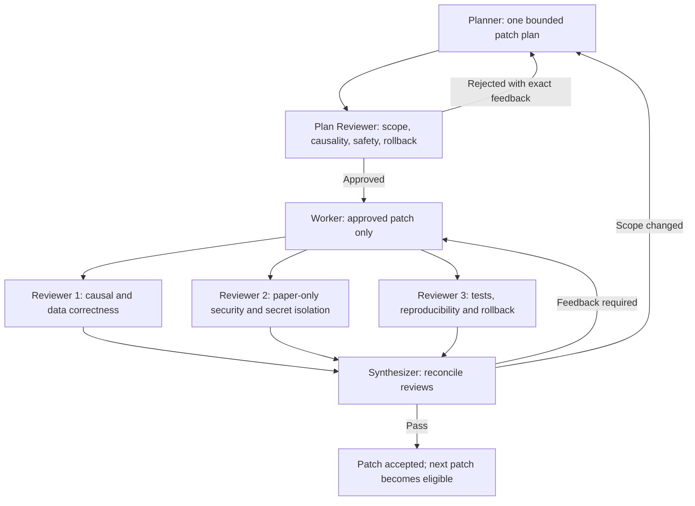

# Stage 1 P0 Evidence-Integrity Implementation Handoff

**Operational task:** `starting stage 1`  
**Handoff status:** implementation plan only; no implementation is authorized by this document  
**Research authority:** `C:\Users\Jayant\Desktop\traiding\STAGE1_DEEP_RESEARCH_PROPOSAL.md`  
**Authority SHA-256:** `D4D415A233630ED93D0020D6135778D5CC3297A2B5F615BEA78052F0112E1E89`  
**Authority read:** complete, through Appendix C  
**Permitted scope:** P0-A through P0-H evidence-integrity controls only

> **DEVELOPMENT CONTROL ONLY — NEVER A TRADING COMPONENT**
>
> The Planner → Plan Reviewer → Worker → independent Reviewers → Synthesizer workflow in this handoff controls software-development changes. It must remain outside the recorder, paper engine, strategy, risk engine, replay decision path, ledger, dashboard control plane, and any future broker integration. It must never create, approve, alter, reject, size, route, or execute a trading decision.

## 1. Authority, purpose, and precedence

`STAGE1_DEEP_RESEARCH_PROPOSAL.md` is the research authority for this handoff. This document narrows that proposal into eight bounded implementation patches. It does not reopen the audit, repeat external research, reinterpret strategy performance, or authorize P1, research-family, Champion–Challenger, AI, news, or live-order work.

If this handoff conflicts with the research authority, the research authority wins and implementation stops for owner review. If the repository has materially changed since the authority was finalized, the Planner must document the difference and request a new bounded decision; the Worker must not silently adapt scope.

Every patch is:

- prospective only unless it merely inventories or verifies existing bytes;
- one human-reviewed commit and one signed development change card;
- independently testable and independently reversible;
- prohibited from reading sealed TEST data;
- prohibited from rewriting, relabeling, deleting, or “repairing” historical evidence;
- ineligible to change strategy behavior, risk settings, or the Champion.

## 2. Non-negotiable boundaries

The implementation task must preserve all of the following:

1. No real orders, order adapter, order WebSocket, broker-control route, or broker-order capability.
2. No changes to entries, exits, indicators, candidate score, thresholds, stops, position sizing, liquidity sizing, sector limits, maximum positions, daily loss, or daily trade limits.
3. No Champion replacement or modification.
4. No Challenger activation, laboratory fan-out, or virtual Challenger ledger creation yet.
5. No Qwen, FinBERT, news, LLM, prompt, embedding, or memory effect on candidates, risk, fills, positions, ledgers, P&L, or acceptance.
6. No online learning, self-modification, autonomous code changes, or self-written memory.
7. No access to sealed TEST contents, metrics, labels, partitions, or derived summaries.
8. No rewriting, backfilling, deleting, rehashing as if original, or retroactive recertification of historical evidence.
9. No profitability claim and no strategy promotion decision.
10. No development-governance component inside the trading runtime.

Any requested change outside these boundaries is `OUT_OF_SCOPE_STOP`. It requires a new owner-approved plan, not an expanded P0 patch.

## 3. Fixed historical classification

The finalized 27 July 2026 paper session remains:

```text
operational_state = FINALIZED
research_validity = PARTIAL_SESSION
engine_start_ist ≈ 09:36
mandatory_opening_coverage = MISSING
full_session_trial_eligible = false
```

The classification must not be changed by any P0 migration, replay, card generator, validator renaming, or backfill. Genuine raw receipts beginning around 09:33 are pre-engine warm-up evidence; they do not restore the missing 09:15 opening or make the session a full-session trial. The session may remain in the engineering and root-cause corpus, with its original hashes and limitations.

## 4. Patch order and dependency gate

| Order | Patch | Depends on | Eligible to start only when |
|---:|---|---|---|
| 1 | P0-A Baseline provenance | none | owner approves this handoff and bounded P0-A plan |
| 2 | P0-B Provider timestamp validation | P0-A | P0-A synthesis is `PASS` |
| 3 | P0-C Causal finalization | P0-A, P0-B | P0-B synthesis is `PASS` |
| 4 | P0-D Append-only decision-state fold | P0-A–P0-C | P0-C synthesis is `PASS` |
| 5 | P0-E Universal finalization | P0-A–P0-D | P0-D synthesis is `PASS` |
| 6 | P0-F Universal acceptance gate | P0-A–P0-E | P0-E synthesis is `PASS` |
| 7 | P0-G Chained/signed acceptance cards | P0-A–P0-F | P0-F synthesis is `PASS` |
| 8 | P0-H Paper-only capability attestation | P0-A–P0-G | P0-G synthesis is `PASS` |

No patches are bundled. A failed patch blocks the next patch. A rollback produces a new development record; it never edits a prior signed session or change card.

## 5. Development-governance procedure

### 5.1 Roles

| Role | Required responsibility | Prohibited action |
|---|---|---|
| Planner | Prepare one bounded patch plan with exact files, schema version, tests, acceptance, rollback, migration effect, and exclusions | Implement, broaden scope, open sealed data |
| Plan Reviewer | Check scope, causal semantics, safety, dependency satisfaction, prospective-only treatment, and rollback feasibility | Approve an ambiguous or multi-patch plan |
| Worker | Implement only the approved bounded patch and record exact diff, commands, environment, test-output hash, and deviations | Add opportunistic cleanup, strategy changes, or unapproved dependencies |
| Reviewer 1 | Independently check causal ordering, timestamps, immutable-state semantics, folds, reconciliation, and data correctness | Rely only on Worker narrative |
| Reviewer 2 | Independently check paper-only security, import/call/network capability, credential and signing-key isolation, secret handling, and sealed-data exclusion | Read or expose credentials; accept “unused” order capability |
| Reviewer 3 | Independently check tests, deterministic reproduction, clean-checkout behavior, failure tests, rollback, and artifact hashes | Accept a test claim without command/environment/output hash |
| Synthesizer | Reconcile all reviews into one decision and exact feedback set | Average away a hard failure or invent new scope |
| Owner | Authorize bounded plans, merges, rollback, and progression to the next patch | Delegate trading decisions to this workflow |

Reviewers must be independent of the Worker for the patch being reviewed. One person may perform more than one role only if the independence requirement is explicitly waived by the owner and recorded; Reviewer 2 may not be waived for P0-H.

### 5.2 Required flow



### 5.3 Patch state machine

```text
DRAFT_PLAN
  → PLAN_REVIEW
  → PLAN_APPROVED | PLAN_REJECTED
PLAN_APPROVED
  → IMPLEMENTING
  → IMPLEMENTED_AWAITING_REVIEW
IMPLEMENTED_AWAITING_REVIEW
  → REVIEW_1_COMPLETE
  → REVIEW_2_COMPLETE
  → REVIEW_3_COMPLETE
  → SYNTHESIS
SYNTHESIS
  → FEEDBACK_REQUIRED | REPLAN_REQUIRED | PASS
FEEDBACK_REQUIRED
  → IMPLEMENTING
REPLAN_REQUIRED
  → DRAFT_PLAN
PASS
  → NEXT_PATCH_ELIGIBLE
```

There is no automatic merge and no runtime invocation of this state machine.

### 5.4 Mandatory artifacts per patch

Store development records outside trading evidence namespaces:

```text
docs/stage1_p0/patches/<patch_id>/
  01-plan.md
  02-plan-review.md
  03-worker-record.md
  04-review-causal-data.md
  05-review-paper-security.md
  06-review-tests-rollback.md
  07-synthesis.md
  08-change-card.json
```

The exact storage path may be adjusted in the P0-A plan if the repository already has an approved documentation convention. Development records must never be imported by `src/stage1`, treated as market evidence, or read by the paper runtime.

The change card records:

```text
patch_id, plan_hash, approved_plan_hash, code_commit,
tree_hash, environment_hash, changed_paths, excluded_paths,
schema_versions_before, schema_versions_after,
test_commands, test_output_hashes, reviewers,
review_hashes, synthesis_status, rollback_commit,
prospective_from_session, created_at, previous_change_card_hash,
owner_approval_reference
```

### 5.5 Feedback and pass rules

- Every failed review returns exact file/line or schema/test feedback to the Worker.
- Feedback must identify the violated requirement, observed evidence, required correction, and retest.
- If the correction changes approved scope, schema meaning, migration policy, or rollback, the Synthesizer returns `REPLAN_REQUIRED` to the Planner.
- A patch passes only when all three reviews have no unresolved hard finding and the Synthesizer records `PASS`.
- A passed patch makes only the next ordered patch eligible. It does not activate trading research or the Champion–Challenger laboratory.

## 6. Shared P0 data and migration rules

These rules apply to all eight patches:

1. Raw provider payload bytes and original fields are immutable.
2. New derived artifacts use explicit schema and producer versions.
3. Historical artifacts remain in their original namespace and retain their original hash.
4. A new implementation writes only to a new prospective namespace/session boundary.
5. A state view is rebuildable; an append-only event journal is authoritative.
6. A rejected, quarantined, partial, invalid, zero-trade, or crashed session remains recorded.
7. A terminal card is written once. Correction is a new linked card/event, never overwrite.
8. Any incompatible schema change requires a reader-version gate; no silent mixed-schema dataset.
9. Tests use synthetic fixtures or unsealed development evidence only.
10. Rollback selects a prior code/schema version prospectively; it never rewrites produced evidence.

## 7. P0-A — Baseline provenance

### Defect fixed

The research authority found no human-reviewed, resolvable code baseline for the artifacts it inspected; run cards used `UNBORN_OR_UNAVAILABLE`. Without a clean code/tree/dependency identity, later evidence cannot be reproduced or attributed.

### Bounded patch

Inventory the current tree; review ignore rules; prove that credentials, `.env`, logs, runtime state, raw/derived data, caches, signing private keys, and sealed partitions are excluded; create the first approved reproducible baseline commit or, if a valid baseline now exists, attest it without rewriting history. Emit a deterministic baseline manifest. Mark earlier evidence `LEGACY_UNATTESTED` by metadata/reference only—never by modifying old files.

### Likely files/components

- `.gitignore`
- `.env.example` for names/placeholders only; never `.env`
- `pyproject.toml`
- `requirements.in`
- `requirements.lock`
- `README.md` or a narrow P0 provenance document
- proposed `src/stage1/validation/provenance.py`
- proposed `scripts/build_baseline_manifest.py`
- `tests/test_secret_scan.py`
- `tests/test_schemas.py`
- proposed `tests/test_provenance.py`

The Planner must list the exact paths after inventory. No runtime data path may be staged.

### Required schema and states

`baseline-manifest-v1`:

```text
manifest_id, schema_version, code_commit, tree_hash,
tracked_path_count, dependency_lock_hash, python_runtime,
platform, build_tool_versions, exclusion_policy_hash,
sealed_test_exclusion_attested, secret_scan_result,
created_at, approved_by, manifest_hash
```

Development provenance state:

```text
UNATTESTED → INVENTORIED → REVIEWED → BASELINED
```

Any failed exclusion or secret scan ends in `PROVENANCE_REJECTED`; it does not proceed by deleting evidence.

### Tests that must pass

- Clean checkout reproduces the same tree manifest and dependency-lock hash.
- Secret-name/credential-pattern scan passes without opening `.env`.
- `.env`, `*.log`, caches, `state/`, runtime `data/`, sealed paths, private keys, and generated evidence are untracked.
- Manifest ordering, path normalization, line endings, and timestamp-independent hashing are deterministic.
- Dirty-tree and missing-lock fixtures fail closed.
- Existing historical artifact hashes are unchanged.

### Acceptance criteria

- Resolvable reviewed commit and clean checkout.
- Deterministic manifest reproduced by Reviewer 3.
- Reviewer 2 confirms no secret, private key, sealed data, or runtime evidence is tracked.
- Run-card producer can receive a resolvable code identity in later patches without changing current runtime behavior.
- Pre-baseline evidence is explicitly described as `LEGACY_UNATTESTED`, not recertified.

### Rollback

Revert only the P0-A commit or abandon the candidate baseline. Preserve the pre-change directory/read-only snapshot and all historical artifacts. Never use `git reset --hard` against user work. A rejected manifest remains in the development record.

### Prospective effect

Provenance identity applies to future builds/sessions only. No historical session gains a retroactive commit identity.

### Dependencies

None. P0-A must pass before every other patch.

## 8. P0-B — Provider timestamp validation

### Defect fixed

`src/stage1/market/normalizer.py` accepts any positive provider epoch and prioritizes `exch_feed_time`; the known `315513000` value normalizes to 1979/1980 despite July 2026 receipt times and, in many rows, a plausible conflicting `last_traded_time`. Silent selection can mispartition sessions and falsify causality.

### Bounded patch

Add a pure provider-time validator before normalization acceptance. Preserve every raw time field. Validate epoch units, exchange calendar/session plausibility, bounded receipt distance, monotonicity where meaningful, and field conflicts. Quarantine invalid/conflicting records; never silently repair or substitute a conflicting timestamp.

### Likely files/components

- `src/stage1/market/normalizer.py`
- `src/stage1/schemas.py`
- `src/stage1/storage/parquet_writer.py`
- `src/stage1/adapters/fyers_market_data.py`
- `scripts/record_fyers.py`
- `tests/test_normalizer.py`
- `tests/test_raw_tick_storage.py`
- `tests/test_fyers_recorder.py`
- `tests/fixtures/fyers_symbol_update.json`
- proposed timestamp-validation fixtures

### Required schema and states

Raw/normalized timestamp additions:

```text
provider_time_fields_raw,
provider_time_units_detected,
exchange_event_at_candidate,
received_at,
payload_complete_at,
parser_completed_at,
source_sequence,
timestamp_validation_status,
timestamp_reason_codes[],
clock_offset_ms,
clock_uncertainty_ms,
raw_record_hash,
validator_version
```

State transition:

```text
RECEIVED → TIMESTAMP_VALIDATED → ACCEPTED
                             ↘ QUARANTINED
```

Minimum reasons:

```text
PROVIDER_TIME_SENTINEL
TIMESTAMP_FIELD_CONFLICT
IMPOSSIBLE_EPOCH
UNSUPPORTED_EPOCH_UNIT
OUTSIDE_EXCHANGE_CALENDAR
OUTSIDE_ALLOWED_RECEIPT_DISTANCE
FUTURE_EVENT_TIME
NON_MONOTONIC_SOURCE_TIME
CLOCK_UNCERTAIN
```

### Tests that must pass

- Seconds, milliseconds, microseconds, and nanoseconds fixtures.
- Exact `315513000` fixture is quarantined.
- Conflicting `exch_feed_time`/`last_traded_time` fixture is quarantined with both raw values preserved.
- Holiday, impossible/future, extreme receipt-distance, and monotonicity fixtures.
- IST/UTC conversion is deterministic and DST-neutral.
- Property tests prove no impossible accepted epoch.
- Quarantined rows cannot enter bar input but remain in immutable raw/quarantine output.
- The 47 known sentinel-row shapes are rejected by fixture/sample-hash test without modifying their source files.

### Acceptance criteria

- 100% quarantine of all known sentinel cases.
- Zero accepted impossible/conflicting test record.
- No silent fallback between provider fields.
- Raw bytes/fields and quarantine reason remain reproducible.
- Existing strategy/risk logic is byte-for-byte unchanged.

### Rollback

Revert the validator consumer commit before a session boundary. Raw inputs and quarantine artifacts remain. Do not merge pre-validator and post-validator derived datasets.

### Prospective effect

Only future normalized/derived sessions use the new validator. Historical raw records remain untouched and retain their original classifications/hashes.

### Dependencies

P0-A `PASS`.

## 9. P0-C — Causal finalization, immutable bars, and receipt watermark

### Defect fixed

Bars called “complete” can be rebuilt after later laptop receipt, changing features and candidates already used. Feature availability is derived from mutable bar time rather than an immutable receipt cutoff. The 27 July journal/final replay differences demonstrate the risk.

### Bounded patch

Introduce provisional and finalized bar versions, a receipt-based eligibility cutoff, and a conservative preregistered `bar_end + 10 seconds` watermark. Only fully received, timestamp-accepted events present by `input_cutoff` may enter the finalized bar. Finalized bars and snapshot hashes are immutable. Later records are linked as late-arrival events and affect session validity according to the frozen policy; they never revise a prior decision input.

The 10-second watermark is an engineering constant from the research authority, not an alpha parameter and not tunable from P&L.

### Likely files/components

- `src/stage1/market/bar_builder.py`
- `src/stage1/market/features.py`
- `src/stage1/strategy/candidate_gate.py`
- `src/stage1/schemas.py`
- `src/stage1/paper/replay.py`
- `src/stage1/storage/parquet_writer.py`
- `scripts/run_live_paper.py`
- `scripts/build_features.py`
- `scripts/replay_paper_day.py`
- `tests/test_bar_builder.py`
- `tests/test_features.py`
- `tests/test_candidate_gate.py`
- `tests/test_paper_replay.py`
- `tests/test_live_paper_session.py`

### Required schema and states

Bar/snapshot fields:

```text
bar_id, symbol, bar_start_at, bar_end_at,
input_cutoff, watermark_at, finalized_at, available_at,
source_event_ids[], source_manifest_hash,
provisional_version, bar_hash, feature_snapshot_hash,
late_event_count, late_event_ids[], finality_policy_version
```

States:

```text
BAR_OPEN → BAR_PROVISIONAL → BAR_FINAL
BAR_PROVISIONAL → BAR_SUPERSEDED
BAR_FINAL + later eligible-for-old-bucket event → LATE_AFTER_WATERMARK event
```

`BAR_FINAL` has no transition back to a mutable bar. Candidate evaluation accepts only `BAR_FINAL`/finalized feature snapshots with `available_at <= decision_at`.

Causal order:

```text
raw received_at
→ payload_complete_at
→ timestamp acceptance
→ input_cutoff/watermark
→ immutable finalized bar
→ feature available_at
→ decision_at
→ first eligible simulated fill received_at
```

### Tests that must pass

- Adversarial late tick cannot change a finalized bar byte or hash.
- Every permutation of later arrivals produces the same finalized bar and linked late-arrival record.
- A record received before/after the cutoff is included/excluded exactly once.
- Reconnect/warm-up cannot cross a watermark as healthy.
- Feature `available_at <= decision_at` for every candidate.
- Fill receipt is strictly later than decision eligibility.
- Same-bar and future-feature leakage fixtures fail.
- Incremental and independent replay produce identical finalized bars/features for synthetic sessions.
- Mixed pre-P0/post-P0 evidence is rejected.

### Acceptance criteria

- Finalized bar hash is invariant under every tested late-arrival permutation.
- Every decision references an immutable snapshot hash and cutoff.
- Late events remain visible and cannot rewrite candidates.
- Randomized receipt-order replay is deterministic under its recorded order.
- No strategy, threshold, stop, size, risk, or fill rule is changed.

### Rollback

Select the prior engine version only before a future session begins. Keep post-P0-C outputs in a separate versioned namespace. Never combine datasets or rewrite finalized bars. Feature-flag fallback, if used for engineering, must be off by default and cannot make a session research-eligible.

### Prospective effect

Prospective sessions only. Historical bars, features, candidates, and the 27 July `PARTIAL_SESSION` record remain unchanged.

### Dependencies

P0-A and P0-B `PASS`.

## 10. P0-D — Append-only decision-state fold and journal/state reconciliation

### Defect fixed

Replay-derived state and append-only journal can describe different histories. Candidate versions can disappear or be replaced without explicit `SUPERSEDED`/`RETRACTED` transitions. Mutable aggregate state is being treated as evidence instead of a view derived from immutable events.

### Bounded patch

Define an append-only decision event schema and legal transition table. Make the journal authoritative and derive all candidate, risk, intent, fill, position, cash, and terminal state by deterministic fold. Add explicit supersession/retraction before paper execution and exact end-of-session journal/state/replay reconciliation.

### Likely files/components

- `src/stage1/schemas.py`
- `src/stage1/storage/operational_db.py`
- proposed `src/stage1/paper/state_fold.py`
- `src/stage1/strategy/candidate_gate.py`
- `src/stage1/paper/replay.py`
- `scripts/run_live_paper.py`
- `scripts/replay_paper_day.py`
- `tests/test_schemas.py`
- `tests/test_live_paper_session.py`
- `tests/test_paper_replay.py`
- proposed `tests/test_decision_state_fold.py`

### Required schema and states

Common event envelope:

```text
event_id, event_seq, session_id, event_type,
entity_id, parent_event_id, supersedes_event_id,
input_snapshot_hash, occurred_at, committed_at,
producer_version, payload_hash, previous_event_hash
```

Candidate/decision flow:

```text
PROVISIONAL → FINAL
PROVISIONAL → SUPERSEDED | RETRACTED
FINAL → RISK_APPROVED | RISK_REJECTED
RISK_APPROVED → INTENT_CREATED
INTENT_CREATED → ENTRY_FILLED | FILL_EXPIRED | MOVEMENT_REJECTED
ENTRY_FILLED → EXIT_FILLED
```

Rules:

- only `FINAL` may enter risk evaluation;
- only `RISK_APPROVED` may create an intent;
- every intent has exactly one terminal entry outcome;
- every filled position has a linked exit or terminal invalid/open-liability record;
- duplicate event IDs are idempotent only when bytes/hash match;
- conflicting duplicates, gaps, illegal transitions, or orphan events invalidate reconciliation.

Fold output:

```text
fold_version, journal_head_hash, event_count_by_type,
candidate_count, approval_count, intent_count,
rejection_count_by_reason, fill_count, exit_count,
positions, cash, ledgers, terminal_state_hash
```

### Tests that must pass

- Duplicate, conflicting duplicate, missing predecessor, out-of-order, orphan, and illegal-transition fixtures.
- Explicit retraction and supersession fixtures.
- Crash/restart fold is idempotent and produces the same terminal hash.
- State is rebuildable from journal only.
- Journal/state/replay counts, cash, positions, ledgers, and hashes match exactly.
- The finalized 27 July mismatch is represented as historical engineering evidence, not silently migrated into equality.
- No disappeared candidate can be removed without a terminal transition in prospective data.

### Acceptance criteria

- One authoritative append-only event sequence.
- Exact equality between journal fold, runtime view, independent replay, positions, cash, and ledger totals.
- Any unexplained difference is terminal failure, never a warning.
- Immutable IDs and snapshot hashes explain every prospective state transition.
- No historical journal/state file is rewritten.

### Rollback

Revert the new consumer and select the prior version for a future session. Retain append-only events and a migration/export manifest. Never delete events to regain equality. If the fold is unreliable, new sessions are ineligible and the engine remains disabled until resolved.

### Prospective effect

Prospective sessions only. Historical mismatches, including 27 July, remain documented with original immutable IDs and classification.

### Dependencies

P0-A through P0-C `PASS`.

## 11. P0-E — Universal finalization, including zero-trade sessions

### Defect fixed

The no-candidate branch can return before producing a complete run/acceptance card. A legitimate zero-signal session is therefore not distinguishable from a late start, stale/disconnected feed, failed evaluation, or crash.

### Bounded patch

Route every scheduled or attempted session through one idempotent finalizer. Produce exactly one terminal card for zero ticks, zero candidates, zero trades, normal trades, late starts, disconnects, validation failures, and recoverable crash finalization. The finalizer records evidence; it does not decide strategy eligibility—that classification is completed in P0-F.

### Likely files/components

- `scripts/run_live_paper.py`
- `scripts/record_fyers.py`
- `scripts/replay_paper_day.py`
- `scripts/validate_recording.py`
- `src/stage1/schemas.py`
- `src/stage1/storage/operational_db.py`
- proposed `src/stage1/validation/session_finalizer.py`
- `tests/test_live_paper_session.py`
- `tests/test_recording_validation.py`
- `tests/test_paper_replay.py`

### Required schema and states

Session lifecycle:

```text
PLANNED → STARTED → FINALIZING → FINALIZED
PLANNED → NOT_STARTED_TERMINAL
STARTED → CRASH_DETECTED → FINALIZING → FINALIZED
```

Terminal card fields:

```text
session_id, schema_version, scheduled_start/end,
actual_recorder_start/end, actual_engine_start/end,
coverage_by_symbol, opening_coverage,
reconnect_intervals, warmup_intervals,
stale_counts/ratios, raw/accepted/quarantined counts,
bar/feature/evaluation/candidate counts,
risk/intent/rejection/fill/exit counts,
zero_candidate_reason_vector, no_trade_reason,
journal_head_hash, state_fold_hash, replay_hash,
positions_remaining, cash/ledger_reconciliation,
code/config/environment/manifest hashes,
finalizer_status, finalizer_reason_codes[],
created_at, terminal_card_hash
```

### Tests that must pass

- Zero tick, zero candidate, zero trade, ordinary trade, late start, disconnect, stale context, and crash-recovery fixtures each emit one terminal card.
- Repeated finalizer invocation is idempotent; it cannot create two terminal cards.
- Healthy zero-candidate card proves coverage and every evaluation/no-action reason.
- Unhealthy zero-trade session cannot be labeled “no signal.”
- Open position, missing ledger, missing manifest, or unreconciled counts are recorded as hard defects.
- Terminal card hashes reproduce in an independent process.

### Acceptance criteria

- Every attempted scheduled session terminates once.
- Zero-trade evidence is complete enough to distinguish no signal from no evidence.
- No early return bypasses finalization.
- Terminal card references immutable manifests and the authoritative state fold.
- Finalization itself does not mutate historical evidence or strategy behavior.

### Rollback

Retain the old finalizer under an explicit versioned entry point only for pre-P0 evidence readers. Revert the prospective finalizer commit before the next session if necessary. Never overwrite a terminal card; a finalizer correction is a linked successor record.

### Prospective effect

Prospective sessions only. The incomplete 23 July zero-trade record remains engineering evidence and is not retroactively upgraded.

### Dependencies

P0-A through P0-D `PASS`.

## 12. P0-F — Universal `VALID/PARTIAL/INVALID` acceptance gate

### Defect fixed

`src/stage1/validation/recording.py` already emits `PASS/PARTIAL_SESSION/FAIL`, but it is not the single deterministic terminal gate for recorder, engine, replay, ledger, run card, dashboard, and evaluation eligibility. It lacks the complete timestamp, causal, hash, and reconciliation checks required by P0-B through P0-E.

### Bounded patch

Extend and map the existing validator; do not create a competing classifier. Emit one terminal acceptance status and make all downstream evidence/evaluation readers consume it. `PARTIAL` and `INVALID` may remain available for engineering diagnosis but cannot enter performance inference.

### Likely files/components

- `src/stage1/validation/recording.py`
- proposed `src/stage1/validation/acceptance.py`
- `src/stage1/schemas.py`
- `src/stage1/evaluation/intraday_lab.py`
- `scripts/validate_recording.py`
- `scripts/run_live_paper.py`
- `scripts/replay_paper_day.py`
- `scripts/run_control_room.py` as a read-only consumer
- `tests/test_recording_validation.py`
- `tests/test_intraday_lab.py`
- `tests/test_control_room.py`
- `tests/test_live_paper_session.py`

### Required schema and states

Terminal validity:

```text
OPEN → VALID | PARTIAL | INVALID
```

Terminal statuses are immutable. A correction is a linked acceptance-card version that never erases the original.

Minimum deterministic classification:

```text
VALID:
  required schedule/coverage met;
  required symbols current;
  timestamp, causal, hash, replay and reconciliation checks pass;
  terminal positions/ledgers reconcile.

PARTIAL:
  internal evidence is sound;
  start/end/opening/reconnect/coverage limitations make the
  session ineligible for performance inference.

INVALID:
  impossible/conflicting accepted time;
  causal or finality violation;
  missing/corrupt manifest;
  hash/replay mismatch;
  journal/state/cash/position disagreement;
  unresolved terminal position/liability;
  classifier input incomplete or inconsistent.
```

Acceptance record:

```text
session_id, classifier_version, status,
reason_codes[], evidence_scope, performance_eligible,
terminal_card_hash, manifest_root, replay_match,
reconciliation_match, classified_at, acceptance_hash
```

### Tests that must pass

- Complete truth-table fixture for every reason and precedence combination.
- Causal/hash/reconciliation failure always yields `INVALID`.
- Sound late-start/missing-opening fixture yields `PARTIAL`.
- `PARTIAL` and `INVALID` are excluded from all performance evaluators and cannot be converted to zero-return observations.
- Every attempted session receives exactly one terminal acceptance result.
- Dashboard cannot show overall healthy/accepted when status is partial/invalid.
- Fixed regression: 27 July 2026 remains `PARTIAL`/displayed `PARTIAL_SESSION`, because the engine began about 09:36 and opening coverage is missing.
- Fixed regression: the session cannot enter an independent full-session trial count.

### Acceptance criteria

- One classifier and one reason precedence table govern all consumers.
- All hard causes are deterministic and fail closed.
- `VALID` requires full causal, replay, hash, terminal, and reconciliation equality.
- The 27 July classification and original hashes remain unchanged.
- No strategy metric, threshold, rule, or ledger amount is altered.

### Rollback

The classifier version is recorded in every card. Revert the whole validator commit prospectively if needed. Never relabel old sessions in place. If no accepted classifier is available, evaluation remains disabled rather than defaulting to valid.

### Prospective effect

Prospective acceptance decisions use the new gate. Historical sessions retain their original card plus a non-destructive mapped interpretation where required; 27 July remains `PARTIAL_SESSION`.

### Dependencies

P0-A through P0-E `PASS`.

## 13. P0-G — Chained and locally signed acceptance cards

### Defect fixed

Existing run cards lack predecessor links and signatures. A content hash alone cannot detect deletion/reordering/replacement of an unanchored card set or authenticate the producing research identity.

### Bounded patch

Create a local append-only acceptance-card chain. Each terminal card references the previous accepted chain entry and immutable manifest root, and has a detached local signature. Build a clean-environment verifier. The research signing key is separate from all broker credentials and is never stored in the repository, `.env`, runtime artifacts, logs, cards, or trading process.

### Likely files/components

- `src/stage1/security.py`
- `src/stage1/schemas.py`
- proposed `src/stage1/validation/card_chain.py`
- proposed `scripts/sign_acceptance_card.py`
- proposed `scripts/verify_acceptance_chain.py`
- `scripts/run_live_paper.py` or the P0-E finalizer integration point
- `.gitignore` for private-key exclusion
- `tests/test_schemas.py`
- proposed `tests/test_acceptance_chain.py`
- `tests/test_secret_scan.py`

### Required schema and states

Acceptance-chain envelope:

```text
card_id, session_id, card_schema_version,
terminal_acceptance_hash, manifest_root,
previous_card_hash, previous_chain_head,
card_hash, signer_key_id, signature_algorithm,
detached_signature_path, signed_at,
key_transition_reference
```

Card/signature states:

```text
UNSIGNED_TERMINAL → SIGNED → VERIFIED
UNSIGNED_TERMINAL → SIGNING_FAILED
SIGNED → VERIFICATION_REJECTED
```

Key rotation requires a signed transition from the previous key plus owner approval. Missing predecessor, wrong key, invalid signature, substituted manifest, or chain discontinuity fails verification.

### Tests that must pass

- Bit tamper, card substitution, manifest substitution, deletion, reorder, duplicate, wrong key, missing predecessor, and truncated-chain fixtures.
- Clean local verifier succeeds without the running recorder/engine.
- Detached signature is not embedded as a mutable card field.
- Private-key material cannot be tracked, logged, exported to cards, or read by the paper runtime.
- Public verification key and daily chain head can be backed up separately.
- Key-rotation fixture requires an authorized signed transition.

### Acceptance criteria

- Clean verifier detects every tested tamper/reorder/delete/substitute case.
- Chain head is independently retained.
- Signature verifies the exact canonical card/manifest bytes.
- Signing key isolation is approved by Reviewer 2.
- Unsigned legacy cards remain explicitly unsigned; none is retroactively presented as signed.

### Rollback

Disable new signing at a future boundary and leave affected sessions non-`VALID` until the problem is resolved. Keep unsigned legacy cards labeled. Rotate a compromised key through a signed owner-approved transition when possible; never rewrite prior signatures or chain heads.

### Prospective effect

Only new cards are chained/signed. Historical cards remain unchanged and unanchored/unsigned as originally produced.

### Dependencies

P0-A through P0-F `PASS`.

## 14. P0-H — Paper-only capability attestation

### Defect fixed

The active recorder/engine path is data-only, but the repository/shared SDK surface includes generic FYERS client objects exposing order methods in offline scripts. “Order methods are unused” is not a sufficient paper-only guarantee.

### Bounded patch

Define a minimal market-data-only runtime interface and prove the live import/call/network graph contains no order-capable class, method, route, WebSocket, dynamic loader, subprocess/plugin escape, or writable extension path. Isolate generic REST/history/profile tooling in an explicitly offline entry point with no live-engine import path. Add startup capability inventory and fail closed if attestation is missing or mismatched.

### Likely files/components

- `src/stage1/adapters/base_market_data.py`
- `src/stage1/adapters/fyers_market_data.py`
- `src/stage1/adapters/fyers_auth.py`
- `src/stage1/security.py`
- `scripts/record_fyers.py`
- `scripts/run_live_paper.py`
- `scripts/run_control_room.py`
- offline-only `scripts/verify_fyers_live.py`
- offline-only history/profile tooling, including `scripts/prepare_historical_research.py` if present
- `tests/test_paper_only_boundary.py`
- `tests/test_fyers_sdk_contract.py`
- `tests/test_fyers_recorder.py`
- `tests/test_control_room.py`
- proposed `tests/test_capability_attestation.py`

### Required schema and states

Runtime capability manifest:

```text
manifest_id, code_commit, entry_point,
allowed_modules[], denied_modules[],
allowed_network_methods[], denied_symbols[],
loaded_module_hashes[], dynamic_loading_disabled,
subprocess_disabled, writable_extension_paths[],
http_routes[], broker_order_capability=false,
attestor_version, manifest_hash, attested_at
```

Startup state:

```text
UNATTESTED → ATTESTED_PAPER_ONLY → START_ALLOWED
UNATTESTED | ATTESTATION_MISMATCH → START_BLOCKED
```

The only allowed live provider surface is the approved market-data interface. Dashboard methods remain `GET/HEAD`; `POST/PUT/PATCH/DELETE` return 405.

### Tests that must pass

- Static import graph contains no generic/order client or order WebSocket in the live path.
- Denied order method/class/module/string and dynamic-import fixtures fail.
- `eval`, `exec`, subprocess launch, writable plugin/module path, and runtime code-loading fixtures fail.
- Network allowlist rejects order-like POST routes and unexpected destinations/methods.
- Control-room write methods return 405 and expose no start/stop/promote/reset/threshold/order action.
- Generic FYERS REST/history tooling cannot be imported by recorder, engine, finalizer, validator, or dashboard.
- Startup fails closed when capability manifest is missing, stale, or mismatched.
- Secret-isolation test proves credentials are neither printed nor written to attestation/card artifacts.

### Acceptance criteria

- Live dependency and call graph is demonstrably market-data-only.
- No broker-order capability is imported, reachable, dynamically loadable, or exposed by a route.
- Startup requires a matching paper-only capability attestation.
- Offline tools are isolated and cannot be reached by the paper runtime.
- Reviewer 2 gives an explicit paper-only/security `PASS`.

### Rollback

Revert the interface/attestation commit only while leaving the live process disabled. Absence of attestation never falls back to permissive startup. Offline utilities remain separately invoked and must not be moved back into the runtime graph.

### Prospective effect

Prospective runtime starts only. No historical evidence, order history, ledger, strategy, or broker account state is changed.

### Dependencies

P0-A through P0-G `PASS`.

## 15. Cross-patch acceptance and five-session dry-run gate

P0 implementation is not complete when unit tests pass. After all eight patches individually pass:

1. Freeze the P0 code commit, dependency/environment hash, schemas, timestamp policy, 10-second watermark, fold rules, finalizer, validity truth table, chain verifier, and capability manifest.
2. Run five consecutive scheduled infrastructure dry-run paper sessions.
3. Every attempted session must produce one terminal, chained, locally signed card.
4. Every card must verify independently in a clean local environment.
5. Journal fold, runtime view, replay, positions, cash, and ledger counts/hashes must have no unexplained difference.
6. Any `PARTIAL` or `INVALID` session is retained but breaks the consecutive-pass count.
7. Any missing/reordered signature, unresolved late-data event, order-capability attestation failure, secret leak, or sealed-data access breaks the count.
8. Restart the five-session count only at the next scheduled boundary after a reviewed corrective patch.
9. These are infrastructure sessions, not evidence of profitability.

The Champion–Challenger laboratory cannot be activated until all P0 controls pass and five consecutive infrastructure dry-run sessions finish with terminal cards and no unexplained reconciliation differences. Passing this gate makes a separately approved laboratory implementation plan eligible; it does not activate any Challenger.

## 16. Required Reviewer synthesis template

```text
Patch:
Approved plan hash:
Implemented commit/tree hash:
Prospective boundary:

Reviewer 1 — causal/data:
  PASS | FAIL
  Findings:

Reviewer 2 — paper-only/security/secrets:
  PASS | FAIL
  Findings:

Reviewer 3 — tests/reproducibility/rollback:
  PASS | FAIL
  Findings:

Scope deviations:
Historical evidence changed:
Sealed TEST accessed:
Strategy/risk behavior changed:
Order capability introduced:

Synthesis:
  PASS | FEEDBACK_REQUIRED | REPLAN_REQUIRED

Exact feedback to Worker:
Required retests:
Rollback readiness:
Owner approval reference:
Next patch eligible:
```

Any non-empty adverse answer for historical rewrite, sealed access, strategy/risk change, or order capability is an automatic `FAIL`.

## 17. Operational checklist for the `starting stage 1` task

Execute in order; stop on the first failed or unapproved item.

- [ ] Confirm owner approval covers P0 evidence-integrity work only.
- [ ] Confirm the research-authority path and SHA-256 match this handoff.
- [ ] Confirm 27 July 2026 remains `FINALIZED` plus `PARTIAL_SESSION`, never full-session eligible.
- [ ] Confirm sealed TEST paths are denied and have not been opened.
- [ ] Confirm no strategy, risk, Champion, Challenger, AI/news, ledger, or order work is in scope.
- [ ] P0-A: plan → plan review → implement → three reviews → synthesis `PASS`.
- [ ] P0-B: plan → plan review → implement → three reviews → synthesis `PASS`.
- [ ] P0-C: plan → plan review → implement → three reviews → synthesis `PASS`.
- [ ] P0-D: plan → plan review → implement → three reviews → synthesis `PASS`.
- [ ] P0-E: plan → plan review → implement → three reviews → synthesis `PASS`.
- [ ] P0-F: plan → plan review → implement → three reviews → synthesis `PASS`.
- [ ] P0-G: plan → plan review → implement → three reviews → synthesis `PASS`.
- [ ] P0-H: plan → plan review → implement → three reviews → synthesis `PASS`.
- [ ] Freeze the accepted P0 commit, schemas, environment, policies, verifier, and capability manifest.
- [ ] Run five consecutive scheduled infrastructure dry-run paper sessions.
- [ ] Verify one terminal chained/signed card per attempt.
- [ ] Verify clean-environment replay/card/signature reproduction.
- [ ] Verify zero unexplained journal/state/replay/position/cash/ledger differences.
- [ ] Record dry-run result as infrastructure evidence only.
- [ ] Keep the Champion–Challenger laboratory disabled.
- [ ] Stop and request separate approval for any next-stage work.

**End state:** P0 controls and five-session dry-run evidence may establish that Stage 1 evidence collection is operationally trustworthy. They do not establish a profitable strategy, authorize a strategy change, activate Challengers, replace the Champion, or enable real trading.
